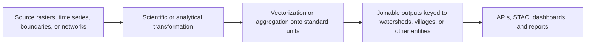

# How Our Pipelines Work Algorithmically

This page is about the scientific and analytical logic behind the pipeline families.

It answers:

- what question does each workflow family answer?
- why did CoRE Stack choose to compute these things this way?
- what are the key inputs and modeling moves?
- what kind of outputs come out?
- where can future contributors improve the science or extend the stack?

---

## The Core Pattern

Most CoRE Stack pipelines follow the same conceptual shape:

This matters because CoRE Stack is not trying to answer one question once. It is trying to build reusable public infrastructure.

So the stack favors:

- standard units
- repeatable computations
- outputs that are interpretable outside the original notebook or script
- data that can be recombined later

---

## Why CoRE Stack Computes In This Shape

### 1. Water planning needs hydrological logic

Administrative names are useful for people, but water moves through catchments, drainage lines, and watershed networks.

That is why CoRE Stack starts from hydrological units and then crosswalks back to administrative ones.

### 2. Rasters are powerful but hard to use directly

Many foundational inputs are raster-like:

- elevation
- rainfall
- satellite observations
- land-cover predictions
- derived terrain surfaces

But most downstream users want:

- tables
- vector layers
- ranked units
- reports

So CoRE Stack repeatedly turns raster evidence into vectorized, indexed, joinable outputs.

### 3. Public infrastructure should expose reusable building blocks

The stack does not try to centrally publish every possible policy question.

Instead it publishes canonical layers and indicators that others can recombine for:

- river rejuvenation
- restoration planning
- drought analysis
- irrigation and cropping questions
- community-facing tools

---

## Scientific Ideas Already Embedded In The Stack

| Idea | How it shows up in CoRE Stack | Why it matters |
|------|-------------------------------|----------------|
| watershed hydrology | micro-watershed registry, catchments, drainage, runoff-oriented reasoning | water moves through connected landscapes |
| land-surface classification | LULC workflows and change layers | many planning questions begin with what is on the land now and how it changed |
| water balance reasoning | rainfall, evapotranspiration, runoff, and related hydrology layers | gives a first planning lens on water availability and stress |
| zonal statistics | raster signals summarized onto MWS, villages, or other units | makes outputs comparable and joinable |
| network analysis | upstream and downstream watershed connectivity | important for river and catchment-scale interventions |
| spatial enrichment | admin overlays, aquifer joins, facilities proximity, asset layers | connects hydrological analysis to implementation reality |

---

## The Four Repeated Questions

Most CoRE Stack computations are trying to answer one of four broad questions:

1. What is on the land or water surface now or over time?
2. How does water move, accumulate, or become available across a landscape?
3. Which administrative or ecological boundaries matter for planning?
4. Which places deserve attention, restoration, protection, or follow-up action?

---

## Read By Workflow Family

=== "Core Workflows"

    **LULC generation**

    - Inputs: satellite imagery, time windows, region of interest
    - Logic: classify land into stable categories over a place and period, then use those classes to support later derived indicators such as cropping intensity and change
    - Outputs: land-use rasters, class summaries, downstream planning layers

    **Surface water body detection**

    - Inputs: imagery and water-sensitive signals over time
    - Logic: identify waterbody extent and track changes or supporting measures, then attach those measurements back to stable hydrological units
    - Outputs: vector waterbodies, area summaries, waterbody analytics

    **Hydrology**

    - Inputs: rainfall, terrain, watershed boundaries, derived coefficients
    - Logic: estimate runoff, recharge, evapotranspiration, and related watershed behavior so that water availability can be reasoned about at watershed scale
    - Outputs: MWS-level indicators, seasonal summaries, hydrological layers

    **Terrain analysis**

    - Inputs: DEM-derived surfaces
    - Logic: derive slope, depressions, terrain classes, drainage support layers
    - Outputs: terrain rasters and planning-oriented derived layers

=== "Boundary and Enrichment"

    **Administrative and clipping workflows**

    - Inputs: state, district, block, watershed, or pan-India source layers
    - Logic: clip, filter, and normalize boundaries or thematic datasets to the requested geography while preserving stable keys
    - Outputs: ready-to-publish vector layers and metadata

    **Enrichment workflows**

    - Inputs: base geometries plus tabular or external thematic sources
    - Logic: attach nearest-distance, class, dominant condition, or joined statistics
    - Outputs: enriched vector layers and planning-ready attributes

=== "Raster and Drainage"

    **Drainage and stream derivatives**

    - Inputs: DEM, hydrological derivatives, watershed context
    - Logic: derive drainage lines, stream order, catchment structure, connectivity support, and proximity surfaces
    - Outputs: raster or vector drainage-support layers

    **Raster planning derivatives**

    - Inputs: terrain, hydrology, and related modeled inputs
    - Logic: produce interpretable surfaces for restoration or prioritization
    - Outputs: clipped rasters and summary-ready layers

=== "Time Series and Ops"

    **Temporal vegetation workflows**

    - Inputs: NDVI-like series, interpolation support, seasonal time windows
    - Logic: summarize vegetation dynamics over time so that seasonality, change, and resilience can be compared between units
    - Outputs: time-series tables, class summaries, comparison-ready outputs

    **Operational helpers**

    - Inputs: credentials, service wiring, reusable pipeline inputs
    - Logic: make the analytical workflows runnable and publishable
    - Outputs: successful execution, not new science by itself

---

## Output Thinking

One useful way to think about the pipeline families is by output type:

| Output type | Typical families | Why it matters |
|-------------|------------------|----------------|
| raster | LULC, terrain, drought, slope, restoration | good for continuous or classified surfaces |
| vector | waterbodies, boundaries, facilities, aquifer joins | good for inspection, download, and attribute tables |
| tabular | tehsil summaries, MWS indicators, time series | good for ranking, reporting, and joins |
| mixed | hydrology, restoration, proximity, SWB ecosystems | most useful public products combine multiple output types |

---

## Why Public Data Looks The Way It Does

The public API is not a random collection of endpoints.

It reflects the fact that CoRE Stack’s pipeline families naturally create:

- stable geometries
- joinable tables keyed by watershed identifiers
- downloadable layers
- metadata that points onward to GeoServer, reports, STAC items, or Earth Engine assets

---

## What Can Become Better

If you think an algorithm, assumptions, data output, or modeling choices can be improved, that is a feature request for the stack, not a problem to hide.

Possible examples:

- richer groundwater-aware modeling
- clearer uncertainty reporting and validation notes
- more open truthing datasets for classification and waterbody workflows
- reliable administrative and hydrological intersection for village and panchayat-level planning
- new standard outputs where the public value is high enough to justify long-term maintenance

---

## Move From Concepts To Code

When you are comfortable with the analytical logic, the next useful section usually is to use [public data](../use-precomputed-data/public-apis.md) extend the stack, continue into [Build New Pipelines](../pipelines/index.md).
