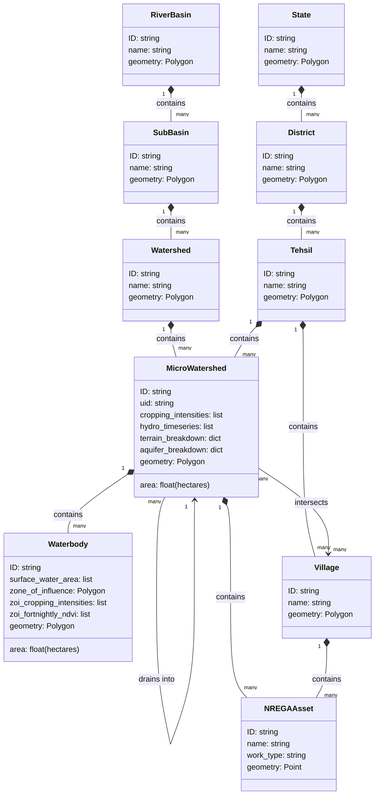

# CoRE Stack Data Structure

Read this page before using CoRE Stack data deeply or building new pipelines.

It explains the main idea that ties the whole stack together:

- landscapes are represented through standardized spatial units
- many outputs are indexed to those units
- different pipeline families become joinable because they share those units

!!! note
    This is a conceptual and documentation-facing model. It should be treated as the working contract for understanding the platform, not as a claim that one exact Django ORM schema already exposes all of it directly.

---

## Why This Chapter Comes First

CoRE Stack does not start from dashboards or APIs. It starts from a way of representing landscapes.

The key move is the micro-watershed registry:

- hydrological units are better than purely administrative units for reasoning about water flow
- the units are stable enough to act like a registry
- once data is indexed to that registry, multiple layers can be joined and compared

---

## Our Three Organizing Principles

### 1. Nested hydrological units

CoRE Stack treats river basins, sub-basins, watersheds, and micro-watersheds as a nested structure.

The micro-watershed is the most important practical planning unit in the current stack because many derived metrics eventually resolve there.

### 2. Crosswalks to administrative units

People often discover and use data through state, district, tehsil, village, and panchayat names.

That means CoRE Stack must constantly connect:

- hydrological correctness
- administrative usability

### 3. Connected rather than isolated entities

The stack is not only hierarchical. It is also networked.

Examples:

- upstream micro-watersheds drain into downstream ones
- waterbodies belong to or influence surrounding watershed units
- villages and assets intersect multiple hydrological contexts

---

## Entity Relationship Diagram

---

## What Each Layer Of The Model Is For

| Entity type | Why it exists in the stack | How users usually meet it |
|-------------|---------------------------|---------------------------|
| river basin, sub-basin, watershed | hydrological nesting and context | GEE assets, conceptual model, some datasets |
| micro-watershed | the main standardized planning and join unit | public APIs, STAC vector layers, dashboards, starter-kit outputs |
| waterbody | feature-level hydrological object nested inside larger units | waterbody APIs, vector layers, dashboards |
| state, district, tehsil | discovery and query entry points | GeoAdmin APIs, public API parameters, STAC browsing |
| village and other enrichment layers | administrative and social context | geometry APIs, enrichment outputs, planning analysis |
| assets such as NREGA works | intervention and planning context | enrichment layers and downstream use cases |

---

## Why Micro-Watersheds And Not Only Villages

The rationale from the CoRE Stack registry writeup is important:

- water planning is fundamentally hydrological
- village and panchayat boundaries are useful, but they are not water-flow units
- hydrological units are more stable over time than many administrative boundaries
- a shared registry makes it easier for many actors to index and exchange data

CoRE Stack’s current registry is a pan-India micro-watershed delineation of roughly `1000 ha` units, nested under larger hydrological boundaries.

That gives CoRE Stack something like a local-scale Earth-system grid:

- small enough for place-based planning
- standardized enough for large-scale data collation

---

## How Data Gets Attached To The Registry

The core operational idea is:

1. start from rasters and source layers
2. compute derived signals such as terrain, land use, drought, or water balance
3. vectorize or aggregate those signals onto standard spatial units
4. store and publish them in a way that preserves stable identifiers

That is why CoRE Stack repeatedly moves between:

- rasters
- vector layers
- watershed registries
- tehsil summaries
- API payloads
- STAC items and style files

The starter-kit mirrors this logic in Python by building structures like:

- tehsil
- micro-watersheds inside that tehsil
- waterbodies inside those micro-watersheds

---

## The Most Important Practical Relationships

1. `tehsil -> micro-watersheds`
   People often query by administrative name, but the computation is frequently organized on hydrological units.

2. `micro-watershed -> uid -> other datasets`
   The watershed `uid` is one of the most important stable keys in the current public surface.

3. `micro-watershed -> upstream/downstream connectivity`
   River rejuvenation, runoff reasoning, and catchment logic all depend on the fact that watersheds are connected, not isolated.

4. `micro-watershed -> villages -> assets`
   Many planning questions require hydrological and administrative layers together.

---

## What Users Should Remember

- If you understand the micro-watershed registry, the rest of the stack becomes much easier to navigate.
- If you only look at administrative units, you will miss how water actually moves.
- If you only look at hydrological units, you may miss how implementation and funding happen on administrative units.
- CoRE Stack tries to keep both views connected.

---

## Limitations And What Can Improve

The current theory pages on the CoRE Stack site are very clear that this structure is useful, but not final.

Important limitations to keep in mind:

- surface-water logic is modeled much better than groundwater flow
- current boundaries were produced from `SRTM`-based delineation; newer DEMs such as `FABDEM` could improve future versions
- village and panchayat-level implementation still requires intersections and social coordination, not only hydrological correctness
- not every useful landscape entity is fully represented yet

---

## See Also

- [How Current Data Was Computed](../use-precomputed-data/how-current-data-was-computed.md)
- [How Our Pipelines Work Algorithmically](how-pipelines-work-algorithmically.md)
- [USE APIs](https://geoserver.core-stack.org/swagger/)
- [Pipeline Development](../pipelines/index.md)
- [Glossary](../reference/glossary.md)
