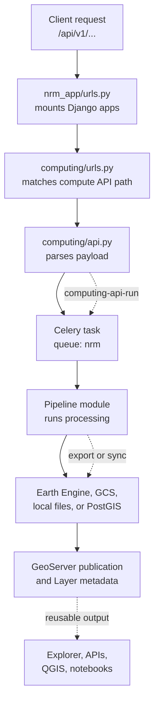

# Backend Code Map

Source repository: [core-stack-org/core-stack-backend](https://github.com/core-stack-org/core-stack-backend)

The backend is a Django project with several apps. For pipeline work, the center of gravity is `computing/`, backed by `utilities/`, `public_api/`, `gee_computing/`, and GeoServer helpers.

## Common Request Path

## Modules You Will Need

| App or module | Why it matters |
| --- | --- |
| `nrm_app/urls.py` | Mounts all API apps under `/api/v1/` and exposes Swagger/ReDoc. |
| `computing/urls.py` | Lists computation API paths such as LULC, hydrology, SWB, terrain, NREGA, and STAC. |
| `computing/api.py` | Parses request payloads and triggers tasks or helper functions. |
| `computing/` submodules | Hold the pipeline logic: `lulc/`, `mws/`, `misc/`, `terrain_descriptor/`, `surface_water_bodies/`, and others. |
| `computing/models.py` | Stores `Dataset` and `Layer` records for generated outputs. |
| `computing/utils.py` | Publishes vectors to GeoServer, writes layer metadata, updates sync flags, and fixes geometries. |
| `utilities/gee_utils.py` | Initializes GEE, builds asset paths, exports rasters/vectors, polls tasks, syncs GCS, and makes assets public. |
| `utilities/geoserver_utils.py` | Wraps GeoServer REST operations. |
| `gee_computing/models.py` | Stores encrypted `GEEAccount` credentials used by GEE-backed pipelines. |
| `public_api/` | Exposes read-oriented public data APIs and generated layer URLs. |

## Common Helper Functions

The call graph points to a small set of heavily reused helpers. Learn these early:

| Helper | File | Job |
| --- | --- | --- |
| `valid_gee_text()` | `utilities/gee_utils.py` | Normalizes names for GEE paths and layer names. |
| `ee_initialize()` | `utilities/gee_utils.py` | Initializes Earth Engine from a stored `GEEAccount`. |
| `is_gee_asset_exists()` | `utilities/gee_utils.py` | Checks whether an asset already exists before export or reuse. |
| `check_task_status()` | `utilities/gee_utils.py` | Polls Earth Engine export tasks. |
| `get_gee_asset_path()` / `get_gee_dir_path()` | `utilities/gee_utils.py` | Builds deterministic asset paths. |
| `export_vector_asset_to_gee()` | `utilities/gee_utils.py` | Exports an `ee.FeatureCollection` to an Earth Engine asset. |
| `export_raster_asset_to_gee()` | `utilities/gee_utils.py` | Exports an `ee.Image` to an Earth Engine asset. |
| `make_asset_public()` | `utilities/gee_utils.py` | Makes a GEE asset readable by public users. |
| `sync_raster_to_gcs()` | `utilities/gee_utils.py` | Stages a raster through Google Cloud Storage. |
| `sync_raster_gcs_to_geoserver()` | `utilities/gee_utils.py` | Publishes a GCS-backed raster to GeoServer. |
| `sync_fc_to_geoserver()` | `computing/utils.py` | Publishes a feature collection to GeoServer. |
| `save_layer_info_to_db()` | `computing/utils.py` | Creates or updates the `Layer` metadata row. |
| `update_layer_sync_status()` | `computing/utils.py` | Marks GeoServer or STAC sync completion. |

## Current Pipelines

| Family | Main examples | Typical modules |
| --- | --- | --- |
| Boundary and MWS | admin boundary, MWS, centroids, connectivity, ZOI | `computing/misc/admin_boundary.py`, `computing/mws/` |
| Hydrology | precipitation, runoff, ET, delta G, well depth | `computing/mws/` |
| Land use | LULC, LULC vector, change detection, crop grid, cropping intensity | `computing/lulc/`, `computing/change_detection/`, `computing/cropping_intensity/` |
| Water bodies | SWB, ponds, wells, SWB-pond merge | `computing/surface_water_bodies/` |
| Terrain and drainage | terrain raster, terrain clusters, CLART, drainage, stream order, slope, catchment, depressions | `computing/terrain_descriptor/`, `computing/clart/`, `computing/misc/` |
| Enrichment overlays | NREGA, facilities, aquifer, SOGE, agroecology, mining, CSR, green credit, LCW conflict | `computing/misc/` |
| Vegetation and tree health | NDVI time series, HLS interpolation, canopy density, canopy height, tree-cover change | `computing/misc/`, `computing/tree_health/` |
| Plantation and restoration | plantation suitability, restoration opportunity | `computing/plantation/`, `computing/misc/restoration_opportunity.py` |
| Catalog and delivery | STAC collections and items, layer status, missing layers | `computing/STAC_specs/`, `computing/views.py` |

For how these become working pipelines, continue to [Develop New Pipelines](../pipelines/index.md).
