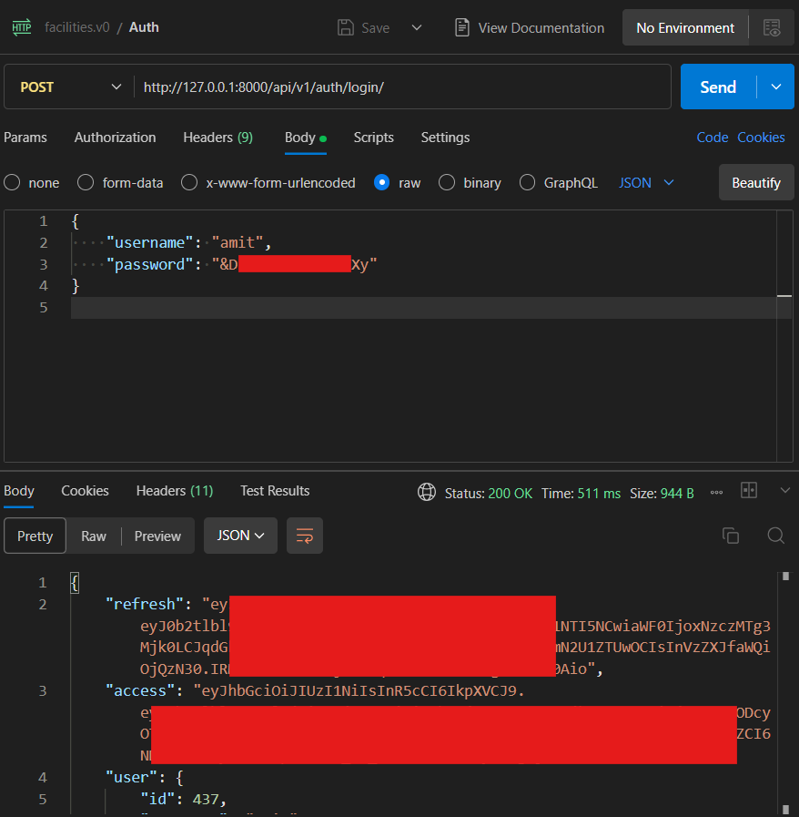

# Run CoRE Stack Backend with Docker

Pull the published image and start Postgres, GeoServer, and Django. You do not need Conda, a local Postgres install, or a GitHub password.

For the native Linux installer, see [Installer](installer.md).

## What you get

| Service | URL | Login |
| --- | --- | --- |
| Django / API | http://localhost:8000 | Superuser `test_user_XXXX` / `test_change_me` (see [First start](#5-first-start)) |
| Django admin | http://localhost:8000/admin/ | Same superuser |
| GeoServer | http://localhost:8080/geoserver | `admin` / `geoserver` |

Postgres listens on `localhost:5432` (`corestack_admin` / `corestack@123`, database `corestack_db`).

Computing APIs run **in-process** inside the backend container (`CELERY_TASK_ALWAYS_EAGER`). You do not start a separate Celery worker.

## Requirements

- [Docker](https://docs.docker.com/get-docker/) with Compose v2 (`docker compose version`)
- About **20 GB** free disk (images plus the first-run admin-boundary download, ~8 GB)
- Ports **8000**, **8080**, and **5432** free on your machine
- Git, to clone [core-stack-backend](https://github.com/core-stack-org/core-stack-backend) (Compose mounts helper scripts from `installation/docker`)

The backend and GeoServer images are **linux/amd64**. Docker Desktop on Apple Silicon runs them with emulation. You do not need extra flags when using `docker compose`.

## 1. Clone the repository

```bash
git clone https://github.com/core-stack-org/core-stack-backend.git
cd core-stack-backend
```

You only need the repo for `docker-compose.yml` and `installation/docker/`. You do not build the backend image yourself.

## 2. Optional: Google Earth Engine credentials

The stack starts without GEE. Layer jobs that call Earth Engine need a service-account JSON.

```bash
mkdir -p gee_confs
cp /path/to/your-gee-service-account.json gee_confs/gee-service-account.json
```

After Django is up, add the account in admin: [http://localhost:8000/admin/gee_computing/geeaccount/add/](http://localhost:8000/admin/gee_computing/geeaccount/add/). Use the service-account email from the JSON. Full GEE project steps are in [Google Earth Engine](integrations/google-earth-engine.md).

## 3. Optional: Google Cloud Storage

Raster publish (GEE → GeoTIFF → GeoServer) needs a GCS bucket. Use the **same** service account as the GEE JSON. Create the bucket in **`us-central1`** (`ee.Image.loadGeoTIFF` fails in other regions). Details and IAM notes: [Google Cloud Storage](integrations/gcs.md).

```bash
# Pick a unique bucket name (GCS names are global)
export GCS_BUCKET=your-gcs-bucket
export GEE_SA=name@project-id.iam.gserviceaccount.com

gcloud storage buckets create "gs://${GCS_BUCKET}" --location=us-central1

gcloud storage buckets add-iam-policy-binding "gs://${GCS_BUCKET}" \
  --member="serviceAccount:${GEE_SA}" \
  --role=roles/storage.objectViewer

gcloud storage buckets add-iam-policy-binding "gs://${GCS_BUCKET}" \
  --member="serviceAccount:${GEE_SA}" \
  --role=roles/storage.legacyBucketReader

gcloud storage buckets add-iam-policy-binding "gs://${GCS_BUCKET}" \
  --member="serviceAccount:${GEE_SA}" \
  --role=roles/storage.objectAdmin
```

Put the bucket name in a `.env` next to `docker-compose.yml`:

```bash
GCS_BUCKET_NAME=your-gcs-bucket
```

If Compose is already running:

```bash
docker compose up -d --force-recreate gee-config backend
```

Skip this section if you only need Django/GeoServer without layer jobs.

## 4. Pull and start

```bash
mkdir -p gee_confs
docker compose pull
docker compose up -d
```

The image is public:

```text
ghcr.io/core-stack-org/core-stack-backend:latest
```

No `docker login` is required. On Apple Silicon a plain `docker pull` of that tag can fail with “no matching manifest for linux/arm64”; Compose already pins `linux/amd64`.

## 5. First start

The first `docker compose up` does extra work. Later starts reuse Docker volumes and skip most of it.

1. **Admin-boundary data** (~8 GB) downloads into the `core_stack_data` volume. This is the slow step.
2. GeoServer comes up and workspaces/styles are created.
3. Django runs migrations, loads seed data, and starts on port 8000.

Watch progress:

```bash
docker compose ps
docker compose logs -f backend
```

GeoServer can take a few minutes. Seed load can also take several minutes.

When Django is ready you will see:

```text
Starting development server at http://0.0.0.0:8000/
Django is ready. Superuser password is test_change_me
```

The superuser name is `test_user_` plus four digits. Find it with:

```bash
docker compose logs backend | grep -E 'created\||updated\|'
```

Change that password after first login. Admin: http://localhost:8000/admin/

### Create your own superuser

The `test_user_XXXX` account is only for first login. Create a named admin when Django is running:

```bash
docker compose exec -it backend python manage.py createsuperuser --skip-checks
```

You will be prompted for username, email, and password. Log in at http://localhost:8000/admin/ with that account.

To reset the installer test user’s password back to `test_change_me`, recreate the backend container (`docker compose up -d --force-recreate backend`). First start always resets that test user.

## 6. Check that it is running

```bash
curl -s -o /dev/null -w "%{http_code}\n" http://localhost:8000/
curl -s -o /dev/null -w "%{http_code}\n" http://localhost:8000/admin/login/
curl -s -o /dev/null -w "%{http_code}\n" http://localhost:8080/geoserver/web/
```

Expect `200` from Django and `200` or `302` from GeoServer.

## Log in and invoke APIs

Computing APIs use **JWT bearer tokens**, not the Django admin session. Base URL: `http://127.0.0.1:8000`.

**1. Log in (JWT)**

```bash
curl -s -X POST http://127.0.0.1:8000/api/v1/auth/login/ \
  -H "Content-Type: application/json" \
  -d '{"username":"test_user_XXXX","password":"test_change_me"}'
```

Replace `test_user_XXXX` with the name from the backend logs. The response includes `access` (use on API calls), `refresh`, and `user`.

**2. Get `gee_account_id`**

Most computing `POST` bodies need a `gee_account_id`. List configured Earth Engine accounts (requires a valid JWT):

```bash
curl -s http://127.0.0.1:8000/api/v1/geeaccounts/ \
  -H "Authorization: Bearer <access-token>"
```

Use the numeric `id` from the response. If the list is empty, complete [GEE credentials](#2-optional-google-earth-engine-credentials) and add the account in Django admin. See [Google Earth Engine](integrations/google-earth-engine.md).

**3. Call a computing API**

The backend container runs compute tasks in-process. Example:

```bash
curl -X POST http://127.0.0.1:8000/api/v1/lulc_for_tehsil/ \
  -H "Authorization: Bearer <access-token>" \
  -H "Content-Type: application/json" \
  -d '{
    "state": "karnataka",
    "district": "raichur",
    "block": "devadurga",
    "start_year": 2022,
    "end_year": 2023,
    "gee_account_id": 1
  }'
```

More routes: [Computing API Endpoints](../pipelines/computing-endpoints.md) and [First computing API test-run](../pipelines/index.md#first-manual-run). Auth errors: [API Errors](../reference/api-errors.md).

**4. Postman**

Import from this docs repository:

| Asset | File |
| --- | --- |
| Collection | [core-stack-api.postman_collection.json](../assets/postman/core-stack-api.postman_collection.json) |
| Environment (Docker) | [core-stack-docker.postman_environment.json](../assets/postman/core-stack-docker.postman_environment.json) |

Run requests in order:

| Order | Request | Purpose |
| --- | --- | --- |
| 1 | **Auth — Login** | `POST /api/v1/auth/login/` → saves JWT `access` |
| 2 | **GEE — List accounts** | `GET /api/v1/geeaccounts/` → read `gee_account_id` |
| 3 | **Computing — LULC for tehsil** | Sample `POST` |



Optional GCS setup for raster publication: [Google Cloud Storage](integrations/gcs.md).

## Day-to-day commands

```bash
docker compose ps          # status
docker compose logs -f     # all services
docker compose stop        # stop, keep data
docker compose start       # start again
docker compose down        # remove containers, keep volumes
docker compose pull && docker compose up -d   # update to the latest published image
```

Wipe the database, GeoServer data, and admin-boundary download (you will re-download ~8 GB next start):

```bash
docker compose down -v
```

## Optional settings

Create a `.env` next to `docker-compose.yml` if you need to change ports, passwords, or GCP settings:

```bash
BACKEND_PORT=8000
GEOSERVER_PORT=8080
POSTGRES_PORT=5432
POSTGRES_DB=corestack_db
POSTGRES_USER=corestack_admin
POSTGRES_PASSWORD=corestack@123
GEOSERVER_USERNAME=admin
GEOSERVER_PASSWORD=geoserver
GEOSERVER_URL=http://geoserver:8080/geoserver/
GCS_BUCKET_NAME=your-gcs-bucket
GEE_STORAGE_PROJECT=ee-your-project
GEE_STORAGE_PROJECT_HELPER=ee-your-helper-project
```

`GEOSERVER_URL` defaults to the Compose GeoServer service. `GEE_STORAGE_PROJECT` defaults to `project_id` in `gee_confs/gee-service-account.json` when unset.

Force a fresh admin-boundary download:

```bash
FORCE_DATA_DOWNLOAD=1 docker compose up -d
```

## Troubleshooting

**Port already in use**  
Stop whatever is bound to 8000, 8080, or 5432, or set `BACKEND_PORT` / `GEOSERVER_PORT` / `POSTGRES_PORT` in `.env`.

**`denied` or `unauthorized` pulling the image**  
The package should be public. Confirm you can open [ghcr.io/core-stack-org/core-stack-backend](https://github.com/core-stack-org/core-stack-backend/pkgs/container/core-stack-backend) without signing in. Then retry `docker compose pull`.

**`no matching manifest for linux/arm64`**  
Use Compose (`docker compose pull`), not a bare `docker pull` on Apple Silicon. Compose sets `platform: linux/amd64`.

**Backend keeps restarting**  
`docker compose logs backend`. Common first-run waits: GeoServer health, the 8 GB download, or seed load.

**GEE jobs fail after a successful start**  
Mount the JSON under `gee_confs/gee-service-account.json` and add the account in Django admin. Restart is not required for the file mount if the directory already existed; recreate the backend container if you added the file later:

```bash
docker compose up -d --force-recreate backend
```

More setup fixes: [Setup Troubleshooting](setup-troubleshooting.md).
