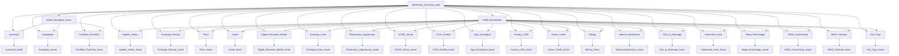

# Run CoRE Stack Backend with Docker

The repository-root `docker-compose.yml` is the only supported Compose definition. It builds the backend environment, mounts source from the host, starts PostgreSQL, Redis, GeoServer, Gunicorn and Celery, and runs initialization jobs in dependency order.

Authoritative backend copy: [installation/DOCKER.md](https://github.com/core-stack-org/core-stack-backend/blob/main/installation/DOCKER.md). Native Linux: [Installer](installer.md). GEE / GCS background: [Google Earth Engine](integrations/google-earth-engine.md) and [Google Cloud Storage](integrations/gcs.md). Airflow + STACD: [STACD Framework](https://github.com/SaharshLaud/STACD_framework) (`dev`).

## Installation in two parts { #two-methods-airflow--sync-or-no-airflow--async }

Docker install is **two parts**. Do the [shared first start](#first-start) once, then finish **either** Part 1 or Part 2.

| Part | Use when | `LAYER_GENERATION_SYNC_MODE` | `layer_generation_mode` | What happens |
| --- | --- | --- | --- | --- |
| **[Part 1 — With Airflow (sync)](#part-1-with-airflow-sync)** | You will set up Airflow + STACD, **upload** the layer DAGs, **trigger** a run, and need a finished STAC payload (`asset_id`, `stac_items`) | `True` | `"sync"` | The HTTP call **waits**. Celery `apply_async` runs **in-process**. Response status becomes `completed`. |
| **[Part 2 — Without Airflow (async)](#part-2-without-airflow-async)** | Default Docker stack. Celery workers do the work. No Airflow install. | `False` (default) | `"async"` or omit | The API **queues** the task and returns `initiated`. Watch `celery-nrm` / `celery-layer-bulk`. |

The switch is **`LAYER_GENERATION_SYNC_MODE`** in `nrm_app/.env`. One request can override that with **`layer_generation_mode`** in the JSON body (`sync` or `async`). Aliases: `layerGenerationMode`, `layer_mode`, `mode`.

Do not confuse this with **`SYNC_LAYER`**. That is a separate older flag. Layer method is **`LAYER_GENERATION_SYNC_MODE`** / **`layer_generation_mode`**.

Airflow is **not** in the backend Compose file. Part 1 installs Airflow + STACD next to the stack, then points the generated DAGs at `http://<backend-host>:8000`.

## Architecture

| State | Location | Persistence |
| --- | --- | --- |
| Backend source | Host checkout mounted at `/app` | Git / host filesystem |
| Downloaded and generated layers | `${CORESTACK_HOST_DATA_DIR:-.}/data` mounted at `/var/tmp/core-stack-data` | Host filesystem |
| PostgreSQL | Separate `postgres` container | Docker volume `postgres_data` |
| GeoServer catalog | Separate `geoserver` container | Docker volume `geoserver_data` |
| Celery broker | Separate `redis` container with AOF | Docker volume `redis_data` |
| GEE JSON | `${CORESTACK_HOST_DATA_DIR:-.}/gee_confs` | Read-only host mount |
| Database backups | `${CORESTACK_HOST_DATA_DIR:-.}/backups/postgres` | Host filesystem |
| GeoServer backups | `${CORESTACK_HOST_DATA_DIR:-.}/backups/geoserver` | Host filesystem |

PostgreSQL is never stored in the backend container. `docker compose --env-file nrm_app/.env down` keeps volumes. Adding `-v` deletes the database, GeoServer catalog, and Redis.

## What you get

| Service | URL |
| --- | --- |
| Django / API | http://localhost:8000 |
| Django admin | http://localhost:8000/admin/ |
| GeoServer | http://localhost:8080/geoserver |
| Airflow (Part 1 only) | http://localhost:8081 — not in Compose; see [setup Airflow](#setup-airflow-and-stacd) |

Postgres is on `127.0.0.1:5432` (`DB_USER` / `DB_PASSWORD` / `DB_NAME` from `nrm_app/.env`). Create a superuser after first start (see [Superuser](#superuser)).

## Requirements

- Docker Engine or Docker Desktop with Compose v2
- Linux/amd64; Apple Silicon uses Docker emulation
- Enough disk for images and requested layers (admin-boundary alone is about 8 GB)
- Ports **8000**, **8080**, and **5432** free on loopback, or overridden in `nrm_app/.env`
- Git, to clone [core-stack-backend](https://github.com/core-stack-org/core-stack-backend)

## First start

```bash
git clone https://github.com/core-stack-org/core-stack-backend.git
cd core-stack-backend
cp installation/docker/env.template nrm_app/.env
chmod 600 nrm_app/.env
```

Pick a layer method in that file (`LAYER_GENERATION_SYNC_MODE`). Use `True` if you will continue with [Part 1](#part-1-with-airflow-sync); leave `False` for [Part 2](#part-2-without-airflow-async). For a server, also set an absolute data root:

```dotenv
CORESTACK_HOST_DATA_DIR=/srv/core-stack-data
LAYER_GENERATION_SYNC_MODE=False
```

Replace the placeholder database and GeoServer passwords before any shared host. Then:

```bash
docker compose --env-file nrm_app/.env up -d --build
```

Run **all** Compose commands from the repository root with `--env-file nrm_app/.env`. Compose does not auto-load `nrm_app/.env`. The retired parent-repo `.env.core-stack` is not read.

`CORESTACK_HOST_DATA_DIR` defaults to the repository root (`./data`, `./gee_confs`, `./backups`). Compose creates those bind-mount directories on start.

One-shot jobs run before Gunicorn:

1. `app-init` completes `nrm_app/.env` and normalizes database, GeoServer, Celery, and runtime values.
2. `database-init` creates installation-local migrations, applies them with `--fake-initial`, collects static files, and loads seed data once.
3. `geoserver-init` reconciles workspaces and bundled styles.
4. `data-download` downloads only requested or missing source layers.
5. `gee-config` discovers optional mounted GEE JSON.
6. `tehsil-watershed-setup` downloads active tehsil watershed layers from the GeoServer `mws` WFS workspace.
7. Gunicorn and the queue-specific Celery workers start.

```bash
docker compose --env-file nrm_app/.env ps
docker compose --env-file nrm_app/.env logs -f app-init database-init data-download geoserver-init \
  gee-config tehsil-watershed-setup backend
```

## Large-download controls

| Variable | Effect when set to `1` |
| --- | --- |
| `SKIP_ADMIN_BOUNDARY_DOWNLOAD` | Skip the ~8 GB admin-boundary archive |
| `SKIP_BASE_LAYER_DOWNLOAD` | Skip terrain, MWS, LULC, and static/tehsil-level base layers |
| `SKIP_TEHSIL_WATERSHEDS` | Do not fetch active tehsil watershed GPKGs from GeoServer |

Set them in `nrm_app/.env` or on one invocation:

```bash
SKIP_ADMIN_BOUNDARY_DOWNLOAD=1 \
SKIP_BASE_LAYER_DOWNLOAD=1 \
SKIP_TEHSIL_WATERSHEDS=1 \
docker compose --env-file nrm_app/.env up -d --build
```

Refresh the admin-boundary archive:

```bash
FORCE_DATA_DOWNLOAD=1 docker compose --env-file nrm_app/.env run --rm data-download
```

Fetch base layers later:

```bash
SKIP_ADMIN_BOUNDARY_DOWNLOAD=1 \
SKIP_BASE_LAYER_DOWNLOAD=0 \
docker compose --env-file nrm_app/.env run --rm data-download
```

Tehsil watersheds land at:

```text
<CORESTACK_HOST_DATA_DIR>/data/base_layers/tehsil_watersheds/<state>/<district>/<tehsil>.gpkg
```

Retry a failed fetch:

```bash
docker compose --env-file nrm_app/.env run --rm tehsil-watershed-setup
```

## GEE and GCS { #gee-and-gcs }

The stack starts without GEE. Earth Engine jobs need a service-account JSON, a Django `GEEAccount`, `GCS_BUCKET_NAME`, and `GEE_STORAGE_PROJECT`.

```bash
mkdir -p /srv/core-stack-data/gee_confs
cp /secure/path/service-account.json /srv/core-stack-data/gee_confs/gee-service-account.json
chmod 600 /srv/core-stack-data/gee_confs/gee-service-account.json
```

Put the GCS bucket and GEE project in `nrm_app/.env`:

```bash
GCS_BUCKET_NAME=your-gcs-bucket
GEE_STORAGE_PROJECT=ee-your-project
GEE_STORAGE_PROJECT_HELPER=ee-your-project
```

Create the bucket in **`us-central1`** (see [Google Cloud Storage](integrations/gcs.md)). Then:

```bash
docker compose --env-file nrm_app/.env run --rm gee-config
docker compose --env-file nrm_app/.env up -d --force-recreate backend \
  celery-nrm celery-layer-bulk celery-geoserver celery-general
```

The mount is read-only. Add the matching `GEEAccount` in Django admin if it is not already in the database:

1. Open [http://localhost:8000/admin/gee_computing/geeaccount/add/](http://localhost:8000/admin/gee_computing/geeaccount/add/).
2. **Name:** GEE project id (same as `GEE_STORAGE_PROJECT`).
3. **Service account email:** `client_email` from the JSON.
4. **Credentials file:** upload the same JSON.
5. Save. The numeric id in the change URL is `gee_account_id`.

Use `SKIP_GEE_CONFIG=1` to disable GEE setup entirely.

### Optional Google Cloud Storage { #3-optional-google-cloud-storage }

Same bucket rules as above: unique name, `us-central1`, grant the GEE service account `roles/storage.objectViewer`, `roles/storage.legacyBucketReader`, and `roles/storage.objectAdmin`. Set `GCS_BUCKET_NAME` in `nrm_app/.env` and recreate `gee-config` plus `backend`.

## Superuser

Set `DJANGO_SUPERUSER_USERNAME`, `DJANGO_SUPERUSER_EMAIL`, and `DJANGO_SUPERUSER_PASSWORD` before first start, or create one:

```bash
docker compose --env-file nrm_app/.env exec backend python manage.py createsuperuser
```

## Part 1 — With Airflow (sync) { #part-1-with-airflow-sync }

Part 1 is: start the backend in **sync**, install **Airflow 2.10.4 + STACD**, **upload** the three YAML files, **trigger** the DAG, open the **full Graph**, and use **re-exec** (`resume_exec`) when a run fails.

### 1. Enable sync on the backend

Airflow algorithm tasks POST the Django APIs and must receive a finished STAC body. Set this **before** start, or recreate the backend after changing it:

```bash
# nrm_app/.env
LAYER_GENERATION_SYNC_MODE=True
```

```bash
docker compose --env-file nrm_app/.env up -d --force-recreate backend
```

Per-request override (wins over the env default):

```json
{
  "state": "Rajasthan",
  "district": "Bhilwara",
  "block": "Mandalgarh",
  "gee_account_id": 1,
  "layer_generation_mode": "sync"
}
```

`url:` values in the algorithm YAML must be reachable from the **Airflow worker**, not from your laptop. The bundled files use `http://core-stack:8000/...` (Compose service name). If Airflow runs on the host, change those URLs to `http://127.0.0.1:8000/...` or the LAN IP before you upload.

### 2. Set up Airflow and STACD { #setup-airflow-and-stacd }

Authoritative install: [STACD Framework README](https://github.com/SaharshLaud/STACD_framework/blob/dev/README.md) (`dev` branch). Short path:

```bash
mkdir airflow_stacd && cd airflow_stacd
python3 -m venv venv
source venv/bin/activate
pip install --upgrade pip

export AIRFLOW_HOME=$(pwd)/airflow
mkdir -p "$AIRFLOW_HOME"

AIRFLOW_VERSION=2.10.4
PYTHON_VERSION=$(python -c "import sys; print(f'{sys.version_info.major}.{sys.version_info.minor}')")
pip install "apache-airflow==${AIRFLOW_VERSION}" \
  --constraint "https://raw.githubusercontent.com/apache/airflow/constraints-${AIRFLOW_VERSION}/constraints-${PYTHON_VERSION}.txt"

git clone -b dev https://github.com/SaharshLaud/STACD_framework.git
cp -r STACD_framework/stacd "$AIRFLOW_HOME/"
cp -r STACD_framework/plugins "$AIRFLOW_HOME/"

export PYTHONPATH=$AIRFLOW_HOME:$AIRFLOW_HOME/stacd:$PYTHONPATH
airflow db init
airflow users create \
  --username admin \
  --firstname admin \
  --lastname admin \
  --role Admin \
  --email admin@example.com

airflow scheduler
```

In a second terminal (same `AIRFLOW_HOME` / venv / `PYTHONPATH`):

```bash
airflow webserver --port 8081
```

GeoServer already uses **8080** on this Compose stack, so do not bind Airflow there. Open [http://localhost:8081](http://localhost:8081) and log in.

`airflow standalone` is fine only if you first move GeoServer (`GEOSERVER_PORT`) or Airflow off 8080.

In **Admin → Variables** (or CLI), set the backend JWT so DAG tasks can call the APIs:

```bash
curl -s -X POST http://127.0.0.1:8000/api/v1/auth/login/ \
  -H "Content-Type: application/json" \
  -d '{"username":"<admin_user>","password":"<password>"}'
```

```bash
airflow variables set CORESTACK_AUTH_TOKEN '<access token>'
```

Tokens expire (typically 90 days). Reset the variable when calls start returning 401.

### 3. Upload the DAG { #upload-the-dag }

The backend already ships the STACD trio for both layer DAGs:

| DAG id | Folder under `computing/dags/generated_yamls/` |
| --- | --- |
| `CoreStack_DAG_LocalCompute_StaticLayers` | `CoreStack_DAG_LocalCompute_StaticLayers_v1/` |
| `CoreStack_DAG_LocalCompute_DynamicLayers` | `CoreStack_DAG_LocalCompute_DynamicLayers_v1/` |

Each folder has **three** files. Upload them in the Airflow UI:

1. Top menu → **STACD → Initialize Workflow**
2. **DAG YAML** → `dag.yaml`
3. **Algorithm Repo YAML** → `algo_repo.yaml`
4. **Dataset Repo YAML** → `dataset_repo.yaml`
5. Click **Initialize Workflow**

Success looks like: *Database initialized | DAG script generated | DAG `CoreStack_DAG_LocalCompute_StaticLayers` deployed to Airflow*.

STACD writes the YAMLs under `$AIRFLOW_HOME/stacd/yaml_configs/`, builds the Python DAG, and drops it in `$AIRFLOW_HOME/dags/`. Wait up to 30 seconds, then refresh **DAGs**. Toggle the DAG **ON**.

Repeat for Dynamic Layers if you need yearly / inter-dependent layers (`start_year`, `end_year`, `gee_account_id`).

Do not hand-edit the generated `.py`. To change the graph later, use STACD **Register Algorithm**, **Register Dataset**, or **Update DAG**.

### 4. Trigger the DAG { #trigger-the-dag }

1. **DAGs** → `CoreStack_DAG_LocalCompute_StaticLayers`
2. Click **▶ Trigger DAG**
3. Set conf / params, then **Trigger**

| Parameter | Example | Required on |
| --- | --- | --- |
| `execution_type` | `fullexec` | Both DAGs (default = full run) |
| `state` | `jharkhand` | Both |
| `district` | `dumka` | Both |
| `block` | `masalia` | Both |
| `start_year` | `2020` | Dynamic Layers |
| `end_year` | `2021` | Dynamic Layers |
| `gee_account_id` | `1` | Dynamic Layers (Django `GEEAccount` id) |
| `updated_algo` | `River` | Only `update_algo` |
| `updated_dataset` | `MWS_Boundaries` | Only `update_dataset` |

REST (same conf). Enable Basic Auth in `airflow.cfg` (`[api] auth_backends = airflow.api.auth.backend.basic_auth`) and restart the webserver:

```bash
curl -X POST "http://127.0.0.1:8081/api/v1/dags/CoreStack_DAG_LocalCompute_StaticLayers/dagRuns" \
  -H "Content-Type: application/json" \
  -u "admin:admin" \
  -d '{
    "conf": {
      "execution_type": "fullexec",
      "state": "jharkhand",
      "district": "dumka",
      "block": "masalia"
    }
  }'
```

Watch **Grid** or **Graph**. Each algorithm task POSTs a sync layer API; the matching `*_Asset` task registers STAC from that response.

### 5. Full DAG (Airflow Graph) { #full-dag-graph }

Open the DAG → **Graph**. That is the full static-layers workflow: one branch, two root datasets, every algorithm, then every output asset.


`determine_execution_path` is the only branch. It has a direct edge to every algorithm **and** to the two root datasets so `resume_exec` / `update_*` can start in the middle of the graph. `fullexec` still runs the roots first (`Admin_Boundary_Asset`, `MWS_Boundaries`), then the algorithms that consume them, then each `*_Asset`.


```mermaid
flowchart TB
  B[determine_execution_path]
  B --> Admin[Admin_Boundary_Asset]
  B --> MWS[MWS_Boundaries]
  B --> Livestock
  B --> Antyodaya
  B --> Fac[Facilities_Proximity]
  B --> Aquifer_Vector
  B --> Drainage_Density
  B --> River
  B --> Canal
  B --> DEM[Digital_Elevation_Model]
  B --> Drainage_Lines
  B --> Rest[Restoration_Opportunity]
  B --> SOGE_Vector
  B --> LCW[LCW_Conflict]
  B --> Agro[Agro_Ecological]
  B --> Factory_CSR
  B --> Green_Credit
  B --> Mining
  B --> Nat[Natural_Depression]
  B --> Dist[Dist_to_Drainage]
  B --> Catch[Catchment_Area]
  B --> Slope[Slope_Percentage]
  B --> Conn[MWS_Connectivity]
  B --> Cent[MWS_Centroid]
  B --> Soil[Soil_Type]
  Admin --> Livestock
  Admin --> Antyodaya
  Admin --> Fac
  MWS --> Aquifer_Vector
  MWS --> Drainage_Density
  MWS --> River
  MWS --> Canal
  MWS --> DEM
  MWS --> Drainage_Lines
  MWS --> Rest
  MWS --> SOGE_Vector
  MWS --> LCW
  MWS --> Agro
  MWS --> Factory_CSR
  MWS --> Green_Credit
  MWS --> Mining
  MWS --> Nat
  MWS --> Dist
  MWS --> Catch
  MWS --> Slope
  MWS --> Conn
  MWS --> Cent
  MWS --> Soil
  Livestock --> Livestock_Asset
  Antyodaya --> Antyodaya_Asset
  Fac --> Facilities_Proximity_Asset
  Aquifer_Vector --> Aquifer_Vector_Asset
  Drainage_Density --> Drainage_Density_Asset
  River --> River_Asset
  Canal --> Canal_Asset
  DEM --> Digital_Elevation_Model_Asset
  Drainage_Lines --> Drainage_Lines_Asset
  Rest --> Restoration_Opportunity_Asset
  SOGE_Vector --> SOGE_Vector_Asset
  LCW --> LCW_Conflict_Asset
  Agro --> Agro_Ecological_Asset
  Factory_CSR --> Factory_CSR_Asset
  Green_Credit --> Green_Credit_Asset
  Mining --> Mining_Asset
  Nat --> Natural_Depression_Asset
  Dist --> Dist_to_Drainage_Asset
  Catch --> Catchment_Area_Asset
  Slope --> Slope_Percentage_Asset
  Conn --> MWS_Connectivity_Asset
  Cent --> MWS_Centroid_Asset
  Soil --> Soil_Type_Asset
```

### 6. Re-exec (`resume_exec`) { #re-exec }

**Re-exec** on these DAGs is the STACD primitive **`execution_type=resume_exec`**. It is not Airflow’s Clear-and-rerun of the whole Graph (that still works, but it is a different action).

On failure, `log_algo_failure` writes the failed algorithm, region, and years into the STACD database. The next trigger with the **same** `state` / `district` / `block` (and years, if used) plus `resume_exec` queries that table and runs **only** the failed algorithm nodes. Successful tasks stay skipped.

| `execution_type` | What runs | When to use |
| --- | --- | --- |
| `fullexec` | Both root datasets and every algorithm, then every `*_Asset` | First run, or a full recompute |
| **`resume_exec`** (**re-exec**) | Only algorithms that **failed** last time for this region / years | Partial failure — retry without recomputing successes |
| `update_algo` | One algorithm (`updated_algo`) and its downstream assets | Algorithm code or version changed |
| `update_dataset` | One root dataset (`updated_dataset`) and the algorithms that consume it | Boundary / MWS input changed |
| `update_dag` | Algorithm nodes that have **never** succeeded in the STACD DB | You added nodes to the YAML and do not want to re-run the old ones |

Trigger a re-exec from the UI (**▶ Trigger DAG**) or REST:

```bash
curl -X POST "http://127.0.0.1:8081/api/v1/dags/CoreStack_DAG_LocalCompute_StaticLayers/dagRuns" \
  -H "Content-Type: application/json" \
  -u "admin:admin" \
  -d '{
    "conf": {
      "execution_type": "resume_exec",
      "state": "jharkhand",
      "district": "dumka",
      "block": "masalia"
    }
  }'
```

If `resume_exec` finds **no** failed tasks for those params, `determine_execution_path` raises `ValueError` and the run fails immediately — use `fullexec` instead. The same happens for `update_dag` when every algorithm already has a successful execution.

Airflow **Clear** on selected failed boxes re-runs those task instances in the **same** dag run. Prefer **`resume_exec`** for a new run that STACD can record, because lineage and `get_failed_executions` stay consistent.

## Part 2 — Without Airflow (async) { #part-2-without-airflow-async }

Skip Airflow. Leave the Compose default and let Celery workers run layers in the background.

```bash
# nrm_app/.env
LAYER_GENERATION_SYNC_MODE=False
```

```bash
docker compose --env-file nrm_app/.env up -d --force-recreate backend \
  celery-nrm celery-layer-bulk celery-geoserver celery-general
```

Call any computing API with `"layer_generation_mode": "async"` (or omit the field). The response is `initiated`. Follow work here:

```bash
docker compose --env-file nrm_app/.env logs -f backend celery-nrm celery-layer-bulk
```

Example:

```json
{
  "state": "Rajasthan",
  "district": "Bhilwara",
  "block": "Mandalgarh",
  "gee_account_id": 1,
  "layer_generation_mode": "async"
}
```

You can later switch the same stack to Part 1 by setting `LAYER_GENERATION_SYNC_MODE=True` and recreating `backend` — you do not reinstall Compose.

## NASA Earthdata (ET download)

Create an account at [urs.earthdata.nasa.gov](https://urs.earthdata.nasa.gov), authorize **NASA GESDISC DATA ARCHIVE**, then in `nrm_app/.env`:

```bash
USERNAME_GESDISC=your-earthdata-username
PASSWORD_GESDISC='your-earthdata-password'
```

```bash
docker compose --env-file nrm_app/.env up -d --force-recreate
```

Wrap passwords that contain `$` in single quotes.

## Run a computing API { #9-run-the-admin-boundary-local-compute-api }

Computing APIs use **JWT**, not the Django session. Base URL: `http://127.0.0.1:8000`.

### Log in

```bash
curl -s -X POST http://127.0.0.1:8000/api/v1/auth/login/ \
  -H "Content-Type: application/json" \
  -d '{"username":"YOUR_USERNAME","password":"YOUR_PASSWORD"}'
```

Copy `access`.

### Generate a block layer

```bash
curl -s http://127.0.0.1:8000/api/v1/generate_block_layer/ \
  -H "Content-Type: application/json" \
  -H "Authorization: Bearer ACCESS_TOKEN" \
  -d '{
    "state": "Rajasthan",
    "district": "Bhilwara",
    "block": "Mandalgarh",
    "gee_account_id": 1,
    "layer_generation_mode": "async"
  }'
```

| `layer_generation_mode` | Response |
| --- | --- |
| `"async"` (or omitted when env is `False`) | `{"Success": "Successfully initiated"}` — follow Celery logs |
| `"sync"` (or env `True`) | Waits until done; body includes `status: completed` and STAC / `asset_id` when the layer was produced |

Watch workers in async mode:

```bash
docker compose --env-file nrm_app/.env logs -f backend celery-nrm celery-layer-bulk
```

More routes: [Computing API Endpoints](../pipelines/computing-endpoints.md). Auth errors: [API Errors](../reference/api-errors.md).

### Postman

| Asset | File |
| --- | --- |
| Collection | [core-stack-api.postman_collection.json](../assets/postman/core-stack-api.postman_collection.json) |
| Environment (Docker) | [core-stack-docker.postman_environment.json](../assets/postman/core-stack-docker.postman_environment.json) |

## Day-to-day operations

```bash
docker compose --env-file nrm_app/.env ps
docker compose --env-file nrm_app/.env logs -f backend
docker compose --env-file nrm_app/.env logs -f celery-nrm celery-layer-bulk celery-geoserver celery-general
docker compose --env-file nrm_app/.env stop
docker compose --env-file nrm_app/.env start
docker compose --env-file nrm_app/.env down
```

Celery Beat is opt-in:

```bash
docker compose --env-file nrm_app/.env --profile periodic up -d celery-beat
```

## Code and dependency updates

Source is host-mounted. A code-only update:

```bash
git pull --ff-only
docker compose --env-file nrm_app/.env run --rm database-init
docker compose --env-file nrm_app/.env up -d --force-recreate backend \
  celery-nrm celery-layer-bulk celery-geoserver celery-general
```

When `Dockerfile` or `installation/environment.yml` changes:

```bash
docker compose --env-file nrm_app/.env build --pull
docker compose --env-file nrm_app/.env up -d --force-recreate
```

Do not install packages in running containers. Pin `CORESTACK_IMAGE_TAG` or `CORESTACK_IMAGE` and the Git commit for production.

## Database, migrations, and backups

PostgreSQL 16 is a separate container. Migrations stay Git-ignored (same as `installation/install.sh`). Only `database-init` changes schema.

```bash
docker compose --env-file nrm_app/.env --profile maintenance run --rm database-backup
ls -lh /srv/core-stack-data/backups/postgres
tar -czf /srv/core-stack-data/backups/postgres/local-migrations.tgz */migrations
```

GeoServer catalog (stop GeoServer first):

```bash
docker compose --env-file nrm_app/.env stop geoserver
docker compose --env-file nrm_app/.env --profile maintenance run --rm geoserver-backup
docker compose --env-file nrm_app/.env start geoserver
```

Downloaded layers stay in `CORESTACK_HOST_DATA_DIR/data` on the host — back that directory up with the host, not as a Docker image.

Restore procedure and `--fake-initial` rules: [installation/DOCKER.md](https://github.com/core-stack-org/core-stack-backend/blob/main/installation/DOCKER.md#restore). Never use `down -v` as a restore.

Set `RESET_LOCAL_MIGRATIONS=1` only for a fresh or verified-matching restored database.

## Behind a campus or corporate proxy

Compose reads `HTTP_PROXY` / `HTTPS_PROXY` from the shell or `nrm_app/.env` and passes them as build args and container env. Service names (`postgres`, `redis`, `geoserver`, `backend`) are always on `NO_PROXY`.

```bash
export HTTP_PROXY=http://proxy.example.org:3128/
export HTTPS_PROXY=http://proxy.example.org:3128/
docker compose --env-file nrm_app/.env up -d
```

Pulling base images is the **daemon** proxy. Check `docker info | grep -i proxy`.

## Testing

```bash
docker compose --env-file nrm_app/.env config --quiet
bash -n installation/docker/*.sh
python3 -m unittest discover -s installation/tests
docker compose --env-file nrm_app/.env run --rm backend python manage.py check
docker compose --env-file nrm_app/.env run --rm backend python manage.py test
```

Production must run `DEBUG=False` and explicit hosts/origins.

## Production checklist

1. Pin the Git commit and image tag; do not deploy moving `latest`.
2. Replace PostgreSQL and GeoServer passwords in `nrm_app/.env` before creating the database volume.
3. Set `DEBUG=False`, exact `ALLOWED_HOSTS`, and trusted HTTPS origins.
4. Keep 8000, 8080, and 5432 on loopback; expose only the HTTPS reverse proxy.
5. Back up PostgreSQL, local migration files, the GeoServer catalog, `CORESTACK_HOST_DATA_DIR/data`, and GEE secrets.
6. Run tests and `check --deploy`; review the `database-init` plan on a restored clone.
7. Run `database-init` once before recreating Gunicorn/Celery.
8. Review Beat schedules before enabling the `periodic` profile.
9. For [Part 1](#part-1-with-airflow-sync), set `LAYER_GENERATION_SYNC_MODE=True` and run Airflow on a port that is not GeoServer’s 8080 (8081). Leave `False` for [Part 2](#part-2-without-airflow-async).
10. Monitor health, queue depth, disk, and backups. Test rollback before launch.

## Complete reset

Destructive — deletes PostgreSQL, Redis, and GeoServer volumes. Files under `CORESTACK_HOST_DATA_DIR` stay:

```bash
docker compose --env-file nrm_app/.env down -v
```

## Troubleshooting

**Port already in use**  
Stop whatever is on 8000, 8080, or 5432, or set `BACKEND_PORT` / `GEOSERVER_PORT` / `POSTGRES_PORT` in `nrm_app/.env`.

**Backend keeps restarting**  
`docker compose --env-file nrm_app/.env logs backend`. First-run waits: GeoServer health, admin-boundary download, seed load.

**`manage.py` not found / empty `/app`**  
Start Compose from a [core-stack-backend](https://github.com/core-stack-org/core-stack-backend) clone (or set `BACKEND_CODE_DIR`). Recreate after changing the mount.

**`GEEAccount with id=N was not found`**  
Add the JSON in Django admin and pass that row’s id as `gee_account_id`.

**`Failed: projects//assets/apps/mws/...`**  
`GEE_STORAGE_PROJECT` is empty. Set it in `nrm_app/.env` and recreate the backend.

**API returns `initiated` but nothing runs**  
You are in **async** mode. Confirm Celery workers are up (`docker compose --env-file nrm_app/.env ps`) and watch `celery-nrm` / `celery-layer-bulk`. Or set `"layer_generation_mode": "sync"` / `LAYER_GENERATION_SYNC_MODE=True`.

**Airflow DAG skips STAC registration**  
The DAG needs a **sync** response with `asset_id` / `stac_items`. Use `LAYER_GENERATION_SYNC_MODE=True` or `"layer_generation_mode": "sync"`.

More setup fixes: [Setup Troubleshooting](setup-troubleshooting.md).
