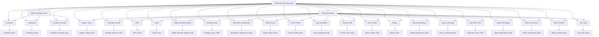

# Run CoRE Stack Backend with Docker

!!! tip "First time here?"
    Use [Install CoRE Stack](installer.md). That page walks through a first Docker install with no Airflow, and explains each command. Come back here for Airflow, Earth Engine, large datasets, GPU jobs, and the full settings list.

CoRE Stack Docker installation has **two ways**. Both use the same Compose stack from [installation/DOCKER.md](https://github.com/core-stack-org/core-stack-backend/blob/main/installation/DOCKER.md). Airflow is installed beside that stack, only on the first way.

| Way | What you install | Layer jobs |
| --- | --- | --- |
| **[1 — With Airflow](#part-1-with-airflow-sync)** | Airflow + STACD, then the Docker stack in sync mode | Airflow runs the layer DAG. Each algorithm call **waits** and returns a finished STAC body (`asset_id`, `stac_items`). |
| **[2 — Without Airflow](#part-2-without-airflow-async)** | The Docker stack only | Celery workers run the jobs. The API returns `initiated`. |

The switch is **`LAYER_GENERATION_SYNC_MODE`** in `nrm_app/.env` (`False` in the template). One request can override it with **`layer_generation_mode`** (`sync` or `async`). Aliases: `layerGenerationMode`, `layer_mode`, `mode`. **`SYNC_LAYER`** is a separate older flag.

First install: [Install CoRE Stack](installer.md). GEE and GCS background: [Google Earth Engine](integrations/google-earth-engine.md), [Google Cloud Storage](integrations/gcs.md).

## Installation in two ways { #two-methods-airflow--sync-or-no-airflow--async }

| Way | `LAYER_GENERATION_SYNC_MODE` | `layer_generation_mode` | What happens |
| --- | --- | --- | --- |
| **[1 — With Airflow](#part-1-with-airflow-sync)** | `True` | `"sync"` | The HTTP call waits. The response status becomes `completed`. |
| **[2 — Without Airflow](#part-2-without-airflow-async)** | `False` (default) | `"async"` or omit | The API queues the task and returns `initiated`. Watch `celery-nrm` / `celery-layer-bulk`. |

## 1. CoRE Stack with Airflow integration { #part-1-with-airflow-sync }

Do these in order:

1. [Read what Airflow is](#what-airflow-is) on this path.
2. [Install Airflow and STACD](#setup-airflow-and-stacd).
3. [Install CoRE Stack](#docker-install-steps) with the steps in `installation/DOCKER.md`, and set `LAYER_GENERATION_SYNC_MODE=True`.
4. [Point the DAGs at the API](#corestack-auth-token), [upload them](#upload-the-dag), [trigger a run](#trigger-the-dag), and use [re-exec](#re-exec) when a task fails.

### What Airflow is { #what-airflow-is }

[Apache Airflow](https://airflow.apache.org/) is a workflow scheduler. A workflow is a **DAG** (directed acyclic graph): tasks are nodes, and edges say which task must finish before the next one starts. The scheduler starts a task only after its upstream tasks succeed. The web UI shows that graph, the logs, and a way to run the workflow again with new parameters.

CoRE Stack uses Airflow when layer generation should be that graph, instead of one API call handed to Celery:

- Two root datasets run first: admin boundary and microwatersheds.
- Each algorithm task POSTs a Django computing API and **waits** for a finished body. That requires sync mode (`LAYER_GENERATION_SYNC_MODE=True`, or `"layer_generation_mode": "sync"` on the request). The body includes `asset_id` and `stac_items`.
- The matching `*_Asset` task registers that STAC payload.
- STACD stores which algorithms succeeded or failed for a state, district, and block, so a later run can retry only the failures.

**STACD** (SpatioTemporal Asset Catalog for Dataflows) is the YAML layer on Airflow. You upload three files — DAG, algorithm repo, and dataset repo. STACD loads them into its database, generates the Python DAG, and places it in Airflow’s `dags/` folder. You then trigger and watch that DAG in the Airflow UI. Framework reference: [STACD Framework](https://github.com/SaharshLaud/STACD_framework) (`dev`).

Airflow is a separate install next to Compose. GeoServer already listens on **8080**, so the Airflow webserver uses **8081**.

### Install Airflow and STACD { #setup-airflow-and-stacd }

Authoritative install: [STACD Framework README](https://github.com/SaharshLaud/STACD_framework/blob/dev/README.md) (`dev`). You need Python 3.10+, pip, and Git.

```bash
mkdir airflow_stacd && cd airflow_stacd
python3 -m venv venv
source venv/bin/activate
pip install --upgrade pip

export AIRFLOW_HOME=$(pwd)/airflow
mkdir -p "$AIRFLOW_HOME"

AIRFLOW_VERSION=2.10.4
PYTHON_VERSION=$(python -c "import sys; print(f'{sys.version_info.major}.{sys.version_info.minor}')")
pip install "apache-airflow==${AIRFLOW_VERSION}" \
  --constraint "https://raw.githubusercontent.com/apache/airflow/constraints-${AIRFLOW_VERSION}/constraints-${PYTHON_VERSION}.txt"

git clone -b dev https://github.com/SaharshLaud/STACD_framework.git
cp -r STACD_framework/stacd "$AIRFLOW_HOME/"
cp -r STACD_framework/plugins "$AIRFLOW_HOME/"

export PYTHONPATH=$AIRFLOW_HOME:$AIRFLOW_HOME/stacd:$PYTHONPATH
airflow db init
airflow users create \
  --username admin \
  --firstname admin \
  --lastname admin \
  --role Admin \
  --email admin@example.com
```

`airflow users create` asks for a password.

Start the scheduler and the webserver in two terminals. In each one, `cd` to `airflow_stacd`, activate `venv`, and export `AIRFLOW_HOME` and `PYTHONPATH` as above.

Terminal 1:

```bash
airflow scheduler
```

Terminal 2 — port **8081**, because GeoServer uses 8080:

```bash
airflow webserver --port 8081
```

Open [http://localhost:8081](http://localhost:8081) and log in. `airflow standalone` is fine only after you move GeoServer (`GEOSERVER_PORT`) or Airflow off 8080.

`$AIRFLOW_HOME` then contains `stacd/` (database, DAG generator, YAML configs) and `plugins/` (the STACD pages in the Airflow menu). Airflow creates `dags/` when the first workflow is uploaded.

Leave this running and continue with the CoRE Stack install below. The auth token and the DAG upload happen after the API is up.

### Install CoRE Stack (with Airflow)

Follow [Docker install steps](#docker-install-steps) — the same sequence as [installation/DOCKER.md](https://github.com/core-stack-org/core-stack-backend/blob/main/installation/DOCKER.md).

In `nrm_app/.env`, before the first `docker compose up`, also set:

```dotenv
LAYER_GENERATION_SYNC_MODE=True
```

Apply a later change with:

```bash
docker compose --env-file nrm_app/.env up -d --force-recreate backend
```

`url:` values in the algorithm YAML must be reachable from the **Airflow worker**. The bundled files use `http://core-stack:8000/...` (the Compose service name). When Airflow runs on the host, change those URLs to `http://127.0.0.1:8000/...` (or the LAN IP) before you upload.

A single request can force sync even when the env default is `False`:

```json
{
  "state": "Rajasthan",
  "district": "Bhilwara",
  "block": "Mandalgarh",
  "gee_account_id": 1,
  "layer_generation_mode": "sync"
}
```

### Point Airflow at the API { #corestack-auth-token }

After [step 6 of the Docker install](#6-check-that-it-works) returns a token, store it as an Airflow Variable so DAG tasks can call the APIs. In the Airflow UI use **Admin → Variables**, or:

```bash
airflow variables set CORESTACK_AUTH_TOKEN '<access token>'
```

You can also log in yourself:

```bash
curl -s -X POST http://127.0.0.1:8000/api/v1/auth/login/ \
  -H "Content-Type: application/json" \
  -d '{"username":"<admin_user>","password":"<password>"}'
```

Copy `access` into `CORESTACK_AUTH_TOKEN`. Tokens expire (typically 90 days). Reset the variable when calls start returning 401.

### Upload the DAG { #upload-the-dag }

The backend ships the STACD trio for both layer DAGs:

| DAG id | Folder under `computing/dags/generated_yamls/` |
| --- | --- |
| `CoreStack_DAG_LocalCompute_StaticLayers` | `CoreStack_DAG_LocalCompute_StaticLayers_v1/` |
| `CoreStack_DAG_LocalCompute_DynamicLayers` | `CoreStack_DAG_LocalCompute_DynamicLayers_v1/` |

Each folder has **three** files. Upload them in the Airflow UI:

1. Top menu → **STACD → Initialize Workflow**
2. **DAG YAML** → `dag.yaml`
3. **Algorithm Repo YAML** → `algo_repo.yaml`
4. **Dataset Repo YAML** → `dataset_repo.yaml`
5. Click **Initialize Workflow**

Success looks like: *Database initialized | DAG script generated | DAG `CoreStack_DAG_LocalCompute_StaticLayers` deployed to Airflow*.

STACD writes the YAMLs under `$AIRFLOW_HOME/stacd/yaml_configs/`, builds the Python DAG, and drops it in `$AIRFLOW_HOME/dags/`. Wait up to 30 seconds, then refresh **DAGs**. Toggle the DAG **ON**.

Repeat for Dynamic Layers if you need yearly / inter-dependent layers (`start_year`, `end_year`, `gee_account_id`).

Leave the generated `.py` as STACD wrote it. To change the graph later, use STACD **Register Algorithm**, **Register Dataset**, or **Update DAG**.

### Trigger the DAG { #trigger-the-dag }

1. **DAGs** → `CoreStack_DAG_LocalCompute_StaticLayers`
2. Click **▶ Trigger DAG**
3. Set conf / params, then **Trigger**

| Parameter | Example | Required on |
| --- | --- | --- |
| `execution_type` | `fullexec` | Both DAGs (default = full run) |
| `state` | `jharkhand` | Both |
| `district` | `dumka` | Both |
| `block` | `masalia` | Both |
| `start_year` | `2020` | Dynamic Layers |
| `end_year` | `2021` | Dynamic Layers |
| `gee_account_id` | `1` | Dynamic Layers (Django `GEEAccount` id) |
| `updated_algo` | `River` | Only `update_algo` |
| `updated_dataset` | `MWS_Boundaries` | Only `update_dataset` |

REST uses the same conf. Enable Basic Auth in `airflow.cfg` (`[api] auth_backends = airflow.api.auth.backend.basic_auth`) and restart the webserver:

```bash
curl -X POST "http://127.0.0.1:8081/api/v1/dags/CoreStack_DAG_LocalCompute_StaticLayers/dagRuns" \
  -H "Content-Type: application/json" \
  -u "admin:admin" \
  -d '{
    "conf": {
      "execution_type": "fullexec",
      "state": "jharkhand",
      "district": "dumka",
      "block": "masalia"
    }
  }'
```

Watch **Grid** or **Graph**. Each algorithm task POSTs a sync layer API; the matching `*_Asset` task registers STAC from that response.

### Full DAG (Airflow Graph) { #full-dag-graph }

Open the DAG → **Graph**. That is the full static-layers workflow: one branch, two root datasets, every algorithm, then every output asset.


`determine_execution_path` is the only branch. It has a direct edge to every algorithm and to the two root datasets so `resume_exec` / `update_*` can start in the middle of the graph. `fullexec` still runs the roots first (`Admin_Boundary_Asset`, `MWS_Boundaries`), then the algorithms that consume them, then each `*_Asset`.


```mermaid
flowchart TB
  B[determine_execution_path]
  B --> Admin[Admin_Boundary_Asset]
  B --> MWS[MWS_Boundaries]
  B --> Livestock
  B --> Antyodaya
  B --> Fac[Facilities_Proximity]
  B --> Aquifer_Vector
  B --> Drainage_Density
  B --> River
  B --> Canal
  B --> DEM[Digital_Elevation_Model]
  B --> Drainage_Lines
  B --> Rest[Restoration_Opportunity]
  B --> SOGE_Vector
  B --> LCW[LCW_Conflict]
  B --> Agro[Agro_Ecological]
  B --> Factory_CSR
  B --> Green_Credit
  B --> Mining
  B --> Nat[Natural_Depression]
  B --> Dist[Dist_to_Drainage]
  B --> Catch[Catchment_Area]
  B --> Slope[Slope_Percentage]
  B --> Conn[MWS_Connectivity]
  B --> Cent[MWS_Centroid]
  B --> Soil[Soil_Type]
  Admin --> Livestock
  Admin --> Antyodaya
  Admin --> Fac
  MWS --> Aquifer_Vector
  MWS --> Drainage_Density
  MWS --> River
  MWS --> Canal
  MWS --> DEM
  MWS --> Drainage_Lines
  MWS --> Rest
  MWS --> SOGE_Vector
  MWS --> LCW
  MWS --> Agro
  MWS --> Factory_CSR
  MWS --> Green_Credit
  MWS --> Mining
  MWS --> Nat
  MWS --> Dist
  MWS --> Catch
  MWS --> Slope
  MWS --> Conn
  MWS --> Cent
  MWS --> Soil
  Livestock --> Livestock_Asset
  Antyodaya --> Antyodaya_Asset
  Fac --> Facilities_Proximity_Asset
  Aquifer_Vector --> Aquifer_Vector_Asset
  Drainage_Density --> Drainage_Density_Asset
  River --> River_Asset
  Canal --> Canal_Asset
  DEM --> Digital_Elevation_Model_Asset
  Drainage_Lines --> Drainage_Lines_Asset
  Rest --> Restoration_Opportunity_Asset
  SOGE_Vector --> SOGE_Vector_Asset
  LCW --> LCW_Conflict_Asset
  Agro --> Agro_Ecological_Asset
  Factory_CSR --> Factory_CSR_Asset
  Green_Credit --> Green_Credit_Asset
  Mining --> Mining_Asset
  Nat --> Natural_Depression_Asset
  Dist --> Dist_to_Drainage_Asset
  Catch --> Catchment_Area_Asset
  Slope --> Slope_Percentage_Asset
  Conn --> MWS_Connectivity_Asset
  Cent --> MWS_Centroid_Asset
  Soil --> Soil_Type_Asset
```

### Re-exec (`resume_exec`) { #re-exec }

**Re-exec** on these DAGs is the STACD primitive **`execution_type=resume_exec`**. Airflow’s Clear-and-rerun of the whole Graph is a different action.

On failure, `log_algo_failure` writes the failed algorithm, region, and years into the STACD database. The next trigger with the **same** `state` / `district` / `block` (and years, if used) plus `resume_exec` queries that table and runs the failed algorithm nodes. Successful tasks stay skipped.

| `execution_type` | What runs | When to use |
| --- | --- | --- |
| `fullexec` | Both root datasets and every algorithm, then every `*_Asset` | First run, or a full recompute |
| **`resume_exec`** (**re-exec**) | Algorithms that **failed** last time for this region / years | Partial failure — retry the failed nodes |
| `update_algo` | One algorithm (`updated_algo`) and its downstream assets | Algorithm code or version changed |
| `update_dataset` | One root dataset (`updated_dataset`) and the algorithms that consume it | Boundary / MWS input changed |
| `update_dag` | Algorithm nodes that have **never** succeeded in the STACD DB | You added nodes to the YAML and want to run only the new ones |

Trigger a re-exec from the UI (**▶ Trigger DAG**) or REST:

```bash
curl -X POST "http://127.0.0.1:8081/api/v1/dags/CoreStack_DAG_LocalCompute_StaticLayers/dagRuns" \
  -H "Content-Type: application/json" \
  -u "admin:admin" \
  -d '{
    "conf": {
      "execution_type": "resume_exec",
      "state": "jharkhand",
      "district": "dumka",
      "block": "masalia"
    }
  }'
```

If `resume_exec` finds no failed tasks for those params, `determine_execution_path` raises `ValueError` and the run fails immediately — use `fullexec` for a full run. The same happens for `update_dag` when every algorithm already has a successful execution.

Airflow **Clear** on selected failed boxes re-runs those task instances in the **same** dag run. **`resume_exec`** starts a new run that STACD can record, so lineage and `get_failed_executions` stay consistent.

## 2. CoRE Stack without Airflow { #part-2-without-airflow-async }

Skip Airflow and STACD. Leave the template default:

```dotenv
LAYER_GENERATION_SYNC_MODE=False
```

Follow [Docker install steps](#docker-install-steps). Celery workers run layer jobs in the background. Call a computing API with `"layer_generation_mode": "async"`, or omit the field. The response is `initiated`. Follow the work here:

```bash
docker compose --env-file nrm_app/.env logs -f backend celery-nrm celery-layer-bulk
```

Example:

```json
{
  "state": "Rajasthan",
  "district": "Bhilwara",
  "block": "Mandalgarh",
  "gee_account_id": 1,
  "layer_generation_mode": "async"
}
```

The same stack can take the Airflow path later: install [Airflow and STACD](#setup-airflow-and-stacd), set `LAYER_GENERATION_SYNC_MODE=True`, and recreate `backend`. You do not reinstall Compose.

## Docker install steps { #docker-install-steps }

These are the steps in [installation/DOCKER.md](https://github.com/core-stack-org/core-stack-backend/blob/main/installation/DOCKER.md). Run every Compose command from the repository root with `--env-file nrm_app/.env`. Compose does not auto-load that file.

When it is done you have:

| Service | URL |
| --- | --- |
| API and Django admin | http://localhost:8000 and http://localhost:8000/admin/ |
| GeoServer | http://localhost:8080/geoserver |
| Airflow (way 1 only) | http://localhost:8081 |

Postgres is on `127.0.0.1:5432` (`DB_USER` / `DB_PASSWORD` / `DB_NAME` from `nrm_app/.env`).

| State | Location | Persistence |
| --- | --- | --- |
| Backend source | Host checkout mounted at `/app` | Git / host filesystem |
| Downloaded and generated layers | `${CORESTACK_HOST_DATA_DIR:-.}/data` mounted at `/var/tmp/core-stack-data` | Host filesystem |
| PostgreSQL | Separate `postgres` container | Docker volume `postgres_data` |
| GeoServer catalog | Separate `geoserver` container | Docker volume `geoserver_data` |
| Celery broker | Separate `redis` container with AOF | Docker volume `redis_data` |
| Database backups | `${CORESTACK_HOST_DATA_DIR:-.}/backups/postgres` | Host filesystem |
| GeoServer backups | `${CORESTACK_HOST_DATA_DIR:-.}/backups/geoserver` | Host filesystem |

`docker compose --env-file nrm_app/.env down` keeps volumes. Adding `-v` deletes the database, GeoServer catalog, and Redis. Files under `CORESTACK_HOST_DATA_DIR` stay.

### 1. Before you start

| You need | Check |
| --- | --- |
| Docker Engine with Compose v2 | `docker compose version` |
| Your user can run Docker (member of the `docker` group) | `docker ps` works without `sudo` |
| Git | `git --version` |
| About 20 GB free disk, plus space for the [data](#data-for-local-compute) you add | `df -h .` |
| Ports 8000, 8080, and 5432 free | `ss -ltn \| grep -E ':(8000\|8080\|5432) '` prints nothing |

For the GPU jobs you also need an NVIDIA driver and the [NVIDIA Container Toolkit](https://docs.nvidia.com/datacenter/cloud-native/container-toolkit/latest/install-guide.html). This must print your GPU:

```bash
docker run --rm --gpus all nvidia/cuda:12.9.0-base-ubuntu22.04 nvidia-smi
```

On Apple Silicon, Docker emulates linux/amd64. On a network that only reaches the internet through a proxy, read [Behind a proxy](#behind-a-proxy) first.

### 2. Get the code

```bash
git clone https://github.com/core-stack-org/core-stack-backend.git
cd core-stack-backend
```

### 3. Create the settings file

```bash
cp installation/docker/env.template nrm_app/.env
chmod 600 nrm_app/.env
```

`nrm_app/.env` holds every setting and password. Docker Compose and Django both read it.

### 4. Edit `nrm_app/.env`

Set the admin account you will log in with:

```dotenv
DJANGO_SUPERUSER_USERNAME=admin
DJANGO_SUPERUSER_EMAIL=you@example.com
DJANGO_SUPERUSER_PASSWORD='choose-a-password'
```

Way 1 (Airflow): set `LAYER_GENERATION_SYNC_MODE=True`. Way 2: leave it `False`.

On a machine with an NVIDIA GPU, uncomment this line (see [GPU and long jobs](#gpu-and-long-jobs)):

```dotenv
COMPOSE_PROFILES=heavy
```

On a server, set an absolute data root before the first start, for example `CORESTACK_HOST_DATA_DIR=/srv/core-stack-data`. Replace `DB_PASSWORD` and `GEOSERVER_PASSWORD` before any shared host. Leave everything else as it is for a first local run.

### 5. Optional: download the admin boundaries yourself

The first start downloads the admin-boundary archive (about 600 MB) from Google Drive. To use a browser download instead, which is often faster, download it from [here](https://drive.google.com/file/d/1VqIhB6HrKFDkDnlk1vedcEHhh5fk4f1d/view) and save it as `data/dataset.7z` in the repository.

### 6. Build and start

```bash
docker compose --env-file nrm_app/.env up -d --build
```

The first run takes 5 to 60 minutes, depending on your connection. The command waits while the database is set up and the data is downloaded. If it is interrupted, run the same command again.

One-shot jobs run before Gunicorn:

1. `app-init` completes `nrm_app/.env` and normalizes database, GeoServer, Celery, and runtime values.
2. `database-init` creates installation-local migrations, applies them with `--fake-initial`, collects static files, and loads seed data once.
3. `geoserver-init` reconciles workspaces and bundled styles.
4. `data-download` downloads only requested or missing source layers.
5. `gee-config` discovers optional mounted GEE JSON.
6. `tehsil-watershed-setup` downloads active tehsil watershed layers from the GeoServer `mws` WFS workspace.
7. Gunicorn and the queue-specific Celery workers start.

### 7. Check that it works { #6-check-that-it-works }

```bash
docker compose --env-file nrm_app/.env ps -a
```

- `app-init`, `database-init`, `geoserver-init`, `data-download`, `gee-config`, and `tehsil-watershed-setup` show `Exited (0)`.
- `backend`, `postgres`, `redis`, and `geoserver` show `Up (healthy)`.
- The `celery-*` workers show `Up`. `celery-heavy` is there only with `COMPOSE_PROFILES=heavy`.

If a job shows a non-zero exit code, read its log: `docker compose --env-file nrm_app/.env logs <service>`.

Log in to the API. This reads the username and password from `nrm_app/.env` and keeps the token in `$TOKEN` for [Test the APIs](#9-run-the-admin-boundary-local-compute-api):

```bash
export no_proxy=localhost,127.0.0.1 NO_PROXY=localhost,127.0.0.1
TOKEN=$(set -a; . nrm_app/.env; set +a; python3 -c '
import json, os, urllib.request
req = urllib.request.Request("http://localhost:8000/api/v1/auth/login/",
    data=json.dumps({"username": os.environ["DJANGO_SUPERUSER_USERNAME"],
                     "password": os.environ["DJANGO_SUPERUSER_PASSWORD"]}).encode(),
    headers={"Content-Type": "application/json"})
print(json.load(urllib.request.urlopen(req))["access"])')
echo "${TOKEN:0:20}"
```

It prints the start of a token (`eyJhbGci...`). You can also log in to Django admin at http://localhost:8000/admin/.

On way 1, continue with [Point Airflow at the API](#corestack-auth-token).

## What to set up next

The stack now runs. Set up only what you need:

| To | Set up |
| --- | --- |
| Compute layers locally (LULC, hydrology, runoff) | [Data for local compute](#data-for-local-compute) |
| Run Google Earth Engine jobs | [Google Earth Engine](#gee-and-gcs) |
| Download ET (evapotranspiration) data | [NASA Earthdata](#nasa-earthdata) |
| Run the GPU and multi-hour jobs | [GPU and long jobs](#gpu-and-long-jobs) |
| Work behind a proxy | [Behind a proxy](#behind-a-proxy) |

Other settings are listed in [Settings](#settings).

## Data for local compute { #data-for-local-compute }

Local computation (`"compute": "local"` in a request) reads its inputs from `data/base_layers/`. Download what the APIs you use need and place it as shown.

| Data | Place at `data/base_layers/` | Needed by |
| --- | --- | --- |
| Terrain (569 MB) | `terrain_raster_fabdam_pan_india.tif` | runoff |
| Soil (6 MB) | `soil/hysogs_india_250m_4326.tif` | runoff |
| LULC, one file per year (63 GB) | `lulc/lulc_v3_<year>_<year+1>.tif` | runoff, LULC |
| India boundary (8 MB) | `PanIndia_Boundaries/india_state_outer_no_islands.geojson` | pan-India runoff |
| Aquifer (102 MB) | `aquifer/aquifer.geojson` | pan-India hydrology |
| Microwatersheds (5.4 GB) | `static_layers/mws/Microwatershed_v2_with_details.geojson` | MWS layers |
| SOI tehsils (316 MB) | `admin_boundary/soi_tehsil.geojson` | tehsil watersheds |
| Tehsil watersheds | `tehsil_watersheds/<state>/<district>/<tehsil>.gpkg` | every tehsil-level request |
| Runoff (164 GB) | `hydrology/runoff/` | pan-India hydrology |
| ET (114 GB) | `hydrology/et/` | pan-India hydrology |
| Pan-India annual hydrology (20 GB) | `hydrology/annual/` | tehsil hydrology |

Files can be added while the stack runs; no restart is needed.

Runoff, ET, and pan-India annual hydrology can also be generated with the APIs in [Test the APIs](#9-run-the-admin-boundary-local-compute-api). That takes many hours. Tehsil hydrology needs the pan-India annual layer for every year it covers; the API tells you which years are missing.

With S3 credentials for the CoRE Stack datasets bucket, terrain, LULC, aquifer, and microwatersheds can be downloaded automatically: set `S3_ACCESS_KEY`, `S3_SECRET_KEY`, `S3_REGION`, `S3_BUCKET`, and `SKIP_BASE_LAYER_DOWNLOAD=0`, then run:

```bash
docker compose --env-file nrm_app/.env run --rm data-download
```

Large-download switches (set in `nrm_app/.env`, or on one invocation). `1` means skip:

| Variable | Effect when set to `1` |
| --- | --- |
| `SKIP_ADMIN_BOUNDARY_DOWNLOAD` | Skip the admin-boundary archive |
| `SKIP_BASE_LAYER_DOWNLOAD` | Skip S3 base-layer download (this is already the default) |
| `SKIP_TEHSIL_WATERSHEDS` | Do not fetch active tehsil watershed GPKGs from GeoServer |

```bash
SKIP_ADMIN_BOUNDARY_DOWNLOAD=1 \
SKIP_TEHSIL_WATERSHEDS=1 \
docker compose --env-file nrm_app/.env up -d --build
```

Tehsil watersheds land at `<CORESTACK_HOST_DATA_DIR>/data/base_layers/tehsil_watersheds/<state>/<district>/<tehsil>.gpkg`. Retry a failed fetch with `docker compose --env-file nrm_app/.env run --rm tehsil-watershed-setup`.

## Google Earth Engine { #gee-and-gcs }

The stack starts without Earth Engine. Local compute does not need it. Earth Engine jobs need a Google Cloud service account with Earth Engine access and its JSON key.

1. Open http://localhost:8000/admin/gee_computing/geeaccount/add/ and log in.
2. Fill in a name, the `client_email` from the JSON as the service account email, and upload the JSON as the credentials file. Save.
3. Open the account again, set **Helper account** to the same account, and save.
4. The account id is the number in the page address (`.../geeaccount/1/change/`). Put it in `nrm_app/.env`:

```dotenv
GEE_DEFAULT_ACCOUNT_ID=1
GEE_HELPER_ACCOUNT_ID=1
```

5. Apply it:

```bash
docker compose --env-file nrm_app/.env up -d --force-recreate
```

The key is stored encrypted in the database and the uploaded file is deleted, so keep your own copy. The encryption key is `FERNET_KEY` in `nrm_app/.env`. If it changes, upload the JSON again.

Pass that numeric id as `gee_account_id` on computing requests. Background: [Google Earth Engine](integrations/google-earth-engine.md).

### Optional Google Cloud Storage { #3-optional-google-cloud-storage }

GEE-backed raster publication also needs a bucket. Create it in **`us-central1`**, grant the same service account `roles/storage.objectViewer`, `roles/storage.legacyBucketReader`, and `roles/storage.objectAdmin`, then set `GCS_BUCKET_NAME` (and `GEE_STORAGE_PROJECT` if the pipeline reads it) in `nrm_app/.env` and recreate the stack as above. Details: [Google Cloud Storage](integrations/gcs.md).

Use `SKIP_GEE_CONFIG=1` to disable the `gee-config` init job.

## NASA Earthdata { #nasa-earthdata }

The ET download (`/api/v1/et_download/`) fetches FLDAS data from NASA GES DISC.

1. Create an account at [urs.earthdata.nasa.gov](https://urs.earthdata.nasa.gov).
2. In your profile, under **Applications → Authorized Apps**, approve **NASA GESDISC DATA ARCHIVE**.
3. Put the login in `nrm_app/.env`. Keep the single quotes if the password contains `$`:

```dotenv
USERNAME_GESDISC=your-username
PASSWORD_GESDISC='your-password'
```

4. Apply it:

```bash
docker compose --env-file nrm_app/.env up -d --force-recreate
```

A wrong password or an unapproved application makes the task fail with an HTML page from GES DISC in the `celery-heavy` log.

## GPU and long jobs { #gpu-and-long-jobs }

Four endpoints start jobs that run for hours:

| Endpoint | Uses the GPU |
| --- | --- |
| `/api/v1/runoff_gpu/` | yes |
| `/api/v1/et_download/` | no |
| `/api/v1/pan-india/hydrology_annual/` | no |
| `/api/v1/pan-india/hydrology_fortnightly/` | no |

They run on the `celery-heavy` worker, one at a time, so they never block the other layers. `COMPOSE_PROFILES=heavy` in `nrm_app/.env` creates that worker and gives it the GPU. Without it, these four endpoints answer `503`.

To run the three CPU jobs on a machine without a GPU, set both:

```dotenv
COMPOSE_PROFILES=heavy
GPU_AVAILABLE=False
```

After changing the profile:

```bash
docker compose --env-file nrm_app/.env up -d --remove-orphans
```

Check that the worker sees the GPU:

```bash
docker compose --env-file nrm_app/.env exec celery-heavy nvidia-smi
```

## Behind a proxy { #behind-a-proxy }

Image pulls are done by the Docker daemon, which needs its own proxy setting: see [Docker daemon proxy](https://docs.docker.com/engine/daemon/proxy/). `docker info | grep -i proxy` shows the current one.

Builds and containers use the proxy from your shell. If `http_proxy` and `https_proxy` are exported, nothing else is needed. Otherwise uncomment and set these in `nrm_app/.env`:

```dotenv
HTTP_PROXY=http://proxy.example.org:3128
HTTPS_PROXY=http://proxy.example.org:3128
```

Service names (`postgres`, `redis`, `geoserver`, `backend`) stay on `NO_PROXY`. For your own `curl` calls to the stack, keep local addresses off the proxy:

```bash
export no_proxy=localhost,127.0.0.1 NO_PROXY=localhost,127.0.0.1
```

## Settings { #settings }

All in `nrm_app/.env`. After a change, run `docker compose --env-file nrm_app/.env up -d --force-recreate`.

| Setting | Default | Meaning |
| --- | --- | --- |
| `LAYER_GENERATION_SYNC_MODE` | `False` | `True` on [way 1](#part-1-with-airflow-sync) so Airflow algorithm calls wait for a finished STAC body. |
| `CORESTACK_HOST_DATA_DIR` | `.` | Where `data/`, `gee_confs/`, and `backups/` live on the host. Set before the first start. |
| `BACKEND_PORT`, `GEOSERVER_PORT`, `POSTGRES_PORT` | `8000`, `8080`, `5432` | Host ports, bound to `127.0.0.1` only. |
| `DB_PASSWORD`, `GEOSERVER_PASSWORD` | placeholders | Change before the first start on any shared machine. |
| `CELERY_NRM_CONCURRENCY` | `3` | Layer jobs that run in parallel. |
| `SKIP_ADMIN_BOUNDARY_DOWNLOAD` | `0` | `1` skips the admin-boundary download. |
| `SKIP_BASE_LAYER_DOWNLOAD` | `1` | `0` downloads base layers from S3 (needs S3 credentials). |
| `SKIP_TEHSIL_WATERSHEDS` | `0` | `1` skips fetching tehsil watersheds from GeoServer. |
| `CELERY_TASK_ALWAYS_EAGER` | `False` | Keep `False`. `True` runs every task inside the web server and bypasses the workers. |

## Test the APIs { #9-run-the-admin-boundary-local-compute-api }

Log in first ([check that it works](#6-check-that-it-works)). Base URL: `http://127.0.0.1:8000`. Computing APIs use the JWT in `$TOKEN`.

On [way 2](#part-2-without-airflow-async) each request answers at once and queues a task. Follow it in the worker log, for example `docker compose --env-file nrm_app/.env logs -f celery-nrm`. On [way 1](#part-1-with-airflow-sync) the same call waits until the layer is finished.

```bash
api() { curl -s -X POST "http://localhost:8000/api/v1/$1/" \
  -H "Authorization: Bearer $TOKEN" -H 'Content-Type: application/json' -d "$2"; echo; }
```

| Test | Request | Worker | Output |
| --- | --- | --- | --- |
| LULC | `api lulc_vector '{"compute":"local","state":"karnataka","district":"raichur","block":"devadurga","start_year":2023,"end_year":2023}'` | `celery-nrm` | `data/lulc/lulc_vector_local/...`, GeoServer workspace `lulc_vector` |
| Tehsil hydrology | `api hydrology_annual '{"compute":"local","state":"karnataka","district":"raichur","block":"devadurga","start_year":2017,"end_year":2024}'` | `celery-nrm` | `data/hydrology/hydrology_local/...`, GeoServer workspace `mws_layers` |
| ET download | `api et_download '{"compute":"local","pan_india":true,"start_date":"2023-07-01","end_date":"2023-07-03"}'` | `celery-heavy` | `data/base_layers/hydrology/et/` |
| Pan-India annual | `api pan-india/hydrology_annual '{"compute":"local","start_year":2017,"end_year":2018}'` | `celery-heavy` | `data/base_layers/hydrology/annual/` |
| Pan-India fortnightly | `api pan-india/hydrology_fortnightly '{"compute":"local","start_year":2017,"end_year":2018}'` | `celery-heavy` | `data/base_layers/hydrology/fortnightly/` |
| Runoff (hours) | `api runoff_gpu '{"compute":"local","pan_india":true,"start_year":2023,"end_year":2024}'` | `celery-heavy` | `data/base_layers/hydrology/runoff/` |

Tehsil hydrology needs `start_year` 2017. Pan-India requests take one year per call: `end_year` is `start_year + 1`.

Admin-boundary generation (used by the Airflow static-layers DAG) is `POST /api/v1/generate_block_layer/`:

```bash
curl -s http://127.0.0.1:8000/api/v1/generate_block_layer/ \
  -H "Content-Type: application/json" \
  -H "Authorization: Bearer $TOKEN" \
  -d '{
    "state": "Rajasthan",
    "district": "Bhilwara",
    "block": "Mandalgarh",
    "gee_account_id": 1,
    "layer_generation_mode": "async"
  }'
```

| `layer_generation_mode` | Response |
| --- | --- |
| `"async"` (or omitted when env is `False`) | `{"Success": "Successfully initiated"}` — follow Celery logs |
| `"sync"` (or env `True`) | Waits until done; body includes `status: completed` and STAC / `asset_id` when the layer was produced |

More routes: [Computing API Endpoints](../pipelines/computing-endpoints.md). Auth errors: [API Errors](../reference/api-errors.md).

### Postman

| Asset | File |
| --- | --- |
| Collection | [core-stack-api.postman_collection.json](../assets/postman/core-stack-api.postman_collection.json) |
| Environment (Docker) | [core-stack-docker.postman_environment.json](../assets/postman/core-stack-docker.postman_environment.json) |

## Everyday use

```bash
docker compose --env-file nrm_app/.env ps
docker compose --env-file nrm_app/.env logs -f backend
docker compose --env-file nrm_app/.env stop
docker compose --env-file nrm_app/.env up -d
```

After `git pull`:

```bash
docker compose --env-file nrm_app/.env up -d --build --force-recreate
```

Commands that write files, such as `manage.py` commands, should run as your user so the files stay yours:

```bash
docker compose --env-file nrm_app/.env exec --user "$(id -u):$(id -g)" backend python manage.py <command>
```

Celery Beat is opt-in:

```bash
docker compose --env-file nrm_app/.env --profile periodic up -d celery-beat
```

`docker compose --env-file nrm_app/.env down -v` deletes the database, GeoServer, and Redis data. `data/` on the host is kept.

Back up the database:

```bash
docker compose --env-file nrm_app/.env --profile maintenance run --rm database-backup
```

The dump is written to `backups/postgres/`. GeoServer catalog (stop GeoServer first):

```bash
docker compose --env-file nrm_app/.env stop geoserver
docker compose --env-file nrm_app/.env --profile maintenance run --rm geoserver-backup
docker compose --env-file nrm_app/.env start geoserver
```

Downloaded layers stay in `CORESTACK_HOST_DATA_DIR/data` on the host. Restore procedure and `--fake-initial` rules: [installation/DOCKER.md](https://github.com/core-stack-org/core-stack-backend/blob/main/installation/DOCKER.md#restore). Set `RESET_LOCAL_MIGRATIONS=1` only for a fresh or verified-matching restored database.

## Running on a server

- Change `DB_PASSWORD`, `GEOSERVER_PASSWORD`, and the admin password before the first start.
- Set `DEBUG=False`, and `ALLOWED_HOSTS` to the server's host name.
- Keep ports bound to `127.0.0.1`; put an HTTPS reverse proxy in front.
- Set `CORESTACK_HOST_DATA_DIR` to a path on a disk with room for the data, for example `/srv/core-stack-data`.
- For [way 1](#part-1-with-airflow-sync), set `LAYER_GENERATION_SYNC_MODE=True` and run Airflow on **8081**. Leave `False` for [way 2](#part-2-without-airflow-async).
- Back up PostgreSQL, the GeoServer catalog, `CORESTACK_HOST_DATA_DIR/data`, and GEE secrets.
- Pin the Git commit and image tag. Review Beat schedules before enabling the `periodic` profile.

## Troubleshooting

| Problem | Cause and fix |
| --- | --- |
| `curl` to `localhost` returns `503` | Your proxy is answering. `export no_proxy=localhost,127.0.0.1 NO_PROXY=localhost,127.0.0.1`. |
| Port already in use | Stop whatever is on 8000, 8080, or 5432, or set `BACKEND_PORT` / `GEOSERVER_PORT` / `POSTGRES_PORT`. Airflow must use 8081 while GeoServer uses 8080. |
| `backend` never starts | An init job failed. `ps -a` shows which; read its log. |
| Build fails at `apt-get` or `pip` | No internet from the build. See [Behind a proxy](#behind-a-proxy). |
| `manage.py` not found / empty `/app` | Start Compose from a [core-stack-backend](https://github.com/core-stack-org/core-stack-backend) clone (or set `BACKEND_CODE_DIR`). Recreate after changing the mount. |
| `Missing Pan-India hydrology annual base layer(s)` | Tehsil hydrology needs the pan-India annual layer for those years. Add it from [Data](#data-for-local-compute) or generate it. |
| `JSONDecodeError` on a tehsil request | `data/base_layers/tehsil_watersheds/<state>/<district>/<tehsil>.gpkg` is missing. |
| The four long-job endpoints return `503` | `COMPOSE_PROFILES=heavy` is not set. See [GPU and long jobs](#gpu-and-long-jobs). |
| `Earth Engine client library not initialized` in logs | Earth Engine is not set up. Harmless for local compute. |
| `GEEAccount with id=N was not found` | Add the JSON in Django admin and pass that row’s id as `gee_account_id`. |
| `401` from `geoserver.core-stack.org` in logs | The STAC catalog step uses the public CoRE Stack GeoServer. The layer itself is saved and published locally. |
| Admin page has no styling | Static files are not served by the web server. The admin still works. |
| `Permission denied` on files in the repository | Left by an older setup that ran as root. `docker compose --env-file nrm_app/.env up -d` gives them back to you. |
| A second copy of the repository uses the first one's database | All copies share the Compose project name `core-stack`. Run one installation per machine. |
| API returns `initiated` but nothing runs | You are on [way 2](#part-2-without-airflow-async). Confirm Celery workers are up and watch `celery-nrm` / `celery-layer-bulk`. Or set `"layer_generation_mode": "sync"`. |
| Airflow DAG skips STAC registration | The DAG needs a sync response with `asset_id` / `stac_items`. Set `LAYER_GENERATION_SYNC_MODE=True` or `"layer_generation_mode": "sync"`. |

To stop a long job that is running on `celery-heavy`:

```bash
docker compose --env-file nrm_app/.env kill celery-heavy
docker compose --env-file nrm_app/.env exec celery-nrm celery -A nrm_app purge -Q heavy -f
docker compose --env-file nrm_app/.env exec redis redis-cli del unacked unacked_index
docker compose --env-file nrm_app/.env up -d celery-heavy
```

Without the `purge` and `redis-cli` steps the job starts again when the worker restarts. The `redis-cli` step also drops tasks started but not finished on other workers.

More setup fixes: [Setup Troubleshooting](setup-troubleshooting.md).
