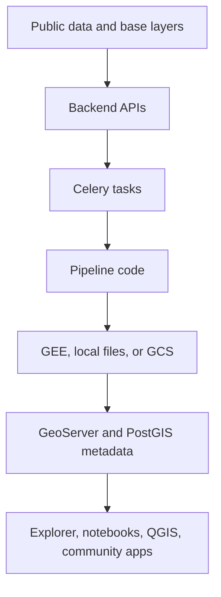

# Develop CoRE Stack

This section is for people who want to build with CoRE Stack, not only read about it.

Start here if you want to install the backend, understand what data is available, trace how a computation runs, or add a new pipeline without getting lost in the older long-form notes.

## Quick Guide

1. [Install the backend](installer.md) and run Django locally.
2. Read the [Backend Code Map](backend-code-map.md) so you know which scripts/functions to look for, in your repo.
3. Move into [Build Pipelines](../pipelines/index.md) when you are ready to run or extend computations.
4. Keep [Troubleshooting](setup-troubleshooting.md) and [Coding Standards](coding-standards-and-guidelines.md) open while you work.

## What You Are Building On

CoRE Stack is a public geospatial computation stack. It brings together micro-watersheds, administrative boundaries, public datasets, satellite-derived layers, Earth Engine computation, GeoServer publication, and API access.

For developers, the important idea is simple: a pipeline takes a place and some parameters, computes a geospatial product, stores its metadata, and publishes it so dashboards, notebooks, QGIS projects, and community platforms can use it.

## Current Backend Reference

The main source repository is [core-stack-org/core-stack-backend](https://github.com/core-stack-org/core-stack-backend).

The developer docs in this section are grounded in the current backend structure:

- `nrm_app/urls.py` mounts the Django API apps under `/api/v1/`.
- `computing/urls.py` lists computation API paths.
- `computing/api.py` keeps HTTP handlers thin and usually queues Celery tasks.
- `computing/` contains the actual geospatial pipeline modules.
- `utilities/gee_utils.py` handles Earth Engine, GCS, asset paths, exports, and task polling.
- `computing/utils.py` handles GeoServer publication and layer metadata bookkeeping.

That is the map to keep in mind while reading the rest of this section.
