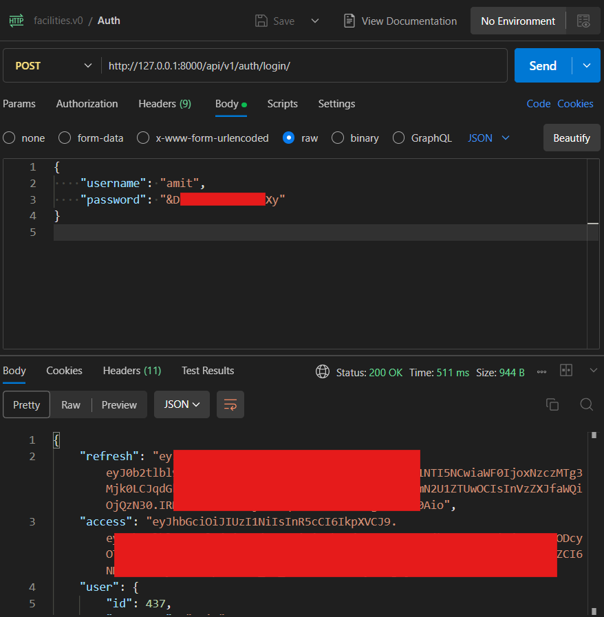

# Installer

Choose how you want to run the backend:

- **Native (Linux)** — uses the backend installer on Ubuntu or WSL2. It sets up Python, PostgreSQL, RabbitMQ, the runtime `.env`, migrations, seed data, optional Earth Engine credentials, admin-boundary data, and the built-in initialization check.
- **Docker** — runs the application and GeoServer in containers. Best when you want a pre-built runtime without installing dependencies on the host.

Optional integrations (GEE, GCS, GeoServer) are Steps 4–6 above. Installer flags and troubleshooting are documented below.

## Installation

Both paths use the **same backend installer** (`installation/install.sh` in [core-stack-backend](https://github.com/core-stack-org/core-stack-backend)) for configuration, credentials, and the API test user. Steps 1–8 below match between native and Docker; only Step 3 (how the runtime is provisioned) and Step 8 (where you run processes) differ.

| Step | What you do |
| --- | --- |
| 1 | Prerequisites |
| 2 | Clone the backend repository |
| 3 | Provision the runtime — native full install **or** Docker containers |
| 4 | GEE service account JSON key (optional) |
| 5 | GCS bucket (optional) |
| 6 | GeoServer (optional) |
| 7 | Data paths in `nrm_app/.env` |
| 8 | Start the runtime |
| 9 | [Log in and invoke APIs](#step-9-log-in-and-invoke-apis) (shared below) |

=== "Native (Linux)"

    #### Step 1 — Prerequisites

    - Ubuntu or another Linux environment. On Windows, use WSL2.
    - `sudo` access, internet access, Git.
    - Enough disk space for dependencies and the admin-boundary dataset.

    ```bash
    sudo apt update
    sudo apt install -y git wget curl build-essential libpq-dev unzip
    ```

    #### Step 2 — Clone the backend repository

    ```bash
    git clone https://github.com/core-stack-org/core-stack-backend.git
    cd core-stack-backend
    ```

    #### Step 3 — Provision the runtime

    Run the full backend installer from the repo root:

    ```bash
    cd installation
    chmod +x install.sh
    ./install.sh
    ```

    This creates the conda env, PostgreSQL, RabbitMQ, `nrm_app/.env`, migrations, seed data, the installer test user (`superuser` step), and optional integrations if you pass flags (for example `--gee-json`).

    Review `nrm_app/.env` after the run. Do not create a competing repo-root `.env`.

    #### Step 4 — GEE service account JSON key

    Skip if you already passed `--gee-json` during Step 3.

    1. Create and download a [Google Cloud service account JSON key](integrations/google-earth-engine.md#step-1-configure-google-cloud-for-earth-engine) with Earth Engine access.
    2. Import it into the backend:

    ```bash
    bash installation/install.sh \
      --only gee_configuration \
      --gee-json /full/path/to/service-account.json
    ```

    #### Step 5 — GCS bucket

    Skip if you do not need GEE-backed raster publication yet.

    Create a bucket in `us-central1` and grant IAM to the **same** service account as Step 4. See [Google Cloud Storage — bucket setup](integrations/gcs.md#current-bucket-assumptions) and [Required IAM](integrations/gcs.md#required-iam-for-the-current-backend).

    ```bash
    bash installation/install.sh \
      --only gcs_bucket_configuration \
      --input gcs_bucket_name=your-gcs-bucket
    ```

    #### Step 6 — GeoServer

    Skip if GeoServer was configured during Step 3. Otherwise register your instance:

    ```bash
    bash installation/install.sh \
      --only initialisation_check \
      --input geoserver_url=https://host/geoserver \
      --input geoserver_username=admin \
      --input geoserver_password=your-password
    ```

    For Docker + container GeoServer, use `http://geoserver:8080/geoserver` from inside the app container, or see the Docker tab Step 6.

    #### Step 7 — Data paths in `nrm_app/.env`

    The installer sets paths in `nrm_app/.env`. Confirm they match your layout:

    - **`DATA_DIR`** — source and working data used by pipelines (inputs to generate other layers).
    - **`EXCEL_DIR`** / **`EXCEL_PATH`** — exported spreadsheet outputs.

    On native Linux these usually sit under the backend tree (for example `$BACKEND_DIR/data/...`). Only edit `nrm_app/.env` if the installer defaults are wrong for your machine.

    #### Step 8 — Start the runtime

    From `core-stack-backend`, use two terminals.

    **Terminal 1 — Django:**

    ```bash
    conda activate corestackenv
    python manage.py runserver
    ```

    **Terminal 2 — Celery** (required for computing APIs):

    ```bash
    conda activate corestackenv
    celery -A nrm_app worker -l info -Q nrm
    ```

    **Access (native):**

    | Service | URL |
    | --- | --- |
    | API / docs | `http://127.0.0.1:8000/` |
    | Django admin | `http://127.0.0.1:8000/admin/` |

    Django admin can use the same installer test user as the API, or run `python manage.py createsuperuser` for a separate admin account.

=== "Docker"

    Follow steps in order. Steps 4–7 use the same `installation/install.sh` commands as native, run **inside** the CoRE Stack container.

    #### Step 1 — Prerequisites

    - Docker Engine, Git, internet access.
    - Enough disk space for images and data.

    #### Step 2 — Clone the backend repository

    ```bash
    git clone https://github.com/core-stack-org/core-stack-backend.git
    ```

    Use the clone directory as the host path in Step 3 (example: `~/dev/docker` if you clone there).

    #### Step 3 — Provision the runtime

    **Pull image and create network:**

    ```bash
    docker pull kapildadheechgv/core-stack-dev:latest
    docker network create corestack-network
    ```

    **Start CoRE Stack** — mount the **codebase** only (`install.sh`, `nrm_app/.env`, service account JSON). Pipeline data (inputs and exports) lives under `/root/core-stack-data` inside the image, not in this mount.

    ```bash
    docker run -dit \
      --name core-stack \
      --network corestack-network \
      -p 9000:80 \
      -p 9001:8000 \
      -v ~/dev/docker:/core-stack-backend \
      kapildadheechgv/core-stack-dev:latest
    ```

    Replace `~/dev/docker` with your clone path from Step 2.

    **Start GeoServer:**

    ```bash
    docker run -dit \
      --name geoserver \
      --network corestack-network \
      -p 8080:8080 \
      docker.osgeo.org/geoserver:2.28.0
    ```

    **Prepare the backend inside the container:**

    ```bash
    docker exec -it core-stack bash
    sudo service postgresql start
    cd /core-stack-backend
    bash installation/install.sh --only env_file,superuser
    ```

    #### Step 4 — GEE service account JSON key

    1. Create and download a [Google Cloud service account JSON key](integrations/google-earth-engine.md#step-1-configure-google-cloud-for-earth-engine).
    2. Copy it into the mounted backend directory (host or container path):

    ```bash
    docker cp /path/on/host/service-account.json core-stack:/core-stack-backend/
    ```

    3. Inside the container:

    ```bash
    bash installation/install.sh \
      --only gee_configuration \
      --gee-json /core-stack-backend/service-account.json
    ```

    Use your real filename in place of `service-account.json`.

    #### Step 5 — GCS bucket

    Same command as native. Inside the container:

    ```bash
    bash installation/install.sh \
      --only gcs_bucket_configuration \
      --input gcs_bucket_name=your-gcs-bucket
    ```

    See [Google Cloud Storage — bucket setup](integrations/gcs.md#current-bucket-assumptions) and [Required IAM](integrations/gcs.md#required-iam-for-the-current-backend).

    #### Step 6 — GeoServer

    Inside the container:

    ```bash
    bash installation/install.sh \
      --geoserver-config http://geoserver:8080/geoserver,admin,geoserver
    ```

    #### Step 7 — Data paths in `nrm_app/.env`

    Paths are already set under `/root/core-stack-data` in the image. Step 3 (`env_file`) should write these into `nrm_app/.env`. Only if they are missing or wrong, set:

    ```env
    DATA_DIR=/root/core-stack-data
    EXCEL_DIR=/root/core-stack-data/excel_files
    EXCEL_PATH=/root/core-stack-data/excel_files
    ```

    - **`DATA_DIR`** — source and working data for pipelines.
    - **`EXCEL_DIR`** / **`EXCEL_PATH`** — exported spreadsheet outputs.

    No need to create directories manually.

    #### Step 8 — Start the runtime

    Inside the container (or separate `docker exec` sessions):

    **Terminal 1 — Django:**

    ```bash
    docker exec -it core-stack bash
    conda activate corestackenv
    cd /core-stack-backend
    python manage.py runserver 0.0.0.0:8000
    ```

    **Terminal 2 — Celery:**

    ```bash
    docker exec -it core-stack bash
    conda activate corestackenv
    cd /core-stack-backend
    celery -A nrm_app worker -l info -Q nrm
    ```

    **Access (Docker on host):**

    | Service | URL |
    | --- | --- |
    | Web | `http://127.0.0.1:9000/` |
    | API / docs | `http://127.0.0.1:9001/` |
    | Django admin | `http://127.0.0.1:9001/admin/` |
    | GeoServer admin | `http://127.0.0.1:8080/geoserver` |

### Step 9 — Log in and invoke APIs { #step-9-log-in-and-invoke-apis }

Same flow for **native** and **Docker**. Computing APIs use **JWT bearer tokens**, not the Django admin session.

**Base URL**

| Install | `base_url` for API calls |
| --- | --- |
| Native | `http://127.0.0.1:8000` |
| Docker | `http://127.0.0.1:9001` |

**1. Installer test user**

Created by the `superuser` installer step (full native install, or Docker Step 3). To recreate:

```bash
bash installation/install.sh --only superuser
```

Note the log line `Installer test superuser ... username=test_user_XXXX` and password `test_change_me`.

**2. Log in (JWT)**

```bash
curl -s -X POST http://127.0.0.1:8000/api/v1/auth/login/ \
  -H "Content-Type: application/json" \
  -d '{"username":"test_user_4272","password":"test_change_me"}'
```

On Docker, replace the host with `http://127.0.0.1:9001`. The response includes `access` (use on API calls), `refresh`, and `user`.

**3. Get `gee_account_id`**

Most computing `POST` bodies need a `gee_account_id`. List configured Earth Engine accounts (requires a valid JWT from step 2):

```bash
curl -s http://127.0.0.1:8000/api/v1/geeaccounts/ \
  -H "Authorization: Bearer <access-token>"
```

On Docker, use `http://127.0.0.1:9001` as the host. Use the numeric `id` from the response. If the list is empty, complete Step 4 in the Native or Docker tab above, or see [Google Earth Engine](integrations/google-earth-engine.md).

**4. Call a computing API**

Keep **Django and Celery running** (Step 8). Example:

```bash
curl -X POST http://127.0.0.1:8000/api/v1/lulc_for_tehsil/ \
  -H "Authorization: Bearer <access-token>" \
  -H "Content-Type: application/json" \
  -d '{
    "state": "karnataka",
    "district": "raichur",
    "block": "devadurga",
    "start_year": 2022,
    "end_year": 2023,
    "gee_account_id": 1
  }'
```

More routes: [Computing API Endpoints](../pipelines/computing-endpoints.md) and [First manual run](../pipelines/index.md#first-manual-run). Auth errors: [API Errors](../reference/api-errors.md).

**5. Postman**

Import from this docs repository:

| Asset | File |
| --- | --- |
| Collection | [core-stack-api.postman_collection.json](../assets/postman/core-stack-api.postman_collection.json) |
| Environment (native) | [core-stack-local.postman_environment.json](../assets/postman/core-stack-local.postman_environment.json) |
| Environment (Docker) | [core-stack-docker.postman_environment.json](../assets/postman/core-stack-docker.postman_environment.json) |

Run requests in order:

| Order | Request | Purpose |
| --- | --- | --- |
| 1 | **Auth — Login** | `POST /api/v1/auth/login/` → saves JWT `access` |
| 2 | **GEE — List accounts** | `GET /api/v1/geeaccounts/` → read `gee_account_id` |
| 3 | **Computing — LULC for tehsil** | Sample `POST`; needs Celery on queue `nrm` |



## Useful installer controls

```bash
# Show exact step names
bash installation/install.sh --list-steps

# Rebuild only nrm_app/.env
bash installation/install.sh --only env_file

# Rerun only backend validation
bash installation/install.sh --only initialisation_check

# Add Earth Engine credentials later
bash installation/install.sh \
  --only gee_configuration,initialisation_check \
  --gee-json /full/path/to/service-account.json

# Add GeoServer values later and validate
bash installation/install.sh \
  --only initialisation_check \
  --input geoserver_url=https://host/geoserver \
  --input geoserver_username=admin \
  --input geoserver_password=your-password

# Rerun the public API smoke test
bash installation/install.sh \
  --only public_api_check \
  --input public_api_key=your-public-api-key
```

Use `--only` for the smallest safe rerun. Use `--from STEP` when you deliberately want to rerun a step and everything after it.

## Optional inputs

The installer currently accepts:

- `gee_json`
- `public_api_key`
- `public_api_base_url`
- `geoserver_url`
- `geoserver_username`
- `geoserver_password`

`--gee-json PATH` is a shortcut for `--input gee_json=PATH`.

## After install

1. Read the [Backend Code Map](backend-code-map.md).
2. Complete [Step 9 — Log in and invoke APIs](#step-9-log-in-and-invoke-apis) if you have not already.
3. For integration deep-dives: [Integrations](integrations/index.md) (GEE, GCS, GeoServer).
4. Use [Troubleshooting](setup-troubleshooting.md) when the installer or runtime names a failing step.
