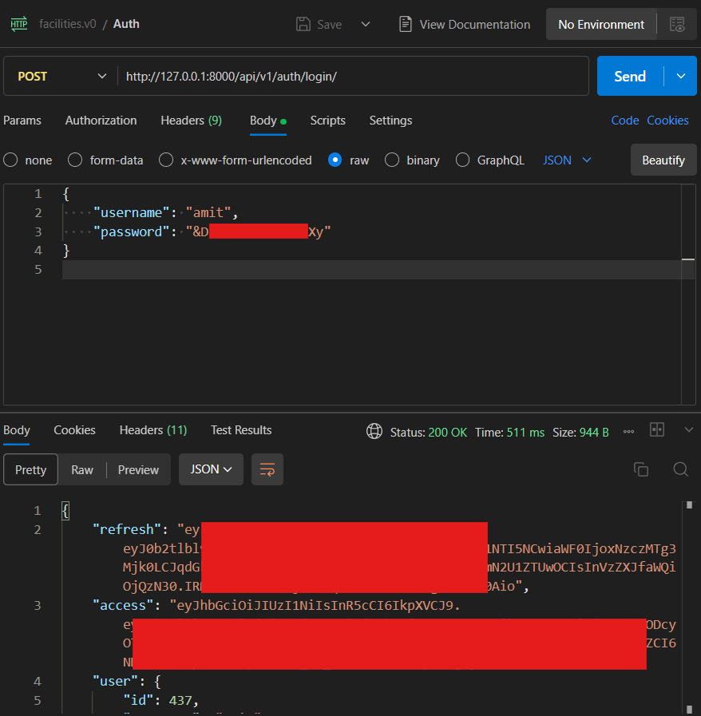

# Install CoRE Stack

This page gets the CoRE Stack backend running on your computer. You do not need to know Python, Docker, or geospatial software before you start. Each step says what you type, what it does, and what you should see when it worked.

When you finish, you can open the API in a browser at [http://127.0.0.1:8000/](http://127.0.0.1:8000/) and log in.

You install with **Docker**. That works on macOS, Windows, and Linux. Airflow, Google Earth Engine, and a GPU are **not** required for a first install. Those are later, optional steps. The full reference, including Airflow, is [Run with Docker](docker.md).

## What you are installing

CoRE Stack computes map layers (land cover, hydrology, and similar products) for a state, district, and block, then serves them over an API.

A normal install starts these pieces for you:

| Piece | Plain meaning | You will see it at |
| --- | --- | --- |
| **API** (Django) | The program that answers requests, such as “compute this layer”. | [http://127.0.0.1:8000/](http://127.0.0.1:8000/) |
| **Database** (PostgreSQL) | Stores users, settings, and layer records. | Not a web page. It uses port `5432`. |
| **Workers** (Celery) | Run the long compute jobs so the API can answer immediately. | Log output, not a web page. |
| **Map server** (GeoServer) | Publishes finished layers as maps. Docker starts this for you. | [http://127.0.0.1:8080/geoserver](http://127.0.0.1:8080/geoserver) |

`127.0.0.1` means “this computer”. Those addresses work only on the machine where you installed.

## Words used below

| Word | Meaning |
| --- | --- |
| **Terminal** | The text window where you type commands. On macOS open **Terminal**. On Ubuntu open **Terminal**. On Windows open **PowerShell** or **Git Bash**. |
| **Clone** | Download a copy of the code from GitHub onto your computer. |
| **Repository** | That copy of the code. The folder is named `core-stack-backend`. |
| **`.env` file** | A text file of settings and passwords. The backend reads `nrm_app/.env`. Do not commit it or share it. |
| **Container** | A packaged copy of a program, started by Docker. You do not install PostgreSQL, RabbitMQ, or GeoServer yourself. |
| **API** | A URL your tools call, instead of clicking a website. Example: `POST /api/v1/auth/login/`. |
| **Token** | A long password the API gives you after login. You send it on later calls. It is also called a JWT. |

## Before you start

You need:

- A computer with internet.
- About **20 GB** of free disk. More if you later download large map datasets.
- Permission to install software (administrator / `sudo` on Linux).

Open a terminal and check two tools. If a command prints a version number, that tool is already installed.

```bash
git --version
```

If Git is missing:

- macOS: install [Git](https://git-scm.com/downloads) or run `xcode-select --install`.
- Windows: install [Git for Windows](https://git-scm.com/download/win).
- Ubuntu:

```bash
sudo apt update
sudo apt install -y git
```

`sudo` asks for your computer password. Nothing is printed as you type it. That is normal.

---

## Install

Docker runs the database, the API, the workers, and GeoServer together. You do not install them one by one.

### 1. Install Docker

Install **Docker Desktop** and leave it running (the whale icon should be open):

- [macOS](https://docs.docker.com/desktop/setup/install/mac-install/)
- [Windows](https://docs.docker.com/desktop/setup/install/windows-install/) — Windows asks you to turn on WSL2. Accept that.
- [Linux](https://docs.docker.com/engine/install/) — install Docker Engine and the Compose plugin. Add your user to the `docker` group so you do not need `sudo` for every command, then **open a new terminal**.

Check that it works. This must print a version, and `docker ps` must not say “permission denied” or “cannot connect”:

```bash
docker compose version
docker ps
```

`docker ps` with an empty table is success. It means Docker is running and you have no containers yet.

### 2. Download the code

```bash
git clone https://github.com/core-stack-org/core-stack-backend.git
cd core-stack-backend
```

`git clone` creates a folder named `core-stack-backend`. `cd` moves into it. Every later command in this section assumes you are inside that folder. Check with:

```bash
pwd
```

The path should end in `core-stack-backend`.

### 3. Create the settings file

```bash
cp installation/docker/env.template nrm_app/.env
```

This copies a template of settings into `nrm_app/.env`. On macOS or Linux, lock the file so other users on the machine cannot read the passwords:

```bash
chmod 600 nrm_app/.env
```

On Windows PowerShell, `chmod` does not exist. Skip that line, or run it in Git Bash.

Open `nrm_app/.env` in any text editor. Find these three lines and replace the placeholders with a username, email, and password you will remember:

```dotenv
DJANGO_SUPERUSER_USERNAME=admin
DJANGO_SUPERUSER_EMAIL=you@example.com
DJANGO_SUPERUSER_PASSWORD='choose-a-password'
```

Keep the single quotes around the password if it contains `$` or spaces.

Leave `LAYER_GENERATION_SYNC_MODE=False`. That means compute jobs run in the background. You do not need Airflow for this.

Save the file.

!!! warning
    Change `DB_PASSWORD` and `GEOSERVER_PASSWORD` in the same file before you install on a shared or public server. For a try-out on your own laptop, the template values are enough.

### 4. Start it

From the `core-stack-backend` folder:

```bash
docker compose --env-file nrm_app/.env up -d --build
```

What this does:

- `--env-file nrm_app/.env` tells Docker to read your settings. Compose does not find that file on its own, so keep this flag on every `docker compose` command.
- `--build` builds the backend image the first time.
- `-d` runs it in the background so you get your terminal back.
- The first run downloads images and an admin-boundary archive (about 600 MB). It often takes **5 to 60 minutes**. If it stops halfway, run the same command again.

### 5. Check that it started

```bash
docker compose --env-file nrm_app/.env ps -a
```

You want:

- These one-time jobs to show **Exited (0)**: `app-init`, `database-init`, `geoserver-init`, `data-download`, `gee-config`, `tehsil-watershed-setup`. Exit code `0` means the job finished without an error.
- These to show **Up** or **Up (healthy)**: `backend`, `postgres`, `redis`, `geoserver`, and the `celery-*` workers.

If a row shows a different exit code, read its log (replace the name with the failing service):

```bash
docker compose --env-file nrm_app/.env logs backend
```

Then see [If something fails](#if-something-fails).

### 6. Open it in a browser

| What | Address | Login |
| --- | --- | --- |
| API | [http://127.0.0.1:8000/](http://127.0.0.1:8000/) | No login to see that the server is up |
| Admin site | [http://127.0.0.1:8000/admin/](http://127.0.0.1:8000/admin/) | The username and password you set in `nrm_app/.env` |
| GeoServer | [http://127.0.0.1:8080/geoserver](http://127.0.0.1:8080/geoserver) | Username `admin`, password from `GEOSERVER_PASSWORD` in `nrm_app/.env` |

If the admin page loads, the install worked. Continue at [Log in and call an API](#log-in-and-call-an-api).

The rest of the Docker page — Airflow, Earth Engine, large datasets, GPU jobs — is optional. Read it when you need it: [Run with Docker](docker.md).

## Log in and call an API

The admin website and the computing API use different logins:

- The **admin site** uses a browser session.
- **Computing APIs** use a token. You get the token by calling the login URL.

Use the username and password you set in `nrm_app/.env` (`DJANGO_SUPERUSER_USERNAME` and `DJANGO_SUPERUSER_PASSWORD`).

### 1. Log in

Replace the username and password, then run:

```bash
curl -s -X POST http://127.0.0.1:8000/api/v1/auth/login/ \
  -H "Content-Type: application/json" \
  -d '{"username":"admin","password":"choose-a-password"}'
```

`curl` is a command that sends a web request. `-X POST` sends data. The JSON body is the username and password.

A successful reply is one JSON object with three fields:

- `access` — the token. Copy this. You will paste it into the next commands.
- `refresh` — used later to get a new `access` token.
- `user` — your account.

If you see `Connection refused`, the API is not running. Recheck step 5.

### 2. Call a computing API

Replace `<access-token>` with the `access` value. Do not include the quote marks from the JSON.

```bash
curl -X POST http://127.0.0.1:8000/api/v1/lulc_for_tehsil/ \
  -H "Authorization: Bearer <access-token>" \
  -H "Content-Type: application/json" \
  -d '{
    "state": "karnataka",
    "district": "raichur",
    "block": "devadurga",
    "start_year": 2022,
    "end_year": 2023,
    "gee_account_id": 1
  }'
```

`Authorization: Bearer ...` is how you show the token.

With the default settings, the reply is a short message that the job was `initiated`. The worker runs it in the background. Watch progress with:

```bash
docker compose --env-file nrm_app/.env logs -f celery-nrm
```

`gee_account_id` is the Earth Engine account stored in the database. A first install often has **no** Earth Engine account yet. Local-only jobs can run without it. Jobs that call Google Earth Engine need the optional setup below. If the API says the account was not found, that is expected until you add one.

More example calls: [Computing API Endpoints](../pipelines/computing-endpoints.md). Login errors: [API Errors](../reference/api-errors.md).

### 3. Or use Postman

[Postman](https://www.postman.com/downloads/) is a desktop app for the same calls, without writing `curl`.

| File | Use |
| --- | --- |
| [Collection](../assets/postman/core-stack-api.postman_collection.json) | The requests |
| [Environment](../assets/postman/core-stack-docker.postman_environment.json) | Local Docker install |

Import the collection and one environment. Then run, in order: **Auth — Login**, **GEE — List accounts**, **Computing — LULC for tehsil**.



## You can skip these until you need them

| Skip for now | Add it when |
| --- | --- |
| [Google Earth Engine](integrations/google-earth-engine.md) | A job must run on Google’s servers, or the API asks for `gee_account_id` and you have no account. |
| [Google Cloud Storage](integrations/gcs.md) | You publish rasters that Earth Engine exports to a bucket. |
| [Airflow](docker.md#part-1-with-airflow-sync) | You want a scheduled graph of many layers, instead of one API call at a time. |
| [GPU / long jobs](docker.md#gpu-and-long-jobs) | You run runoff, ET download, or pan-India hydrology. |

GeoServer is already started for you at [http://127.0.0.1:8080/geoserver](http://127.0.0.1:8080/geoserver). Downloaded and generated files go under `data/` in the repository, or under `CORESTACK_HOST_DATA_DIR` if you set that before the first start.

### Earth Engine later

1. Create a [Google Cloud service account JSON key](integrations/google-earth-engine.md#step-1-configure-google-cloud-for-earth-engine) with Earth Engine access.
2. Upload that JSON in the admin site at [http://127.0.0.1:8000/admin/gee_computing/geeaccount/add/](http://127.0.0.1:8000/admin/gee_computing/geeaccount/add/).
3. Set `GEE_DEFAULT_ACCOUNT_ID` to the number in the page address.

Details: [Google Earth Engine on Docker](docker.md#gee-and-gcs).

## If something fails

| What you see | What to try |
| --- | --- |
| `docker: command not found` | Docker is not installed, or the terminal was opened before install. Install Docker, then open a new terminal. |
| `permission denied` on `docker` | On Linux, add your user to the `docker` group and open a new terminal. On macOS/Windows, start Docker Desktop. |
| `port is already allocated` | Something else is using port 8000, 8080, or 5432. Stop that program, or change `BACKEND_PORT`, `GEOSERVER_PORT`, or `POSTGRES_PORT` in `nrm_app/.env` and start again. |
| Browser cannot open the API | The stack is still on its first start, or `backend` is not `Up`. Run the `ps -a` command in step 5. |
| Login returns an error about credentials | Use the username and password from `nrm_app/.env`. |
| API says `initiated` and then nothing happens | The worker is not running. Check that `celery-nrm` is `Up`. |

Longer tables: [Setup troubleshooting](setup-troubleshooting.md) and [Docker troubleshooting](docker.md#troubleshooting).

## Commands you will reuse

Run these from `core-stack-backend`:

```bash
docker compose --env-file nrm_app/.env ps
docker compose --env-file nrm_app/.env logs -f backend
docker compose --env-file nrm_app/.env stop
docker compose --env-file nrm_app/.env up -d
```

`stop` pauses the stack and keeps your database. `up -d` starts it again.

!!! warning
    `docker compose --env-file nrm_app/.env down -v` deletes the database, GeoServer catalog, and Redis data. Files in the `data/` folder on your computer stay.

## What to read next

1. [Backend code map](backend-code-map.md) — where the Python lives.
2. [Build pipelines](../pipelines/index.md) — run or add a computation.
3. [Docker reference](docker.md) — Airflow, datasets, GPU, and every setting.
