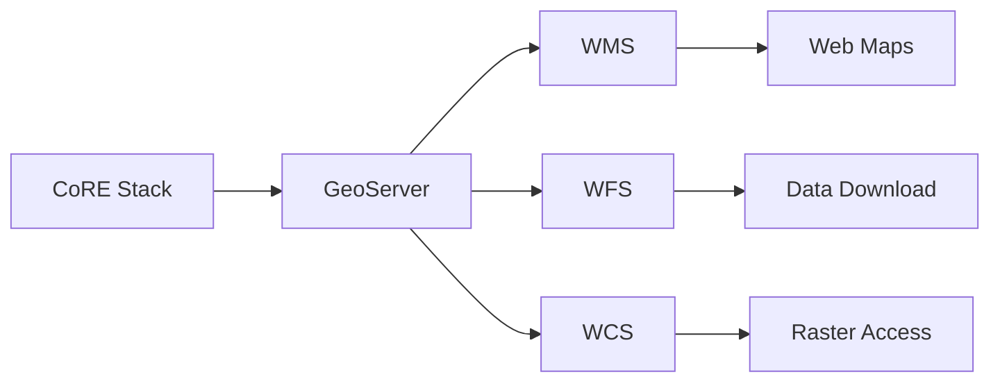

# GeoServer Integration

CoRE Stack can publish geospatial layers to GeoServer for visualization and OGC services.

---

## Overview



---

## Configuration

```python
# nrm_app/settings.py
GEOSERVER_URL = "http://localhost:8080/geoserver"
GEOSERVER_USER = "admin"
GEOSERVER_PASSWORD = "geoserver"
```

---

## Backend Implementation

```python
# computing/utils.py
# Reference: Geoserver class
# Used by: generate_layer_in_order, upload_kml

class Geoserver:
    """
    GeoServer integration utility.
    Located at: computing/utils.py
    """
```

---

## Publishing Layers

Layers are automatically published after computation:

```python
# After SWB generation
Geoserver.publish(
    workspace="corestack",
    layer_name="swb_karnataka_raichur",
    file_path="/path/to/output.geojson"
)
```

---

## See Also

- [Public API References](../../api/public-endpoints.md)
- [Computing API Endpoints](../../api/computing-endpoints.md)
- [Develop Computation Pipelines](../../pipelines/index.md)
