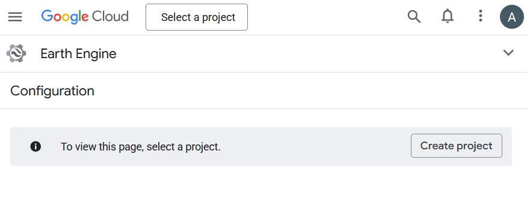
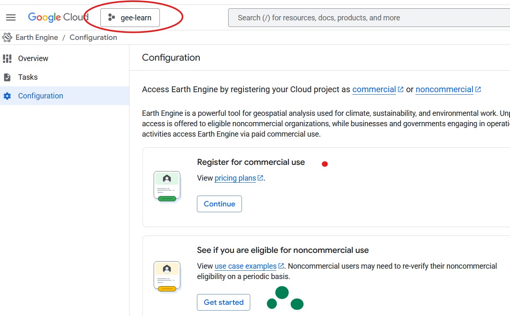
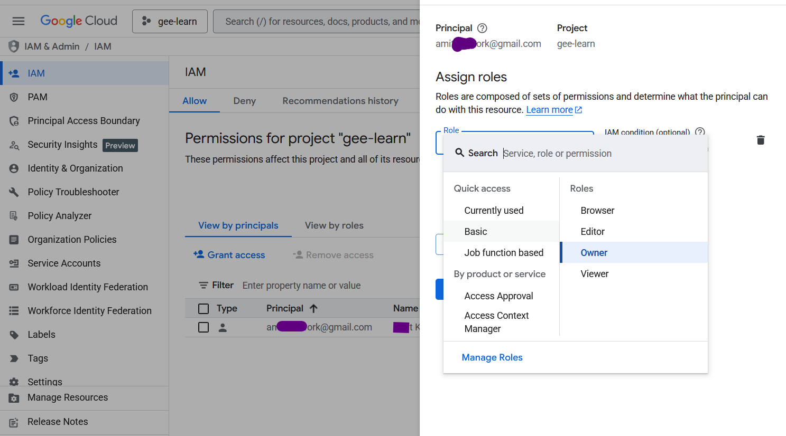
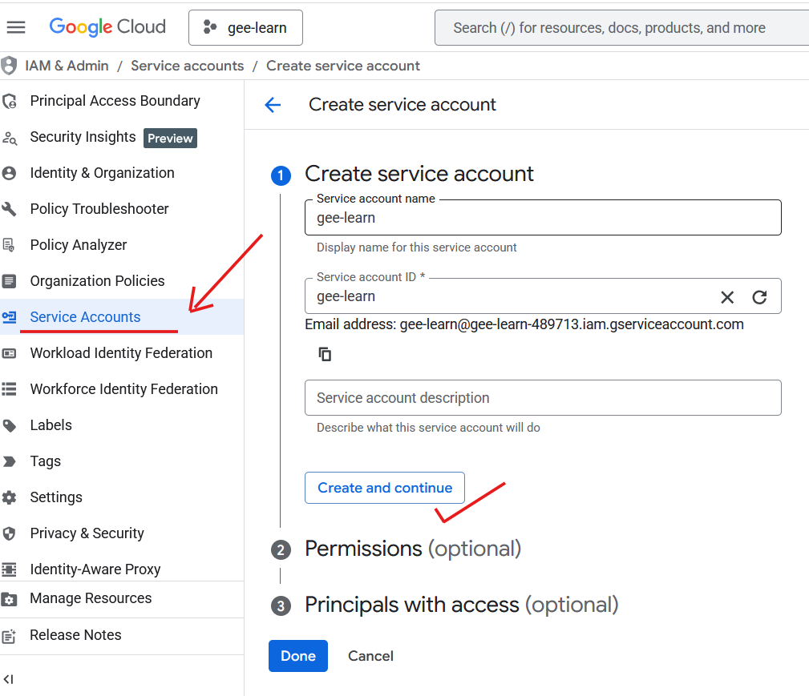
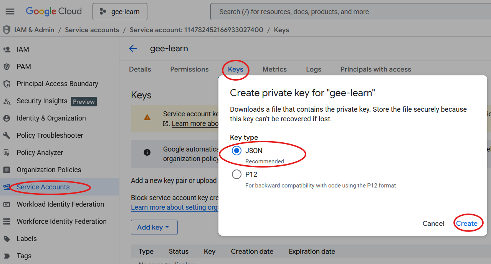
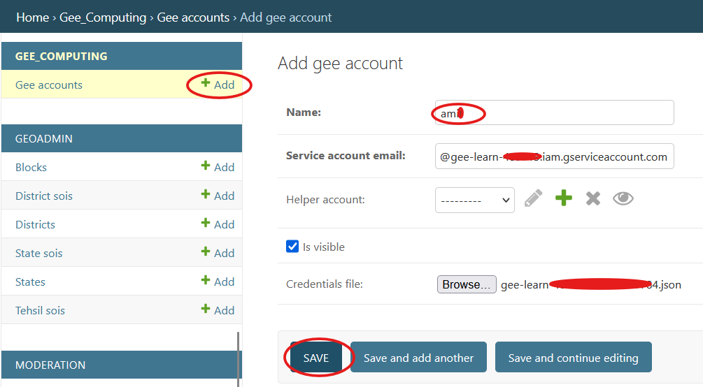

# Google Earth Engine

Google Earth Engine is not an optional edge integration in the current CoRE Stack backend.
Most computing pipelines, several authenticated compute APIs, and some publication flows depend on a valid backend-side `GEEAccount`.

If you see `gee_account_id` in pipeline docs, API examples, or direct Python calls, it refers to a Django `GEEAccount` record backed by a Google Cloud service account that has Earth Engine access.

!!! warning
    For the current backend, you should assume GEE setup is required before trying to run most computing pipelines end-to-end. Without it, many local and queued compute paths will fail during `ee_initialize(...)`.

If the shared JSON key is not available during your first install, you can still finish the base backend setup and come back later with a targeted rerun:

```bash
bash installation/install.sh \
  --only gee_configuration,initialisation_check \
  --gee-json /full/path/to/service-account.json
```

---

## What You Need Before Running GEE-Backed Pipelines

Set up these pieces in order:

1. a Google Cloud project with Earth Engine enabled
2. a service account with the required Earth Engine permissions
3. a downloaded JSON key for that service account
4. a Google Cloud Storage bucket in `us-central1`, with read/write access for that same service account
5. a Django `GEEAccount` entry, usually created through the installer or admin
6. a usable `gee_account_id` for API calls, Celery tasks, and shell runs

!!! important
    Some current backend import paths call `ee.Image.loadGeoTIFF()` through the GCS bridge in `utilities/gee_utils.py`. For those paths, the bucket used by `GCS_BUCKET_NAME` should be created in `us-central1`, not an arbitrary region. The bucket-side details live in [Google Cloud Storage](gcs.md).

---

## Step 1: Configure Google Cloud For Earth Engine

1. Go to the Google Cloud Earth Engine configuration page:
   [`https://console.cloud.google.com/earth-engine/configuration`](https://console.cloud.google.com/earth-engine/configuration)
2. Create a new Google Cloud project, or select an existing one.

   

3. Register that project for Earth Engine use.

   

4. Review IAM permissions and make sure the account you are using can manage the project and service accounts.

   

5. Create a service account in that project.

   

6. Create a JSON key for that service account and download it.

   

The downloaded file will look something like `<project-name>-12345-356644b54.json`.

!!! warning
    Save the JSON key securely. It grants access to your cloud resources. Do not commit it to git, do not place it under `docs/`, and do not share it in issues or chat logs.

---

## Step 2: Import The Credentials Into The Backend

### Option A: Let The Installer Do It

This is now the fastest and most aligned path.

Run the installer with the JSON path:

```bash
bash installation/install.sh \
  --only gee_configuration,initialisation_check \
  --gee-json /full/path/to/service-account.json
```

You can also use the generic input style:

```bash
bash installation/install.sh \
  --only gee_configuration,initialisation_check \
  --input gee_json=/full/path/to/service-account.json
```

What the current installer does during `gee_configuration`:

- stages the JSON file into `data/gee_confs/`
- creates or updates a Django `GEEAccount`
- sets `GEE_DEFAULT_ACCOUNT_ID` and `GEE_HELPER_ACCOUNT_ID` in `nrm_app/.env`
- sets the key-path variables such as `GEE_SERVICE_ACCOUNT_KEY_PATH`
- marks later validation as GEE-required so the initialization test fails fast on missing GEE readiness

### Option B: Create The `GEEAccount` In Django Admin

Use this path if you skipped the installer GEE step or want to inspect the account manually.

1. Open the Django admin add form for GEE accounts:
   `http://127.0.0.1:8000/admin/gee_computing/geeaccount/add/`
2. Fill in:
   - **Name:** a recognizable label such as `production` or `local-gee-account`
   - **Service Account Email:** the email from the JSON key, such as `name@project-id.iam.gserviceaccount.com`
   - **Helper Account:** leave blank unless you already know you need another stored helper account
   - **Is Visible:** usually enabled
   - **Credentials File:** upload the downloaded service account JSON key

   

3. Save the record.
4. After creation, copy the numeric account ID from the URL.
   - Example URL: `http://127.0.0.1:8000/admin/gee_computing/geeaccount/21/change/`
   - In this case, the `gee_account_id` is `21`

If you use the admin path instead of the installer path, also make sure `nrm_app/.env` points to the correct default IDs when your workflow relies on default account lookup:

- `GEE_DEFAULT_ACCOUNT_ID`
- `GEE_HELPER_ACCOUNT_ID`

---

## Step 3: Verify GEE And GCS Readiness

The current backend validation is stricter than just “can Earth Engine authenticate”.

`computing/misc/internal_api_initialisation_test.py` checks:

- `GEE_DEFAULT_ACCOUNT_ID` and `GEE_HELPER_ACCOUNT_ID`
- Earth Engine authentication through `probe_gee_connection(...)`
- Google Cloud Storage upload access through `probe_gcs_upload_access(...)`
- the first authenticated computing API once GEE, GCS, GeoServer, and admin-boundary data are all ready

Rerun it explicitly when you want a GEE-focused answer:

```bash
source "$HOME/miniconda3/etc/profile.d/conda.sh"
conda activate corestackenv
cd /path/to/core-stack-backend
python computing/misc/internal_api_initialisation_test.py --require-gee
```

Interpret the most important result names like this:

- `gee-probe`: Earth Engine authentication succeeded or failed
- `gcs-upload-probe`: the same service account could or could not write to the configured GCS bucket
- `first-computing-api`: the backend could or could not execute `POST /api/v1/generate_block_layer/` with GEE in Celery eager mode
- `setup-next-step`: the exact next fix the script thinks you should make

If `gcs-upload-probe` fails, Earth Engine auth alone is not enough. The current first computing API uploads shapefile parts to Google Cloud Storage before importing them into Earth Engine.

For the bucket region, IAM, and backend-side GCS usage patterns, continue into [Google Cloud Storage](gcs.md).

---

## Step 4: Use `gee_account_id` When Running Pipelines

Once the Django record exists, the ID becomes part of normal compute execution.

Example API body:

```json
{
  "state": "karnataka",
  "district": "raichur",
  "block": "devadurga",
  "gee_account_id": 21
}
```

Example direct Python usage:

```python
generate_facilities_proximity("Odisha", "Koraput", "Jaypur", gee_account_id=21)
```

You will see this parameter throughout the docs because many handlers pass the GEE credential context into Celery-backed pipeline code.

!!! note
    Some backend paths can fall back to `GEE_DEFAULT_ACCOUNT_ID`, but explicit `gee_account_id` values are still the safest choice when you are manually testing a pipeline or API path.

---

## Where GEE Is Wired In The Backend

The main helper module is:

- [utilities/gee_utils.py](https://github.com/core-stack-org/core-stack-backend/blob/main/utilities/gee_utils.py#L30-L219)

Key responsibilities there:

- initialize Earth Engine from stored credentials
- initialize Google Cloud Storage access
- validate and build asset paths
- poll task status
- create asset folders

Many compute handlers accept a `gee_account_id` parameter and pass it into Celery-backed pipeline tasks.

Examples:

- hydrology handlers in [computing/api.py](https://github.com/core-stack-org/core-stack-backend/blob/main/computing/api.py#L218-L279)
- LULC handlers in [computing/api.py](https://github.com/core-stack-org/core-stack-backend/blob/main/computing/api.py#L280-L455)
- SWB handler in [computing/api.py](https://github.com/core-stack-org/core-stack-backend/blob/main/computing/api.py#L485-L512)

The public API also uses Earth Engine for spatial lookups:

- admin lookup by coordinates in [public_api/views.py](https://github.com/core-stack-org/core-stack-backend/blob/main/public_api/views.py#L117-L177)
- report and MWS lookup helpers in [public_api/views.py](https://github.com/core-stack-org/core-stack-backend/blob/main/public_api/views.py#L378-L409)

---

## Related Docs

- [Google Cloud Storage](gcs.md)
- [Installer](../installer.md)
- [Build Pipelines](../../pipelines/index.md#first-manual-run)
- [Pipeline Patterns](../../pipelines/index.md#pipeline-patterns)
