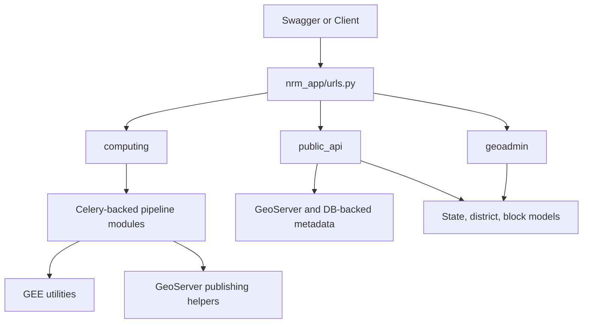
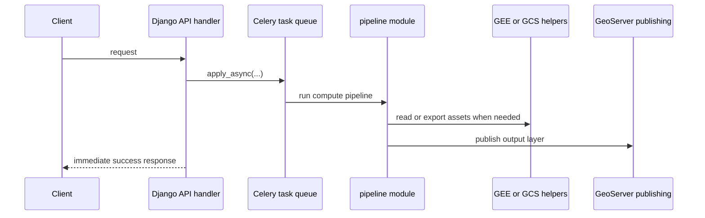
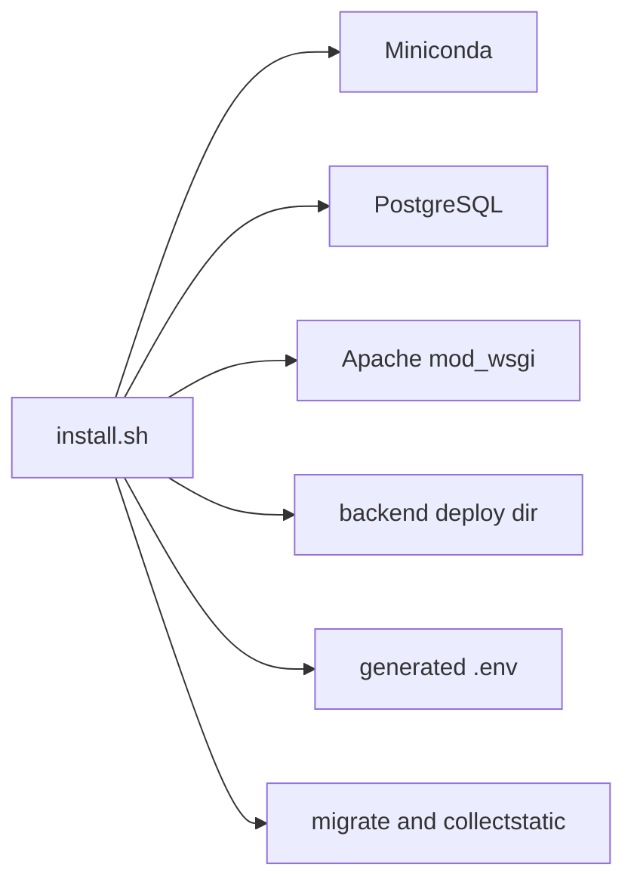

# System Architecture

This page explains the current backend architecture as implemented in `core-stack-backend`, with links into the actual source files.

---

## Request Routing

The top-level Django router is [nrm_app/urls.py](https://github.com/core-stack-org/core-stack-backend/blob/main/nrm_app/urls.py#L39-L66). It wires:

- auth-free geographic discovery routes from [geoadmin/urls.py](https://github.com/core-stack-org/core-stack-backend/blob/main/geoadmin/urls.py#L5-L12)
- API-key public-data routes from [public_api/urls.py](https://github.com/core-stack-org/core-stack-backend/blob/main/public_api/urls.py#L4-L34)
- compute submission routes from [computing/urls.py](https://github.com/core-stack-org/core-stack-backend/blob/main/computing/urls.py#L7-L183)
- Swagger and ReDoc from [nrm_app/urls.py](https://github.com/core-stack-org/core-stack-backend/blob/main/nrm_app/urls.py#L56-L66)

---

## Runtime Layers

---

## What Each App Does

### `geoadmin`

- Implements auth-free location discovery in [geoadmin/api.py](https://github.com/core-stack-org/core-stack-backend/blob/main/geoadmin/api.py#L21-L79)
- Backs state, district, and block lookup flows used before heavier computation

### `public_api`

- Exposes public-data lookups in [public_api/api.py](https://github.com/core-stack-org/core-stack-backend/blob/main/public_api/api.py#L43-L487)
- Builds layer download metadata in [public_api/views.py](https://github.com/core-stack-org/core-stack-backend/blob/main/public_api/views.py#L56-L114)
- Fetches MWS and village geometries from GeoServer in [public_api/views.py](https://github.com/core-stack-org/core-stack-backend/blob/main/public_api/views.py#L378-L519)

### `computing`

- Declares the backend compute surface in [computing/urls.py](https://github.com/core-stack-org/core-stack-backend/blob/main/computing/urls.py#L7-L183)
- Queues SWB, LULC, hydrology, terrain, and other tasks from [computing/api.py](https://github.com/core-stack-org/core-stack-backend/blob/main/computing/api.py#L76-L560)
- Publishes vector and raster outputs toward GeoServer via [computing/utils.py](https://github.com/core-stack-org/core-stack-backend/blob/main/computing/utils.py#L67-L190)

### `utilities`

- Handles auth mode parsing and headers in [utilities/auth_check_decorator.py](https://github.com/core-stack-org/core-stack-backend/blob/main/utilities/auth_check_decorator.py#L22-L176)
- Handles Earth Engine initialization, task polling, and asset path helpers in [utilities/gee_utils.py](https://github.com/core-stack-org/core-stack-backend/blob/main/utilities/gee_utils.py#L30-L219)

!!! note
    In operational terms, this means most compute deployments need a configured Django `GEEAccount` before pipeline execution will work reliably. The setup flow is documented in [Google Earth Engine](integrations/google-earth-engine.md).

---

## Installation and Serving

The current install script is in [installation/install.sh](https://github.com/core-stack-org/core-stack-backend/blob/main/installation/install.sh#L28-L251). It is deployment-oriented and defaults to Apache plus `/var/www/data/corestack`, not a lightweight dev-only bootstrap.

---

## See Also

- [Develop CoRE Stack](index.md)
- [Backend Code Map](backend-code-map.md)
- [Build New Pipelines](build-new-pipelines.md)
- [Watershed Data Structure](../pipelines/watershed-data-structure.md)
- [Google Earth Engine](integrations/google-earth-engine.md)
