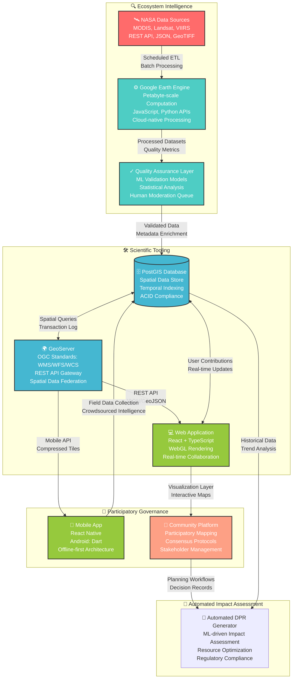

# CoRE Stack Documentation

CoRE Stack is open geospatial infrastructure for landscape planning, public data access, and community-grounded decision-making.

It helps people move from scattered public datasets to usable planning evidence: micro-watersheds, villages, generated layers, public APIs, Earth Engine assets, GeoServer layers, notebooks, and community-facing tools.

## Start Here

| You want to... | Start with... |
| --- | --- |
| understand the core stack data structure | [CoRE Stack Data Structure](concepts/watershed-data-structure.md) |
| inspect public APIs and get data | [Public APIs](use-precomputed-data/public-apis.md) |
| install core stack backend | [Installer](developers/installer.md) |
| understand how current data was computed | [How Current Data Was Computed](use-precomputed-data/how-current-data-was-computed.md) |
| install the backend and build pipelines | [Develop CoRE Stack](developers/index.md) |
| run current pipelines on your ROI | [computing api endpoints](pipelines/computing-endpoints.md) |

## CoRE Stack Architecture

## API Access

To use precomputed data programmatically, you need CoRE-Stack API key.

[Register or sign in at dashboard.core-stack.org](https://dashboard.core-stack.org/){ .md-button .md-button--primary }

Use the API to access the data, and try our demo notebooks.

1. [Open the Water Balance Analysis notebook](https://colab.research.google.com/drive/1uZH1KZFbe0TUIgCECOz_2cQ1jUfZglsA?usp=sharing#scrollTo=K26lCyd3u93J){ .md-button .md-button--primary }
2. [Open the Cropping Intensity Analysis notebook](https://colab.research.google.com/drive/1zv9TWdzfaEanE_i1kKw2Cr2snoCEhuIg?usp=sharing){ .md-button .md-button--primary }

---

## About Us

CoRE Stack, Commoning for Resilience and Equality, is a social-tech enterprise working with underserved communities in low-resource and remote areas.

We build participatory technology platforms that help communities understand pathways for resilience and development, use scientific evidence in local decision-making, and strengthen solidarity across institutions. Our work focuses on community institutions, equity, responsible AI, ethical data practice, and open-source tools for transparent development.

By making landscape data easier to understand and act on, CoRE Stack helps communities manage natural resources and move toward climate-resilient, fair, and sustainable futures.

## Partners

Our journey is strengthened by partners and collaborators including IIT Delhi, IIT Palakkad, GramVaani, and Magasool, with continued support and affiliation from GIZ, RainMatter, FES, Common Grounds, and Tarides.

## CoRE-Stack Building Blocks

- [CoRE Stack website](https://core-stack.org)
- [Backend repository](https://github.com/core-stack-org/core-stack-backend)
- [CoRE Stack GEE app](https://ee-corestackdev.projects.earthengine.app/view/core-stack-gee-app)
- [Landscape Explorer](https://www.explorer.core-stack.org/)
- [Commons Connect](https://github.com/core-stack-org/Commons-Connect)
- [Try our notebooks](https://github.com/core-stack-org/corestack-notebooks)

## License

- License: [GNU Affero General Public License v3.0](reference/license.md)
