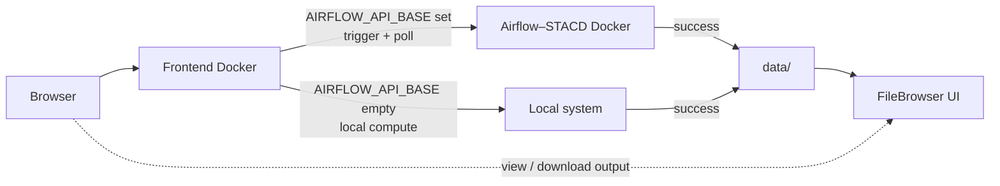
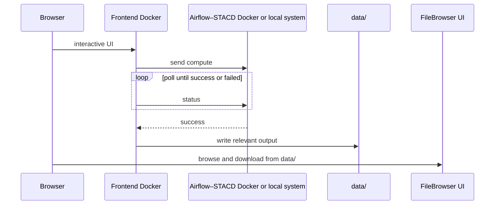

# Tower Services

**Tower Services** is the group of small Docker apps that run compute: **Drone**, **Bioacoustic** (CEM), **DIY LULC**, and others. Each service does one job (tree crowns, audio, land cover). They share **Airflow** and **STACD** when a job needs orchestration.

## Architecture

Every Tower Service is **interactive in the browser**. The operator uses a **frontend Docker**. From there the app **sends compute** and **polls status**. When the run is **success**, it **writes the relevant output into `data/`**. That directory is exposed by **FileBrowser**, so people can browse and download results in the FileBrowser UI.

**Where compute runs** is one env var:

| `AIRFLOW_API_BASE` | Compute |
| --- | --- |
| **Set** | Frontend/backend sends the job to the **Airflow–STACD Docker**, then polls until `success` or `failed`. |
| **Empty** | Compute runs on the **local system** (in the service container). No Airflow. |

The browser never talks to Airflow. The frontend Docker talks to Airflow–STACD only when `AIRFLOW_API_BASE` is set.





Supporting pieces on the host: bind-mounts **`code/`** → `/app`, **`models/`** → `/app/models`, **`data/`** → `/app/data`. Logs under **`data/logs/<application_name>/`**. Optional **central Postgres**. Image pulls through the campus proxy.

## Shared terminology

Use these names in READMEs, `.env.example`, the runbook, and the checklist. Do not invent aliases.

| Term | Meaning |
| --- | --- |
| **Tower Services** | This host and the small compute apps on it (Drone, Bioacoustic, DIY LULC). |
| **Service** | One Tower app (browser + frontend Docker) that sends compute and writes output to `data/`. |
| **Frontend Docker** | The container the browser talks to. Sends compute, polls status, writes `data/` on success. |
| **Airflow–STACD Docker** | Shared orchestrator. Used only when **`AIRFLOW_API_BASE`** is set. |
| **`AIRFLOW_API_BASE`** | Airflow 2.x REST root, e.g. `http://airflow:8080/api/v1`. **Set** → compute in Airflow–STACD Docker. **Empty** → **local compute** on this system. |
| **`AIRFLOW_DAG_ID`** | DAG this service triggers when `AIRFLOW_API_BASE` is set. |
| **`CORESTACK_API_BASE`** | URL the **Airflow worker** uses to reach **this** service (LAN or Docker DNS, not `localhost` from the worker). |
| **Same-origin proxy** | Browser talks to the **frontend Docker** only. That container calls Airflow–STACD. |
| **FileBrowser** | UI over **`data/`**. After a successful run, people view and download outputs here. |
| **`code/`** | Host git checkout. Bind-mount to **`/app`**. Update with `git pull` + restart. |
| **`models/`** | Host model weights. Bind-mount to **`/app/models`**. |
| **`data/`** | Host inputs, caches, **all compute output**. Bind-mount to **`/app/data`**. Exposed by **FileBrowser**. |
| **STACD** | YAML → Airflow DAG generator. Three files: DAG YAML, Algorithm Repo YAML, Dataset Repo YAML. |
| **STAC Item** | Required compute output: a STAC 1.x Feature (see runbook §9). |
| **Deps-only image** | Image has OS/Python deps and an entrypoint only. No application source, models, or outputs. |
| **GHCR or Docker Hub** | Where you push the deps-only image. Either registry is fine. |
| **`LOG_LEVEL`** | `debug` \| `info` \| `error`. Logs on disk: **`data/logs/<application_name>/`**. |
| **Central Postgres** | Shared cluster database. Connect with **`DATABASE_URL`**. No per-service Postgres/SQLite on cluster. |
| **`outputs.yaml`** | Declares each tree under `data/`. Modes: **`public`**, **`private_persistent`**, **`delete`**. |
| **Host data service** | Cluster process that reads `outputs.yaml` and publishes, keeps, or deletes. |

Do **not** use `AIRFLOW_BASE_API_URL`, `AIRFLOW_BASE_URL` (unless you only mean the web UI host), `COMPUTE_MODE`, `/data` as the data mount, or `/models` as the models mount. Those names showed up in older notes and are not the contract.

## How the two long docs fit

| Document | What it is | What it is not |
| --- | --- | --- |
| [Cluster Docker Services](../server/cluster-docker-services.md) | The **standards and how-to**: why deps-only images, how to write STACD YAML, how to trigger/poll Airflow, STAC Item shape, Custom LULC copy-this example. | Not a tick-box for deploy sign-off. |
| [Cluster Service Checklist](../server/cluster-service-checklist.md) | The **acceptance list** you copy into the GitHub issue. Tick a row only when the **Acceptance** line is true. | Not a second copy of the how-to. Each item points back to the runbook when you need the procedure. |

### Background you need before Cluster Docker Services

The runbook is long. You can follow it if you already know:

1. **Deps-only + three mounts** — rebuild the image only when requirements change; `git pull` updates **`code/`**.
2. **`AIRFLOW_API_BASE` is the compute switch** — set = Airflow–STACD Docker (trigger + poll); empty = local system.
3. **STACD writes the DAG** — you do not hand-write Airflow Python for cluster services. Algorithm YAML is **API** mode (HTTP work endpoint) or **Docker** mode (`image` + `module.function`).
4. **The browser never talks to Airflow** — browser → frontend Docker → Airflow–STACD (or local compute). On **success**, output goes to **`data/`**, which **FileBrowser** exposes.
5. **Deliverable is a STAC Item** — not a bare file path or GeoServer layer name.
6. **Campus `docker pull` uses the daemon proxy** — see [IIT Delhi proxy](#docker-pull-behind-the-iit-delhi-proxy) below.

Then open the runbook in this order: §1–§2 (env + mounts) → §7–§9 (STACD, Airflow, STAC) → Custom LULC example → §3–§6 and §10 as needed.

[Open Cluster Docker Services](../server/cluster-docker-services.md){ .md-button .md-button--primary }

### Background you need before the checklist

The checklist is ten acceptance items. It does not re-teach STACD or STAC. Complete it **after** you understand the architecture on this page and the matching runbook sections.

| Checklist item | Same term as the runbook |
| --- | --- |
| 1. Mounts | **`code/`**, **`models/`**, **`data/`** → `/app`, `/app/models`, `/app/data` — [runbook §2](../server/cluster-docker-services.md#2-code-models-and-data-live-on-the-host-mount-do-not-copy) |
| 2. Airflow vs local | **`AIRFLOW_API_BASE`** set / empty — [runbook §8](../server/cluster-docker-services.md#8-compute-and-processing--always-via-airflow) |
| 3. Registry | **GHCR or Docker Hub**, deps-only image — [runbook §5](../server/cluster-docker-services.md#5-ghcr-or-docker-hub--build-push-and-keep-updated) |
| 4–10 | SSO, `LOG_LEVEL`, one container, frontend API base, per-service diagram, **central Postgres**, **`outputs.yaml`** — checklist is the source; runbook §1 / §6 covers env and logging |

[Open Cluster Service Checklist](../server/cluster-service-checklist.md){ .md-button }

## Shared cluster pieces

| Piece | Role |
| --- | --- |
| Airflow + STACD | Orchestration — [STACD Framework](https://github.com/SaharshLaud/STACD_framework) (`dev`) |

Install commands stay in each service repository.

## Docker pull behind the IIT Delhi proxy

Campus hosts often cannot reach GHCR or Docker Hub directly. Configure the **Docker daemon** proxy. Do **not** put `registry-1.docker.io` or `auth.docker.io` in `NO_PROXY`.

```bash
sudo mkdir -p /etc/systemd/system/docker.service.d
sudo tee /etc/systemd/system/docker.service.d/http-proxy.conf <<'EOF'
[Service]
Environment="HTTP_PROXY=http://proxy21.iitd.ac.in:3128"
Environment="HTTPS_PROXY=http://proxy21.iitd.ac.in:3128"
Environment="NO_PROXY=localhost,127.0.0.1,::1,10.0.0.0/8,172.16.0.0/12,192.168.0.0/16"
EOF
sudo systemctl daemon-reload
sudo systemctl restart docker
```

Replace the proxy host with the one for your IITD account category. Same steps: [Cluster Docker Services — IIT Delhi proxy](../server/cluster-docker-services.md#cluster-notes-iit-delhi-proxy).

## Adding a service

1. Read this page (architecture + terms).
2. Follow [Cluster Docker Services](../server/cluster-docker-services.md) for how to package, wire Airflow/STACD, and return a STAC Item.
3. Tick [Cluster Service Checklist](../server/cluster-service-checklist.md) in the service issue or README.
4. Keep install steps, image name, and pinned tag in the service `README` and `VERSION`.
