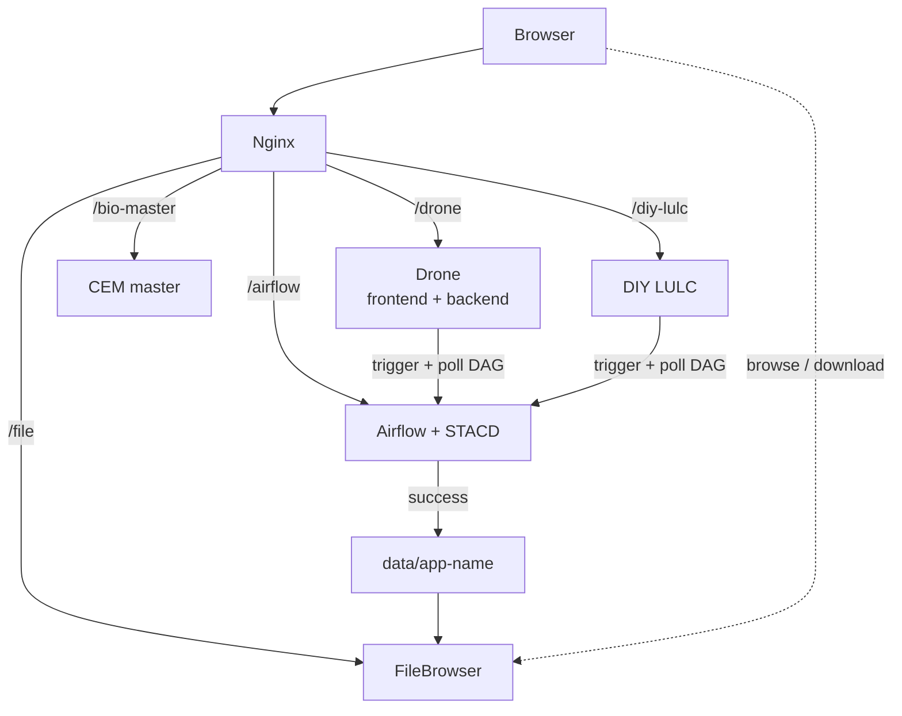
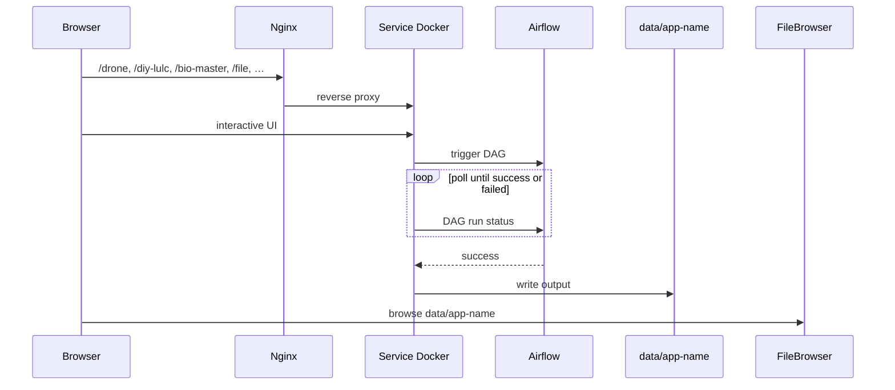

# Deployed Architecture

This page is the **currently deployed** layout on the Tower Services host. The generic contract (env vars, mounts, STACD) stays on [Tower Services](index.md).

**Nginx** is the only public entry point. Path prefixes send the browser to a service Docker. Compute services **trigger an Airflow DAG**, **poll the run**, and on **success** write output under **`data/<app-name>/`**, which the **shared FileBrowser** exposes.

## Architecture

The browser talks to **Nginx**, not to Airflow. Each compute service’s backend triggers the DAG and monitors the run. When the run completes, results land in the shared data tree, one folder per app, and people open them in FileBrowser at [`/file`](https://www.cse.iitd.ernet.in/act4dws5/file/).

## Nginx paths

| Path | Goes to | URL |
| --- | --- | --- |
| **`/drone`** | Drone — frontend and backend in Docker | [act4dws5/drone](https://www.cse.iitd.ernet.in/act4dws5/drone/) |
| **`/airflow`** | Airflow (STACD-generated DAGs) | [act4dws5/airflow/home](https://www.cse.iitd.ernet.in/act4dws5/airflow/home) |
| **`/bio-master`** | CEM master | [act4dws5/bio-master](https://www.cse.iitd.ernet.in/act4dws5/bio-master/) |
| **`/diy-lulc`** | DIY LULC | [act4dws5/diy-lulc](https://www.cse.iitd.ernet.in/act4dws5/diy-lulc/) |
| **`/file`** | Shared FileBrowser over `data/<app-name>/` | [act4dws5/file](https://www.cse.iitd.ernet.in/act4dws5/file/) |

Each service writes to **`data/<app-name>/`** (for example `data/drone/`, `data/diy-lulc/`).

## Compute loop

Every compute service follows the same loop:

1. Operator works in that service’s UI (behind its Nginx path).
2. The service **triggers** an Airflow DAG.
3. The service **monitors** the DAG run until it is `success` or `failed`.
4. On success it **produces the result** and **pushes output** to **`data/<app-name>/`**.
5. Operators view and download that folder in the **shared FileBrowser**.

The browser never calls Airflow. Nginx → service Docker → Airflow REST. Same pattern as [Tower Services](index.md#architecture).

## Services and repos

| Service | Nginx path | URL | What it is | Repo |
| --- | --- | --- | --- | --- |
| **Drone** | `/drone` | [Open](https://www.cse.iitd.ernet.in/act4dws5/drone/) | Tree-crown detection on a drone orthomosaic. Frontend + backend Docker. | [anunay1206/drone_docker](https://github.com/anunay1206/drone_docker) |
| **Airflow + STACD** | `/airflow` | [Open](https://www.cse.iitd.ernet.in/act4dws5/airflow/home) | Shared orchestrator. Services trigger DAGs here and poll until the run finishes. | [SaharshLaud/STACD_framework](https://github.com/SaharshLaud/STACD_framework) (`dev`) |
| **CEM master** | `/bio-master` | [Open](https://www.cse.iitd.ernet.in/act4dws5/bio-master/) | Continuous Ecological Monitoring master page (explore spots, species, network). | [xHrid/continuous-ecological-monitoring-toolkit](https://github.com/xHrid/continuous-ecological-monitoring-toolkit) |
| **DIY LULC** | `/diy-lulc` | [Open](https://www.cse.iitd.ernet.in/act4dws5/diy-lulc/) | 10 m land-use / land-cover over India; grow classes from example polygons. | [salil-123/Project](https://github.com/salil-123/Project) |
| **FileBrowser** | `/file` | [Open](https://www.cse.iitd.ernet.in/act4dws5/file/) | Shared file UI. After a successful run, browse and download `data/<app-name>/`. | [filebrowser/filebrowser](https://github.com/filebrowser/filebrowser) |

Install, image tags, and `.env` live in each service repo. Cluster standards are in [Cluster Docker Services](../../server/cluster-docker-services.md).
