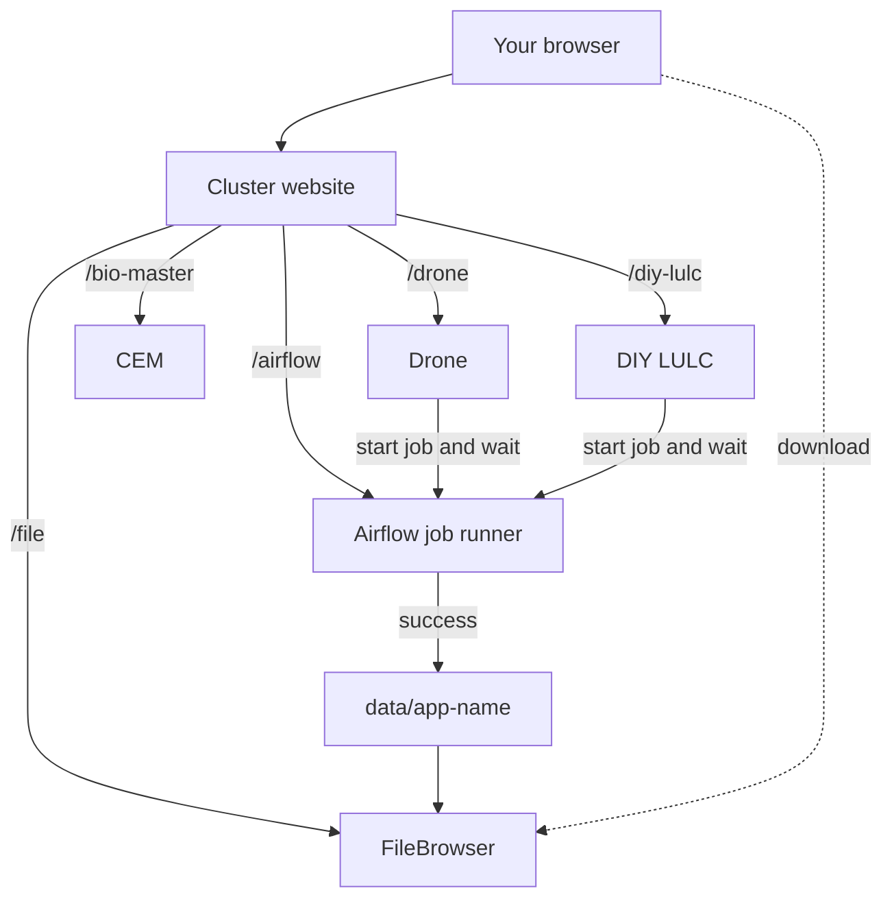
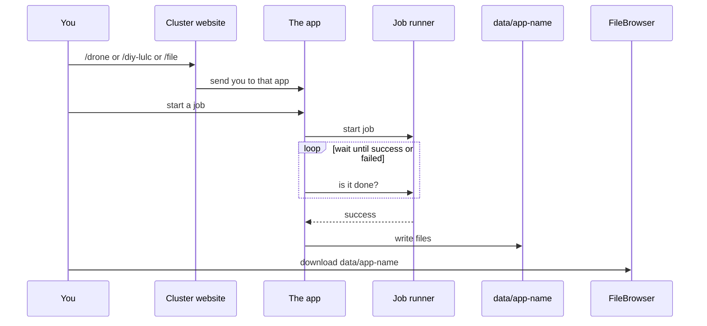

# Deployed Architecture

This is **what is running today** on the Tower Services cluster. Open the URLs below in a browser. You do not need to install anything.

These are examples of apps that have already been deployed. The cluster is for **anyone who wants to share an app** — see [Tower Services](index.md) and [Add your own service](index.md#adding-a-service).

How jobs work, and **why the cluster uses Airflow**, stays on [Tower Services](index.md#why-airflow).

## Open the apps

All public pages go through **one website** (Nginx). The path after the host name chooses the app.

| Path | App | Open |
| --- | --- | --- |
| **`/drone`** | Drone — tree crowns on a drone image | [act4dws5/drone](https://www.cse.iitd.ernet.in/act4dws5/drone/) |
| **`/diy-lulc`** | DIY LULC — land cover from example polygons | [act4dws5/diy-lulc](https://www.cse.iitd.ernet.in/act4dws5/diy-lulc/) |
| **`/bio-master`** | CEM master — ecological monitoring | [act4dws5/bio-master](https://www.cse.iitd.ernet.in/act4dws5/bio-master/) |
| **`/file`** | FileBrowser — download finished files | [act4dws5/file](https://www.cse.iitd.ernet.in/act4dws5/file/) |
| **`/airflow`** | Job runner (Airflow). The apps use this; you usually do not. | [act4dws5/airflow/home](https://www.cse.iitd.ernet.in/act4dws5/airflow/home) |

Each app writes output under **`data/<app-name>/`** (for example `data/drone/`, `data/diy-lulc/`). FileBrowser shows that tree.

## What happens after you start a job

1. You work in that app’s page (`/drone`, `/diy-lulc`, …).
2. The **app** (not your browser) starts a job on Airflow.
3. The app **checks status** until the job is `success` or `failed`.
4. On success it **writes files** under `data/<app-name>/`.
5. You open **FileBrowser** (`/file`) and download that folder.

```mermaid
flowchart TB
  Browser[Your browser] --> Nginx[Cluster website]
  Nginx -->|"/drone"| Drone[Drone]
  Nginx -->|"/airflow"| Airflow[Airflow job runner]
  Nginx -->|"/bio-master"| BioMaster[CEM]
  Nginx -->|"/diy-lulc"| Lulc[DIY LULC]
  Nginx -->|"/file"| FB[FileBrowser]
  Drone -->|"start job and wait"| Airflow
  Lulc -->|"start job and wait"| Airflow
  Airflow -->|success| Data["data/app-name"]
  Data --> FB
  Browser -.->|download| FB
```

```mermaid
sequenceDiagram
  participant You
  participant Website as Cluster website
  participant App as The app
  participant Airflow as Job runner
  participant Data as data/app-name
  participant FB as FileBrowser
  You->>Website: /drone or /diy-lulc or /file
  Website->>App: send you to that app
  You->>App: start a job
  App->>Airflow: start job
  loop wait until success or failed
    App->>Airflow: is it done?
  end
  Airflow-->>App: success
  App->>Data: write files
  You->>FB: download data/app-name
```

Your browser never calls Airflow. The path is: website → the app → Airflow. Same idea as [Tower Services — How a job runs](index.md#architecture).

## Services and source code

| Service | Path | What it is | Source |
| --- | --- | --- | --- |
| **Drone** | `/drone` | Tree-crown detection on a drone orthomosaic | [anunay1206/drone_docker](https://github.com/anunay1206/drone_docker) |
| **DIY LULC** | `/diy-lulc` | 10 m land-use / land-cover over India | [salil-123/Project](https://github.com/salil-123/Project) |
| **CEM master** | `/bio-master` | Continuous Ecological Monitoring | [xHrid/continuous-ecological-monitoring-toolkit](https://github.com/xHrid/continuous-ecological-monitoring-toolkit) |
| **Airflow + STACD** | `/airflow` | Shared job runner | [SaharshLaud/STACD_framework](https://github.com/SaharshLaud/STACD_framework) (`dev`) |
| **FileBrowser** | `/file` | Shared file UI over `data/<app-name>/` | [filebrowser/filebrowser](https://github.com/filebrowser/filebrowser) |

How to install each app is in **that repo’s README**. Cluster-wide rules (mounts, STAC, checklist) are in [Cluster Docker Services](../../server/cluster-docker-services.md) after you have read [Tower Services](index.md).
