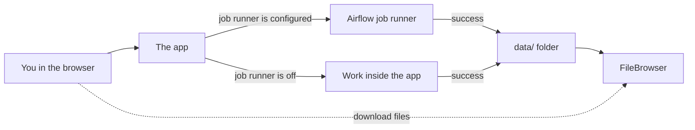
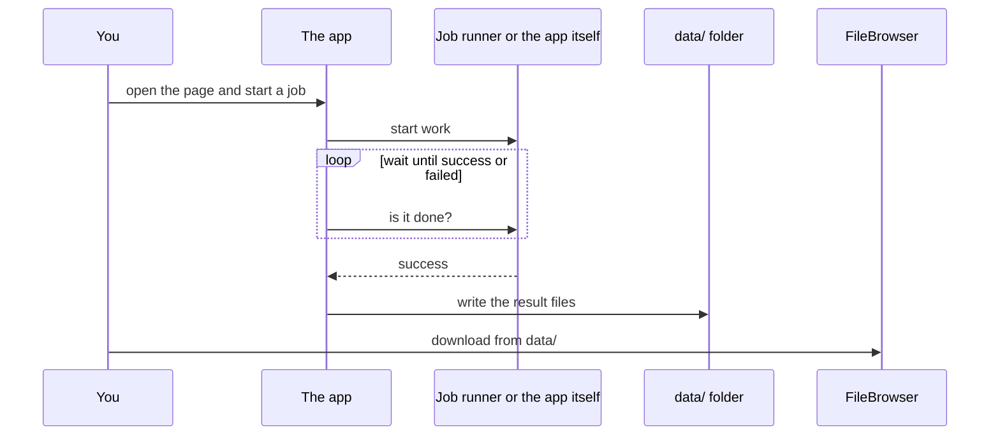

# Tower Services

This page is for **anyone who wants to share an app** on the Tower Services cluster — students, researchers, and other teams. You do not need to know Docker, Airflow, or CoRE Stack already.

**Tower Services** is a **shared cluster**. You package your app as a Docker service; if it is accepted, it runs next to the others, uses the shared job runner when you opt in, and writes results where people can download them.

It is **not** only the campus demo websites. Drone, CEM, and DIY LULC are **examples already on the cluster**. Your app can be next.

Live URLs of what is running today: [Deployed Architecture](deployed-architecture.md). To deploy yours: [Add your own service](#adding-a-service).

## What you can do today

| If you want to… | Do this |
| --- | --- |
| **Try an app that is already deployed** | Open it from the table below. No install. |
| **Download a finished result** | Open [FileBrowser](https://www.cse.iitd.ernet.in/act4dws5/file/). Each app writes into its own folder (`data/drone/`, `data/diy-lulc/`, …). |
| **Deploy your own app on the cluster** | Read [Why we use Airflow](#why-airflow) and [How a job runs](#architecture), then [Add your own service](#adding-a-service). |

| App | What it does | Open |
| --- | --- | --- |
| **Drone** | Finds tree crowns on a drone orthomosaic | [act4dws5/drone](https://www.cse.iitd.ernet.in/act4dws5/drone/) |
| **CEM (Bioacoustic)** | Continuous Ecological Monitoring — spots, species, network | [act4dws5/bio-master](https://www.cse.iitd.ernet.in/act4dws5/bio-master/) |
| **DIY LULC** | 10 m land-use / land-cover; grow classes from example polygons | [act4dws5/diy-lulc](https://www.cse.iitd.ernet.in/act4dws5/diy-lulc/) |
| **FileBrowser** | Browse and download job output | [act4dws5/file](https://www.cse.iitd.ernet.in/act4dws5/file/) |

You will also see **Airflow** at [`/airflow`](https://www.cse.iitd.ernet.in/act4dws5/airflow/home). That is the shared **job runner**. The apps talk to it for you. You do not open Airflow to use Drone or DIY LULC.

## Why we use Airflow { #why-airflow }

The apps on this host look like websites, but the work behind **Run** is not a quick page load. Detecting tree crowns, growing a land-cover map, or processing a recording can take **minutes to hours**, use a **GPU or a lot of RAM**, and often has **several steps** (prepare input → run a model → write a STAC result).

If each app did that work **inside its own web container**:

- A second person clicking Run would compete with the first for the same CPU/GPU.
- Closing the tab or restarting the app could kill the job.
- Every team would invent its own retries, logs, and “is it done yet?” page.
- You could not see one shared picture of what is running on the cluster.

So the cluster uses **one shared Airflow** (with **STACD** to describe the steps in YAML):

| Need | What Airflow + STACD give you |
| --- | --- |
| Long jobs | The website starts the job and **polls**. The worker keeps running if you close the tab. |
| Many apps, one cluster | Drone, DIY LULC, and **your** app **queue on the same runner** instead of each holding a private compute box. |
| Several steps | A **DAG** is a graph of tasks (fetch → compute → register). Airflow runs them in order and can retry a failed step. |
| “What failed?” | One **Graph / Grid** and task logs for every app, instead of grepping a different container each time. |
| Thin app images | The app Docker stays a **UI + API**. Heavy work is an executor Airflow starts. |
| Lineage | STACD records which algorithm produced which file, so a result is not a bare path on disk. |

That is why the cluster is **Airflow-based** for compute. The browser still only talks to your app’s path (for example `/drone` or `/diy-lulc`). Airflow is the back office.

You can still turn Airflow **off** on a laptop: leave `AIRFLOW_API_BASE` empty and the same app runs the job inside its container. That is for local try-out, not for the shared cluster.

## How a job runs { #architecture }

Think of three people:

1. **You** — the browser. You only talk to the app’s web page.
2. **The app** — a Docker container. It shows the UI, starts the job, and waits until the job finishes.
3. **The job runner** (Airflow + STACD) — optional. If the app is configured to use it, the app sends the job there and checks status until the run is `success` or `failed`.

When the run succeeds, the app writes files under **`data/`**. FileBrowser is just a website over that folder.





**The browser never talks to Airflow.** Only the app does. That is why you use `/drone` or `/diy-lulc`, not `/airflow`, to start work.

### Where the work actually runs

One setting on the app decides this: **`AIRFLOW_API_BASE`**.

| `AIRFLOW_API_BASE` | What it means for you |
| --- | --- |
| **Filled in** (for example `http://airflow:8080/api/v1`) | The app sends the job to the shared Airflow machine and waits. |
| **Empty** | The app does the work **inside its own container**. No Airflow. |

You do not invent a second switch such as `COMPUTE_MODE`. Empty vs set is the whole rule.

## Folders on the machine

If you later deploy an app here, the host keeps three folders and **mounts** them into the container (the container sees them as local paths). Code is not baked into the Docker image.

| Host folder | Path inside the container | What lives there |
| --- | --- | --- |
| **`code/`** | `/app` | The git checkout. Update with `git pull`, then restart the container. |
| **`models/`** | `/app/models` | Trained weights (`.pt`, `.onnx`, and similar). |
| **`data/`** | `/app/data` | Inputs, caches, **every job output**, and logs under `data/logs/<app-name>/`. FileBrowser shows this tree. |

The Docker image only has system libraries and Python/Node packages (a **deps-only image**). Rebuild the image when requirements change. Do not rebuild it just to change application code.

## Words you will see { #shared-terminology }

These are the names used on this host. Use the same words in a README or GitHub issue so others can follow.

| Word | Plain meaning |
| --- | --- |
| **Tower Services** | The shared **cluster** where anyone can deploy an app (not only the live campus demos). |
| **Service** | One app (web UI + its Docker container). |
| **Frontend Docker** | The container your browser talks to. It starts jobs, waits, and writes `data/` when the job succeeds. |
| **Airflow–STACD Docker** | The shared job runner. Used only when **`AIRFLOW_API_BASE`** is set. |
| **`AIRFLOW_API_BASE`** | Address of Airflow’s REST API. Set = use the job runner. Empty = run inside the app. |
| **`AIRFLOW_DAG_ID`** | Name of the workflow this app starts on Airflow. |
| **`CORESTACK_API_BASE`** | Address the **Airflow worker** uses to call **this** app back. Must be a LAN or Docker name — not `localhost` from the worker’s point of view. |
| **Same-origin proxy** | Nginx sends `/drone`, `/diy-lulc`, … to the right container. Your browser only talks to that website. |
| **FileBrowser** | Website over **`data/`**. Download results here. |
| **STACD** | Tool that turns three YAML files into an Airflow workflow (DAG). You do not write Airflow Python by hand for cluster apps. |
| **STAC Item** | The required job result: a STAC 1.x GeoJSON Feature that describes the output (see the [runbook §9](../../server/cluster-docker-services.md#9-always-return-output-in-stac-format)). |
| **Deps-only image** | Image has dependencies and a start command only — no source, models, or outputs. |
| **GHCR or Docker Hub** | Where the image is pushed. Either registry is fine. |
| **`LOG_LEVEL`** | `debug`, `info`, or `error`. Logs on disk: **`data/logs/<application_name>/`**. |
| **Central Postgres** | One shared database for the cluster. Connect with **`DATABASE_URL`**. Do not add a private Postgres/SQLite per app on the cluster. |
| **`outputs.yaml`** | Lists each tree under `data/` and whether it is `public`, `private_persistent`, or `delete`. |
| **Host data service** | Cluster process that reads `outputs.yaml` and publishes, keeps, or deletes those trees. |

Do **not** use `AIRFLOW_BASE_API_URL`, `AIRFLOW_BASE_URL` (unless you only mean the Airflow web page), `COMPUTE_MODE`, `/data` as the data mount, or `/models` as the models mount. Older notes used those names; they are not the contract on this host.

## Add your own service { #adding-a-service }

If you want **your** app on this cluster, package it the same way as the apps already running. You do not need the full runbook to understand the idea. You do need it when you ask for a deploy.

1. Your app has a **browser UI**.
2. When someone starts a job, **your container** starts the work (on Airflow if `AIRFLOW_API_BASE` is set, otherwise locally).
3. Your container **waits** until the job is `success` or `failed`.
4. On success it writes files under **`data/<your-app>/`** and returns a **STAC Item** (not only a file path).
5. People download from **FileBrowser**.

Short how-to (env, three mounts, STACD YAML, STAC, copy-this LULC): [Cluster Docker Services](../../server/cluster-docker-services.md).

Acceptance list to paste into a GitHub issue: [Cluster Service Checklist](../../server/cluster-service-checklist.md). Tick a row only when the **Acceptance** line is true.

The runbook is short. Read it top to bottom (§1 env → mounts → image → STACD → trigger → STAC → front page). Copy-this LULC is at the end.

[Open Cluster Docker Services](../../server/cluster-docker-services.md){ .md-button .md-button--primary }
[Open Cluster Service Checklist](../../server/cluster-service-checklist.md){ .md-button }

Keep install steps, image name, and a pinned tag in **your** repo `README` and `VERSION`. This page does not replace that.

### Checklist mapped to the runbook

| Checklist item | Same idea as above |
| --- | --- |
| 1. Mounts | **`code/`**, **`models/`**, **`data/`** → `/app`, `/app/models`, `/app/data` — [runbook §2](../../server/cluster-docker-services.md#2-code-models-and-data-live-on-the-host-mount-do-not-copy) |
| 2. Airflow vs local | **`AIRFLOW_API_BASE`** set / empty — [runbook §8](../../server/cluster-docker-services.md#8-compute-and-processing--always-via-airflow) |
| 3. Registry | **GHCR or Docker Hub**, deps-only image — [runbook §5](../../server/cluster-docker-services.md#5-ghcr-or-docker-hub--build-push-and-keep-updated) |
| 4–10 | Google SSO, `LOG_LEVEL`, one container, frontend API base, a diagram of **your** app, **central Postgres**, **`outputs.yaml`** |
| 11. Front page + demo video | Landing page like Drone; one video (manual + tutorial) on the front page; video reviewed and approved — [runbook §11](../../server/cluster-docker-services.md#11-front-page-and-demo-video) |

## Docker pull on IIT Delhi campus { #docker-pull-behind-the-iit-delhi-proxy }

Campus machines often cannot reach GitHub Container Registry or Docker Hub without the **Docker daemon** proxy. Do **not** put `registry-1.docker.io` or `auth.docker.io` in `NO_PROXY`.

```bash
sudo mkdir -p /etc/systemd/system/docker.service.d
sudo tee /etc/systemd/system/docker.service.d/http-proxy.conf <<'EOF'
[Service]
Environment="HTTP_PROXY=http://proxy21.iitd.ac.in:3128"
Environment="HTTPS_PROXY=http://proxy21.iitd.ac.in:3128"
Environment="NO_PROXY=localhost,127.0.0.1,::1,10.0.0.0/8,172.16.0.0/12,192.168.0.0/16"
EOF
sudo systemctl daemon-reload
sudo systemctl restart docker
```

Replace the proxy host with the one for your IITD account category. Same steps: [Cluster Docker Services — IIT Delhi proxy](../../server/cluster-docker-services.md#cluster-notes-iit-delhi-proxy).

## Shared pieces on the host

| Piece | Role |
| --- | --- |
| Airflow + STACD | Shared job runner — [STACD Framework](https://github.com/SaharshLaud/STACD_framework) (`dev`) |
| FileBrowser | Download UI over `data/` |
| Nginx | Public entry: `/drone`, `/diy-lulc`, `/bio-master`, `/file`, `/airflow` |

Install commands stay in each service repository. The live path map is on [Deployed Architecture](deployed-architecture.md).
