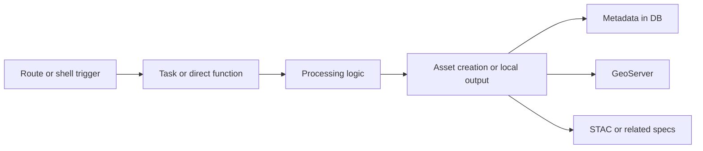

# Pipeline Integration Pattern

This page explains how existing CoRE Stack pipelines become fully integrated into the stack.

Read it as a pattern library, not as a single algorithm description.

Primary code surfaces:

- [computing/api.py](https://github.com/core-stack-org/core-stack-backend/blob/main/computing/api.py)
- [computing/urls.py](https://github.com/core-stack-org/core-stack-backend/blob/main/computing/urls.py)
- [computing/utils.py](https://github.com/core-stack-org/core-stack-backend/blob/main/computing/utils.py)
- [utilities/gee_utils.py](https://github.com/core-stack-org/core-stack-backend/blob/main/utilities/gee_utils.py)

---

## What "Fully Integrated" Means Here

An integrated pipeline usually does most of the following:

- accepts a stable ROI such as `state`, `district`, `block`, or project ROI
- exposes an entry point through API, Django shell, or Celery
- uses shared naming and asset-path helpers
- runs the actual processing step
- saves resulting layer metadata to the database
- publishes vector or raster outputs to GeoServer when needed
- optionally creates STAC or related catalog metadata
- gets documented in this docs site

---

## Reusable Building Blocks

| Concern | Typical helpers | Where to look |
|---------|------------------|---------------|
| GEE setup | `ee_initialize()` | [utilities/gee_utils.py](https://github.com/core-stack-org/core-stack-backend/blob/main/utilities/gee_utils.py) |
| naming and path normalization | `valid_gee_text()`, `get_gee_asset_path()`, `get_gee_dir_path()` | [utilities/gee_utils.py](https://github.com/core-stack-org/core-stack-backend/blob/main/utilities/gee_utils.py) |
| vector export to GEE | `export_vector_asset_to_gee()`, `upload_shp_to_gee()` | [utilities/gee_utils.py](https://github.com/core-stack-org/core-stack-backend/blob/main/utilities/gee_utils.py) |
| raster export and publication | `sync_raster_to_gcs()`, `sync_raster_gcs_to_geoserver()` | [utilities/gee_utils.py](https://github.com/core-stack-org/core-stack-backend/blob/main/utilities/gee_utils.py) |
| vector publication | `sync_fc_to_geoserver()`, `sync_layer_to_geoserver()`, `push_shape_to_geoserver()` | [computing/utils.py](https://github.com/core-stack-org/core-stack-backend/blob/main/computing/utils.py) |
| layer bookkeeping | `save_layer_info_to_db()` and sync status helpers | [computing/utils.py](https://github.com/core-stack-org/core-stack-backend/blob/main/computing/utils.py) |
| route exposure | DRF views and task triggers | [computing/api.py](https://github.com/core-stack-org/core-stack-backend/blob/main/computing/api.py), [computing/urls.py](https://github.com/core-stack-org/core-stack-backend/blob/main/computing/urls.py) |

!!! note
    If your pipeline uses `ee_initialize()` or accepts `gee_account_id`, document the setup prerequisite explicitly and point operators to [Google Earth Engine](../developers/integrations/google-earth-engine.md). In the current stack, that setup is required for most real compute runs.

---

## Recurring Pipeline Shapes

### 1. Vector Clip and Publish

Used by pages such as:

- [Admin Boundary](admin-boundary.md)
- [Drainage Lines](drainage-lines.md)
- [NREGA Assets](nrega-assets.md)
- [Agroecological Space](agroecological-space.md)

Typical pattern:

1. build or load ROI
2. filter an external vector dataset
3. export to GEE or write local shapes
4. save layer metadata
5. publish to GeoServer

### 2. Raster Clip and Publish

Used by pages such as:

- [Catchment Area](catchment-area.md)
- [Distance to Nearest Drainage](distance-to-nearest-drainage.md)
- [Natural Depression](natural-depression.md)
- [Slope Percentage](slope-percentage.md)

Typical pattern:

1. build ROI
2. load a source raster
3. clip or derive the raster
4. export raster to GEE or GCS
5. publish through GeoServer

### 3. Vector Enrichment or Spatial Join

Used by pages such as:

- [Facilities Proximity](facilities-proximity.md)
- [Aquifer Vector](aquifer-vector.md)
- [SOGE Vector](soge-vector.md)

Typical pattern:

1. load ROI or administrative geometry
2. join with an external table or vector layer
3. compute attributes or dominant classes
4. export and publish the resulting feature collection

### 4. Mixed Raster and Vector Outputs

Used by pages such as:

- [Stream Order](stream-order.md)
- [Restoration Opportunity](restoration-opportunity.md)
- [Surface Water Body Detection](swb-detection.md)

These pages are useful when you want to study both raster publication and vector summary logic in one place.

### 5. Time-Series Helpers

Used by pages such as:

- [NDVI Time Series](ndvi-time-series.md)
- [HLS Interpolated NDVI](hls-interpolated-ndvi.md)

These are useful when your new pipeline depends on temporal compositing, per-class aggregation, or derived vegetation signals.

---

## Builder Workflow

### Step 1: Decide the smallest useful output

Choose early whether the first useful version of your pipeline is:

- vector only
- raster only
- tabular plus geometry
- mixed raster and vector

That choice determines which shared helpers you will reuse.

### Step 2: Start with the processing function

Write the core logic first. Make it clear what inputs the function needs and what output it returns before you add publication concerns.

### Step 3: Wrap it in a task or callable entry point

Depending on the use case, follow one of these patterns:

- direct function for shell use
- Celery task for async execution
- DRF view in `computing/api.py` for HTTP callers

### Step 4: Reuse shared integration helpers

Do not re-invent:

- naming conventions
- asset path generation
- GeoServer upload paths
- layer metadata persistence

Those are already shared across the stack.

### Step 5: Document the pattern, not just the result

A good pipeline page should tell future contributors:

- where the code lives
- what entry point calls it
- whether it is vector, raster, or mixed
- which shared helpers it relies on
- what cloud dependencies are required for full integration
- how an operator obtains the `gee_account_id` if the pipeline needs one

---

## Good Pages to Borrow From

If you are building a new pipeline, compare these examples:

| If you need... | Start from |
|----------------|------------|
| a vector clipping workflow | [Drainage Lines](drainage-lines.md) |
| a raster clipping workflow | [Catchment Area](catchment-area.md) |
| a table-plus-geometry enrichment workflow | [Facilities Proximity](facilities-proximity.md) |
| mixed raster and vector publication | [Stream Order](stream-order.md) |
| time-series processing ideas | [NDVI Time Series](ndvi-time-series.md) |

---

## Incremental Adoption

A new contributor does not need to build the whole cloud publication chain on day one.

A practical way to start is:

1. understand an existing pipeline page in this section
2. prototype the data logic locally
3. expose a direct function or shell workflow
4. add API or Celery integration
5. add GEE, GeoServer, or STAC publication only when the science is stable

That staged approach is the same one reflected across the developer pages in this site: start with direct execution, then expose stable entry points, then add publication and metadata integration.

---

## See Also

- [Pipeline Overview](index.md)
- [Build New Pipelines](../developers/build-new-pipelines.md)
- [Local Pipeline First](../developers/local-pipeline-first.md)
- [System Architecture](../developers/system-architecture.md)
