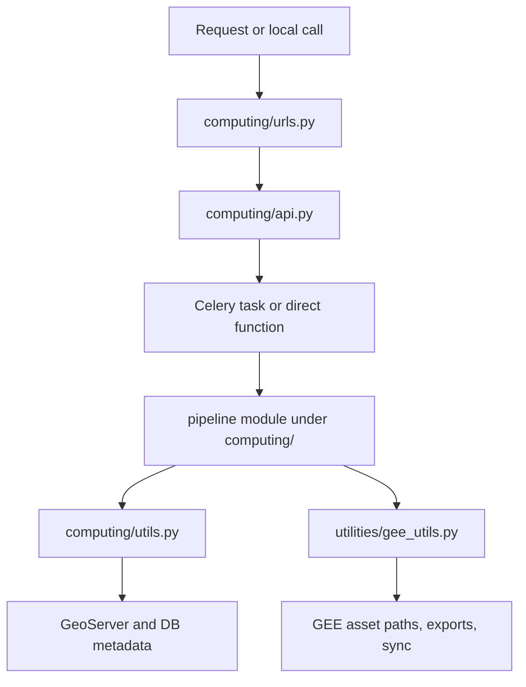

# How They Work Programmatically

This page explains how CoRE Stack turns analytical logic into runnable, inspectable, and publishable computations.

---

## The Main Programmatic Surfaces

- [computing/urls.py](https://github.com/core-stack-org/core-stack-backend/blob/main/computing/urls.py)
- [computing/api.py](https://github.com/core-stack-org/core-stack-backend/blob/main/computing/api.py)
- [computing/utils.py](https://github.com/core-stack-org/core-stack-backend/blob/main/computing/utils.py)
- [utilities/gee_utils.py](https://github.com/core-stack-org/core-stack-backend/blob/main/utilities/gee_utils.py)
- pipeline modules under `computing/`

---

## The Usual Code Path



---

## The Thin-Handler Principle

The route layer should stay thin and should not become the science layer.

```python linenums="1" hl_lines="4-7 8-10" title="Pattern from computing/api.py"
@api_view(["POST"])
@schema(None)
def generate_lcw(request):
    state = request.data.get("state").lower()  # (1)!
    district = request.data.get("district").lower()
    block = request.data.get("block").lower()
    gee_account_id = request.data.get("gee_account_id")
    generate_lcw_conflict_data.apply_async(    # (2)!
        args=[state, district, block, gee_account_id], queue="nrm"
    )
    return Response({"Success": "Successfully initiated"})  # (3)!
```

1. Normalize request fields early so downstream naming and asset lookup stay predictable.
2. Hand heavy work off quickly to a function or task boundary.
3. Return a fast acknowledgement instead of turning the API layer into a long-running worker.

---

## The Reusable Layers

### 1. Request and route layer

- `computing/urls.py`
- `computing/api.py`

This layer exposes route names and maps requests to handlers.

### 2. Task or callable boundary

- direct function calls for local experimentation
- Celery tasks for async production-style execution

This is the best place to separate:

- pure computation
- retry behavior
- auth or entry-point concerns

### 3. Processing layer

- workflow modules under `computing/`

This layer contains the actual geospatial logic.

### 4. Publication and metadata layer

- `computing/utils.py`
- `public_api/views.py`

This is where outputs become discoverable datasets, layers, and public metadata.

### 5. Integration helper layer

- `utilities/gee_utils.py`

This layer standardizes asset naming, initialization, exports, and sync helpers.

---

## Why Local-First Matters Programmatically

The safest sequence is:

1. make the analytical function work locally
2. make it callable from shell or a small script
3. expose it through the Django Computing API
4. add Celery, auth, retries, and publication integration

That is why the developer flow begins with [Local Pipeline First](../developers/local-pipeline-first.md), not with Celery or admin wiring.

---

## Where Public Data Re-enters

Once the computation is published, downstream public surfaces begin to depend on it:

- [Public API References](../api/public-endpoints.md)
- [STAC Specs](../api/stac-specs.md)
- [How Current Data Was Computed](../use-precomputed-data/how-current-data-was-computed.md)

That is the bridge from internal computation to public usefulness.

---

## Next Paths

- [Common Pipeline Design / Integration Patterns](common-design-and-integration-patterns.md)
- [Pipeline Integrations](pipeline-integrations.md)
- [Computing API Endpoints](../api/computing-endpoints.md)
- [Local Pipeline First](../developers/local-pipeline-first.md)
- [Backend Code Map](../developers/backend-code-map.md)
