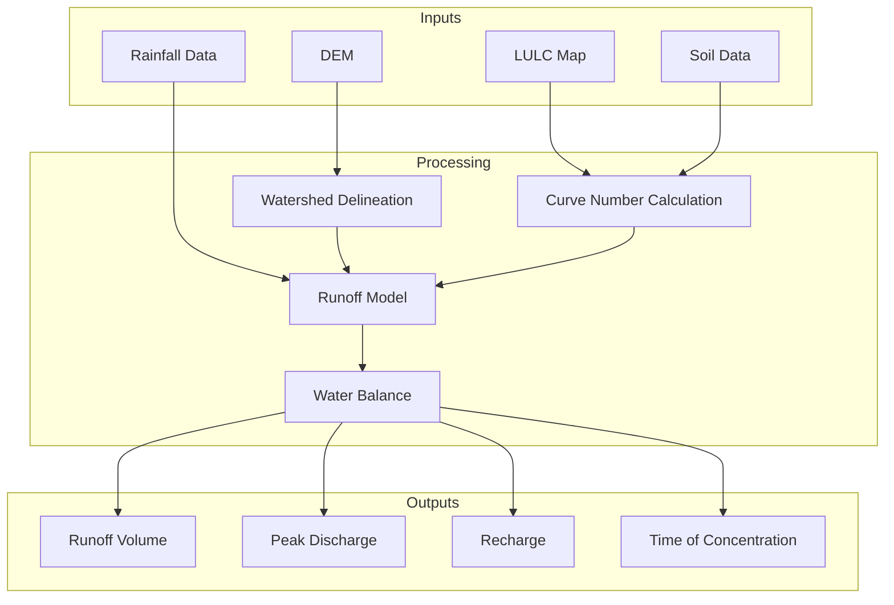
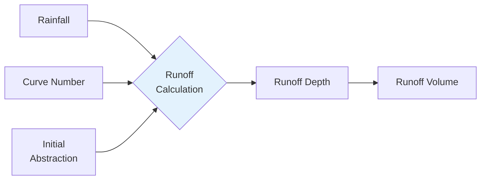
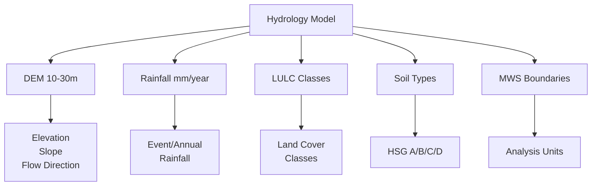
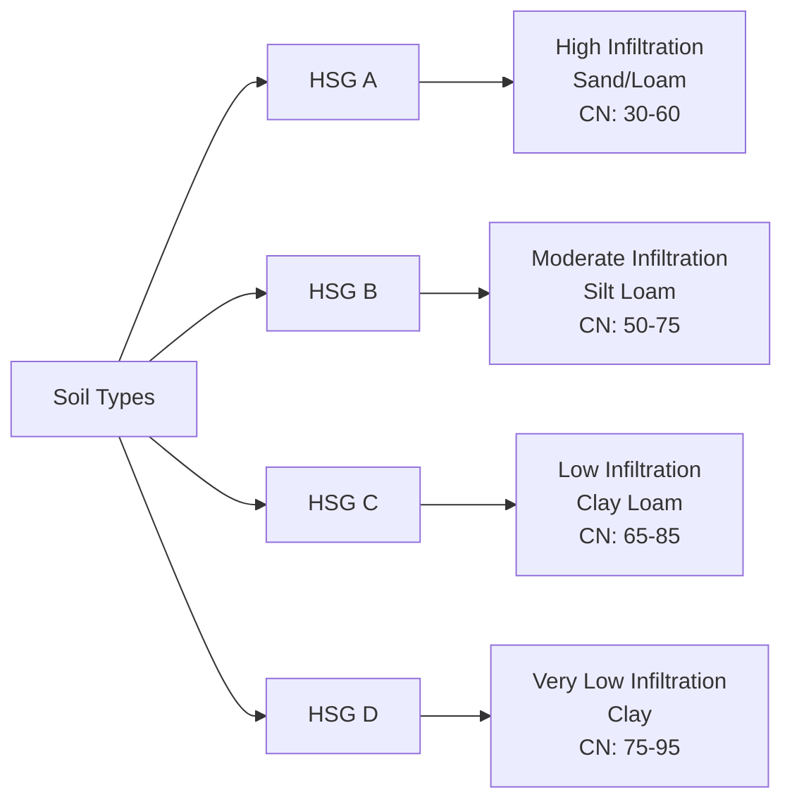
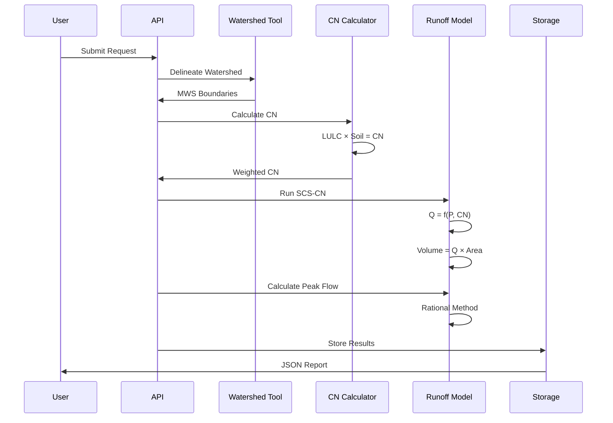
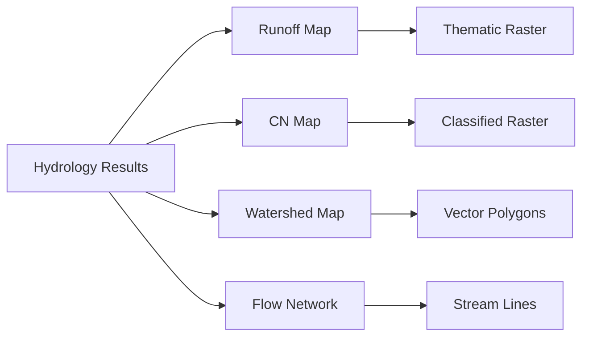
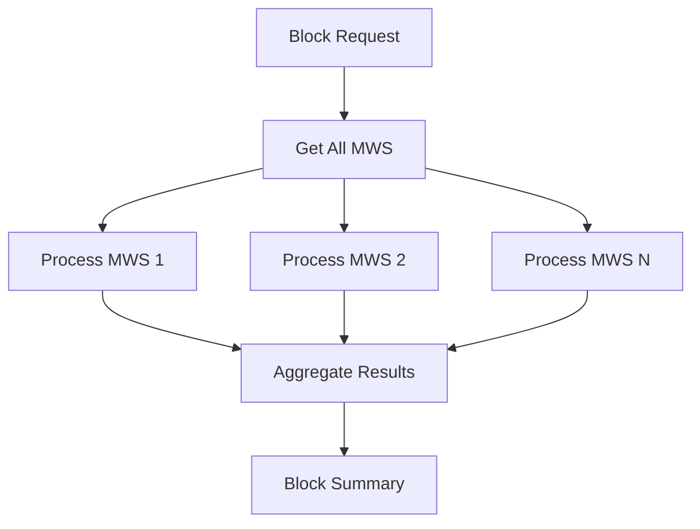
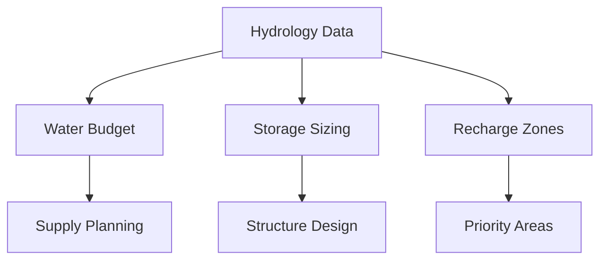
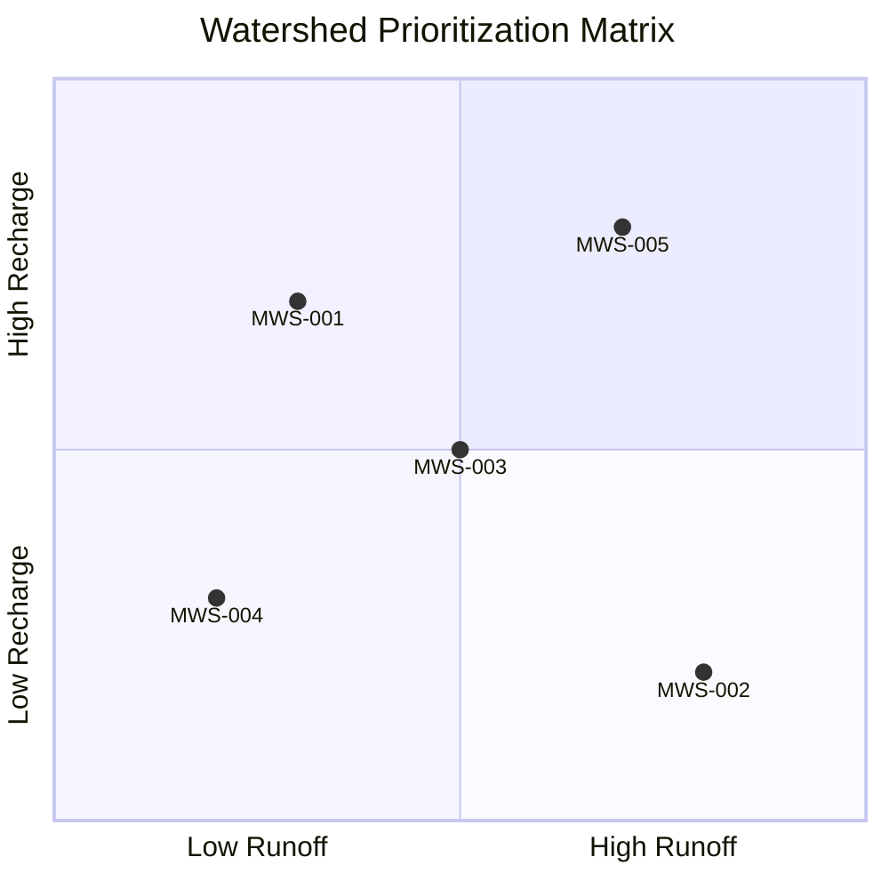

# Hydrological Modeling Pipeline

Calculate runoff, recharge, and other hydrological parameters for watershed management and water resource planning.

---

## Overview



The hydrology pipeline uses the **SCS-CN (Soil Conservation Service Curve Number)** method for runoff estimation, the industry standard for watershed hydrology.

---

## SCS-CN Method



### Key Equations

**Potential Maximum Retention:**
```
S = (25400 / CN) - 254
```

**Runoff Depth:**
```
Q = (P - Ia)² / (P - Ia + S)    for P > Ia
Q = 0                             for P ≤ Ia
```

Where:
- **Q** = Runoff depth (mm)
- **P** = Rainfall depth (mm)
- **Ia** = Initial abstraction (typically 0.2S)
- **S** = Potential maximum retention (mm)
- **CN** = Curve Number (0-100)

---

## Input Requirements



### Required Parameters

```json
{
  "state": "karnataka",
  "district": "raichur",
  "block": "devadurga",
  "mws_id": "mws_12345",
  "rainfall_mm": 850,
  "rainfall_type": "annual",
  "cn_method": "scs",
  "model": "runoff"
}
```

---

## Curve Number Determination

The Curve Number depends on land cover and hydrologic soil group.

### Hydrologic Soil Groups



### CN Lookup Table

| Land Cover | HSG A | HSG B | HSG C | HSG D |
|------------|-------|-------|-------|-------|
| Agriculture | 67 | 78 | 85 | 89 |
| Forest | 30 | 55 | 70 | 77 |
| Grassland | 39 | 61 | 74 | 80 |
| Urban | 77 | 85 | 90 | 92 |
| Water | 100 | 100 | 100 | 100 |
| Barren | 76 | 85 | 90 | 93 |

---

## Processing Workflow



### 1. Watershed Delineation


**Algorithms used:**
- D8 flow routing
- Contributing area thresholding
- Pour point snapping

### 2. Curve Number Calculation

```python
# Calculate area-weighted CN
for mws in micro_watersheds:
    cn_values = []
    areas = []
    
    for lulc_class, soil_group in zip(lulc, soils):
        cn = lookup_cn(lulc_class, soil_group)
        area = get_area(lulc_class)
        cn_values.append(cn * area)
        areas.append(area)
    
    weighted_cn = sum(cn_values) / sum(areas)
```

### 3. Runoff Calculation

```python
def calculate_runoff(precipitation_mm, curve_number):
    """Calculate runoff depth using SCS-CN method."""
    if curve_number == 0:
        return 0
    
    # Maximum retention
    S = (25400 / curve_number) - 254
    
    # Initial abstraction
    Ia = 0.2 * S
    
    # Runoff depth
    if precipitation_mm <= Ia:
        return 0
    
    numerator = (precipitation_mm - Ia) ** 2
    denominator = precipitation_mm - Ia + S
    
    return numerator / denominator
```

### 4. Peak Discharge

Using the Rational Method:

```
Qp = CiA
```

Where:
- **Qp** = Peak discharge (m³/s)
- **C** = Runoff coefficient
- **i** = Rainfall intensity (mm/hr)
- **A** = Catchment area (km²)

---

## Output Products

### Hydrological Report

```json
{
  "mws_id": "mws_12345",
  "area_km2": 12.45,
  "rainfall_input": {
    "annual_mm": 850,
    "seasonal_mm": 650,
    "storm_mm": 75
  },
  "curve_number": 72,
  "runoff_results": {
    "runoff_depth_mm": 245.5,
    "runoff_volume_m3": 3056475,
    "runoff_coefficient": 0.29,
    "peak_discharge_m3s": 42.8
  },
  "recharge_results": {
    "recharge_depth_mm": 420.3,
    "recharge_volume_m3": 5232735,
    "recharge_coefficient": 0.49
  },
  "water_balance": {
    "precipitation_m3": 10582500,
    "evapotranspiration_m3": 2293275,
    "runoff_m3": 3056475,
    "recharge_m3": 5232735
  },
  "time_parameters": {
    "time_of_concentration_hr": 2.5,
    "lag_time_hr": 1.5,
    "time_to_peak_hr": 3.0
  }
}
```

### Visual Outputs



---

## API Usage

### Request

```bash
curl -X POST "https://geoserver.core-stack.org/api/v1/hydrology_fortnightly/" \
  -H "Content-Type: application/json" \
  -d '{
    "state": "karnataka",
    "district": "raichur",
    "block": "devadurga",
    "start_year": 2022,
    "end_year": 2023,
    "gee_account_id": 1
  }'
```

### Response

```json
{
  "Success": "Successfully initiated"
}
```

---

## Batch Processing

Calculate hydrology for all MWS in a block:



Use repeated block-level requests through the current hydrology routes in [`computing/urls.py`](https://github.com/core-stack-org/core-stack-backend/blob/main/computing/urls.py#L17-L23) until batch behavior is documented as a first-class public endpoint.

---

## Applications

### Water Resource Planning



### Flood Risk Assessment

| Parameter | Use |
|-----------|-----|
| Peak discharge | Culvert/bridge design |
| Runoff volume | Detention basin sizing |
| Time of concentration | Warning time |

### Watershed Prioritization



---

## Accuracy & Validation

### Comparison with Gauged Data

| Watershed | Modeled Q | Observed Q | Error |
|-----------|-----------|------------|-------|
| WS-001 | 42.5 m³/s | 45.2 m³/s | -6% |
| WS-002 | 28.3 m³/s | 27.1 m³/s | +4% |
| WS-003 | 55.8 m³/s | 52.4 m³/s | +6% |

### Limitations

- Requires accurate rainfall estimates
- Assumes uniform CN across MWS
- Does not model baseflow
- Event-scale accuracy varies

---

## Troubleshooting

### High CN Values (>90)

| Cause | Solution |
|-------|----------|
| Urban classification | Verify LULC accuracy |
| Water bodies | Exclude from CN calc |
| Soil misclassification | Check soil data |

### Zero Runoff

| Cause | Solution |
|-------|----------|
| Low rainfall | Check input value |
| Very low CN | Verify land cover |
| Ia > P | Normal for small storms |

### Unrealistic Peak Flow

| Cause | Solution |
|-------|----------|
| Wrong time of concentration | Check DEM resolution |
| Area calculation error | Verify watershed boundary |

---

## Best Practices

1. **Calibrate CN values** using local gauged data
2. **Use multiple storm events** for design
3. **Validate with field measurements** where possible
4. **Consider climate change** for future scenarios

---

## See Also

- [LULC Pipeline](lulc-generation.md) - Generate input land cover
- [Terrain Pipeline](terrain-analysis.md) - Derive elevation data
- [API Reference](../api/computing-endpoints.md) - Programmatic access
