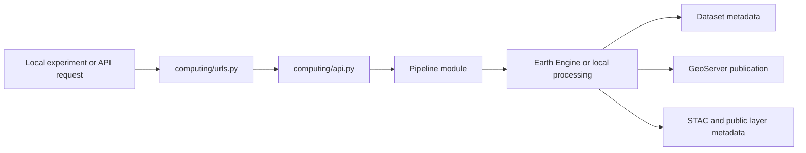

# Develop Computation Pipelines

This section explains how CoRE Stack computes the data it publishes, and how contributors can extend those computations responsibly.

Read the [CoRE Stack Data Structure](watershed-data-structure.md) chapter first if you have not already.

Use it when you want to answer one of these questions:

- what produced the data I am seeing?
- how do the pipeline families differ?
- how do I install enough of the backend to run computations?
- where does the code live?
- how do I move from a local experiment to an integrated computation?

---

## Start Here

- :material-download-box-outline: **Installer**

  ---

  Set up the backend environment needed to run and inspect computation workflows locally.

  [Open Installer](../developers/installer.md){ .md-button .md-button--primary }

- :material-flask-outline: **Algorithmic View**

  ---

  Understand what the pipeline families do scientifically before worrying about route wiring or async execution.

  [How Pipelines Work Algorithmically](how-pipelines-work-algorithmically.md){ .md-button }

- :material-code-json: **Programmatic View**

  ---

  Trace how computations move through `computing/api.py`, pipeline modules, helpers, and publication layers.

  [How They Work Programmatically](how-pipelines-work-programmatically.md){ .md-button }

- :material-play-outline: **Local Pipeline First**

  ---

  Start with one inspectable local run before adding routes, auth, Celery, or publication layers.

  [Open Local Pipeline First](../developers/local-pipeline-first.md){ .md-button }

- :material-connection: **Integration Patterns**

  ---

  See the repeated design shapes behind vector, raster, mixed-output, and time-series workflows.

  [Common Design Patterns](common-design-and-integration-patterns.md){ .md-button }

- :material-database-sync: **Pipeline Integrations**

  ---

  Follow how outputs become datasets, GeoServer layers, metadata entries, and public data surfaces.

  [Open Pipeline Integrations](pipeline-integrations.md){ .md-button }

- :material-format-list-bulleted-square: **Computation Registry**

  ---

  Browse the available computing routes and jump from route names into workflow families.

  [Open Computation Registry](computation-registry.md){ .md-button }

---

## Choose The Right Reading Order

=== "I want to understand current data"

    - [CoRE Stack Data Structure](watershed-data-structure.md)
    - [How Pipelines Work Algorithmically](how-pipelines-work-algorithmically.md)
    - [Core Workflows](core-workflows/index.md)
    - [How Current Data Was Computed](../use-precomputed-data/how-current-data-was-computed.md)

=== "I want to build a pipeline"

    - [Installer](../developers/installer.md)
    - [Local Pipeline First](../developers/local-pipeline-first.md)
    - [Common Pipeline Design / Integration Patterns](common-design-and-integration-patterns.md)
    - [Integrate With Django Computing API](../developers/django-computing-api-integration.md)
    - [Add Celery / Auth / Task Integration](../developers/celery-auth-and-task-integration.md)
    - [Build New Pipelines](../developers/build-new-pipelines.md)

=== "I want to trace code"

    - [How They Work Programmatically](how-pipelines-work-programmatically.md)
    - [Computing API Endpoints](../api/computing-endpoints.md)
    - [Computation Registry](computation-registry.md)
    - [Backend Code Map](../developers/backend-code-map.md)

---

## The Common Shape

This shape changes in detail from workflow to workflow, but not in spirit.

---

## Workflow Families

- :material-map-legend: **Core Workflows**

  ---

  The most central current workflow families: land cover, waterbodies, hydrology, and terrain.

  [Open Core Workflows](core-workflows/index.md){ .md-button }

- :material-map-marker-path: **Boundary and Enrichment Layers**

  ---

  Clip, enrich, or join datasets onto administrative or watershed boundaries.

  [Open Boundary and Enrichment](boundary-and-enrichment/index.md){ .md-button }

- :material-image-filter-hdr: **Raster and Drainage Layers**

  ---

  Raster derivatives, drainage networks, catchments, terrain outputs, and related products.

  [Open Raster and Drainage](raster-and-drainage/index.md){ .md-button }

- :material-chart-timeline-variant: **Time Series and Ops**

  ---

  Temporal vegetation workflows and supporting operational surfaces.

  [Open Time Series and Ops](time-series-and-ops/index.md){ .md-button }

---

## Key Backend Surfaces

- [computing/urls.py](https://github.com/core-stack-org/core-stack-backend/blob/main/computing/urls.py)
- [computing/api.py](https://github.com/core-stack-org/core-stack-backend/blob/main/computing/api.py)
- [computing/utils.py](https://github.com/core-stack-org/core-stack-backend/blob/main/computing/utils.py)
- [utilities/gee_utils.py](https://github.com/core-stack-org/core-stack-backend/blob/main/utilities/gee_utils.py)
- [public_api/views.py](https://github.com/core-stack-org/core-stack-backend/blob/main/public_api/views.py)

---

## Next Paths

- [Installer](../developers/installer.md)
- [Watershed Data Structure](watershed-data-structure.md)
- [How Pipelines Work Algorithmically](how-pipelines-work-algorithmically.md)
- [How They Work Programmatically](how-pipelines-work-programmatically.md)
- [Common Pipeline Design / Integration Patterns](common-design-and-integration-patterns.md)
- [Local Pipeline First](../developers/local-pipeline-first.md)
