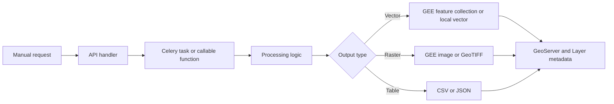
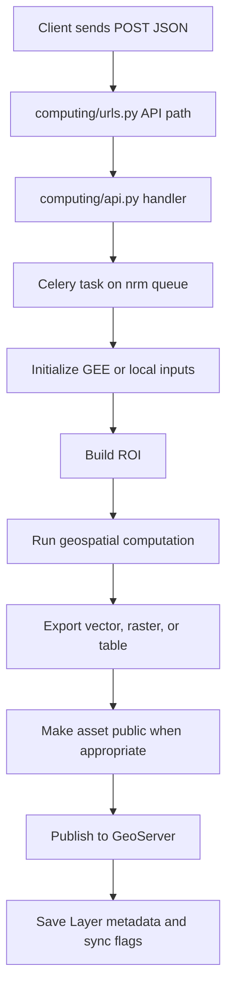

# Build Pipelines

A CoRE Stack pipeline is backend logic that takes a place, a time period, or a project ROI; runs a geospatial computation; and publishes an output that other tools can reuse.

That output may be a vector layer, raster layer, table, time series, report, or STAC item. The internal request path is usually the same: API trigger, Celery task, computation, export, publication, and metadata.

## Basic Pipeline Building Steps

1. Run one existing computation manually.
2. Trace the request from `computing/urls.py` to `computing/api.py`.
3. Follow the called task or function into its pipeline module.
4. Prototype new logic locally, and then add API and Celery wiring, reusing shared GEE, GeoServer, and metadata helpers.
5. Document the new pipeline in the algorithm catalog or the relevant product docs.



## First Computing API test-run { #first-manual-run }

Use one small request after the backend and Celery worker are running. Replace the place names and `gee_account_id` with values from your environment.


```bash
curl -X POST \
  -H "Content-Type: application/json" \
  -d '{
    "state": "karnataka",
    "district": "raichur",
    "block": "devadurga",
    "start_year": 2022,
    "end_year": 2023,
    "gee_account_id": 1
  }' \
  http://127.0.0.1:8000/api/v1/lulc_for_tehsil/
```
!!! note
    Make sure your Django server is running (`python manage.py runserver`) before trying it.

The response should come back quickly:

```json
{
  "Success": "generate_lulc_v3_tehsil task initiated"
}
```

If the request returns a fast acknowledgement, the API did its job; the longer main computation happens as a Celery task. If it fails, check the Django console, Celery worker logs, and [Troubleshooting](../developers/setup-troubleshooting.md).

---

## Pipeline Lifecycle

Every mature CoRE Stack pipeline follows the same broad lifecycle. The details change by domain, but the shape should feel familiar after one or two traces.

## Components

| Component | Role |
| --- | --- |
| Django API | Receives requests and keeps the HTTP layer responsive. |
| Celery | Runs heavy jobs outside the request-response cycle. |
| Google Earth Engine | Computes many raster and vector products and stores GEE assets. |
| Google Cloud Storage | Stages raster and vector exports for GeoServer or follow-up imports. |
| GeoServer | Publishes OGC-ready map layers for dashboards and GIS clients. |
| PostgreSQL/PostGIS | Stores users, locations, datasets, layer metadata, status, and app data. |

## Standard Flow



## Standard Inputs

Most administrative pipelines use:

| Parameter | Type | Meaning |
| --- | --- | --- |
| `state` | string | State name, usually normalized before path building. |
| `district` | string | District name. |
| `block` or `tehsil` | string | Block or tehsil name used for ROI lookup. |
| `start_year` | integer | Start of the agricultural or analysis year. |
| `end_year` | integer | End of the analysis window. |
| `gee_account_id` | integer | Stored `GEEAccount` used for Earth Engine credentials. |

Project-backed pipelines may use `project_id`, KML uploads, plantation profiles, or custom ROI records instead of the standard state-district-block path.

## CoRE-Stack Conventions

- Agricultural-year logic usually follows July to June, not January to December.
- Static layers, such as terrain or admin boundaries, should be deterministic and reusable.
- Dynamic layers, such as LULC, NDVI, drought, and cropping intensity, must preserve the year or date range in names and metadata.

## Skeleton Task

Use this as a mental model, not as a file to paste blindly.

```python
from nrm_app.celery import app
from utilities.gee_utils import (
    ee_initialize,
    valid_gee_text,
    get_gee_dir_path,
    export_vector_asset_to_gee,
    check_task_status,
    make_asset_public,
)
from computing.utils import sync_fc_to_geoserver, save_layer_info_to_db, update_layer_sync_status


@app.task(bind=True, max_retries=3, default_retry_delay=60)
def generate_example_layer(self, state, district, block, gee_account_id):
    ee_initialize(gee_account_id, strict=True)

    asset_suffix = f"{valid_gee_text(district.lower())}_{valid_gee_text(block.lower())}"
    folder_list = [state, district, block]
    roi_asset = get_gee_dir_path(folder_list) + f"filtered_mws_{asset_suffix}_uid"

    roi = ...
    result_fc = ...

    layer_name = f"example_{asset_suffix}"
    asset_id = get_gee_dir_path(folder_list) + layer_name
    task_id = export_vector_asset_to_gee(result_fc, layer_name, asset_id)
    check_task_status([task_id])
    make_asset_public(asset_id)

    layer_id = save_layer_info_to_db(
        state,
        district,
        block,
        layer_name,
        asset_id,
        "Example Dataset",
    )

    response = sync_fc_to_geoserver(result_fc, asset_suffix, layer_name, "example")
    if response and layer_id:
        update_layer_sync_status(layer_id, sync_to_geoserver=True)
```

## Output Paths

| Output type | Common path |
| --- | --- |
| GEE vector | `export_vector_asset_to_gee()` then `sync_fc_to_geoserver()` when needed. |
| GEE raster | `export_raster_asset_to_gee()`, then `sync_raster_to_gcs()`, then `sync_raster_gcs_to_geoserver()`. |
| Local vector | write GeoJSON, SHP, or GPKG, then publish with `push_shape_to_geoserver()` or `sync_layer_to_geoserver()`. |
| Tabular or mixed output | write CSV/JSON and attach it to a stable geometry or report API. |
| Catalog output | create or update STAC collection/item metadata after the layer exists. |

## Pipeline Patterns

Most new work fits one of these patterns. Choose the pattern first, then use the lifecycle above to wire the API handler, Celery task, export, publication, and metadata update.

| Pattern | Use it for | Typical helpers |
| --- | --- | --- |
| Raster generation | LULC, terrain rasters, slope percentage, natural depression, catchment area, restoration rasters, tree-health rasters | `export_raster_asset_to_gee()`, `sync_raster_to_gcs()`, `sync_raster_gcs_to_geoserver()` |
| Vector generation | MWS, drainage, NREGA assets, facilities, aquifer, SOGE, crop intensity, terrain clusters, vectorized water bodies | `export_vector_asset_to_gee()`, `sync_fc_to_geoserver()`, `sync_layer_to_geoserver()`, `push_shape_to_geoserver()`, `gdf_to_ee_fc()` |
| Local or tabular data | CSV, GeoJSON, S3, shapefile, or public data dumps that need filtering and publication | CRS normalization, geometry validation, `GeoDataFrame` cleanup, vector export helpers |
| Project-backed ROI | Plantation, water-rejuvenation, or other workflows that run on a project boundary instead of a standard block | `Project` records, uploaded KML, workflow profile records, project-scoped GEE paths |
| Catalog publication | STAC collection and item generation after a layer already exists | STAC generation task, `Layer` metadata, sync flags |

The important design choice is where the boundary sits. Keep the API layer thin, keep network-heavy work inside a retrying Celery task, and keep the inner computation callable enough that you can debug it without sending a full HTTP request every time.

## Reliability Checklist

- Use human-readable asset names, so reruns are understandable.
- Check asset existence before export when overwrite behavior matters.
- Make public assets public only after export success.
- Save layer metadata after the asset path is known.
- Update sync flags only after publication succeeds.
- Keep exception logging near the task boundary.
- Prefer small, separately callable processing functions under the task wrapper.
