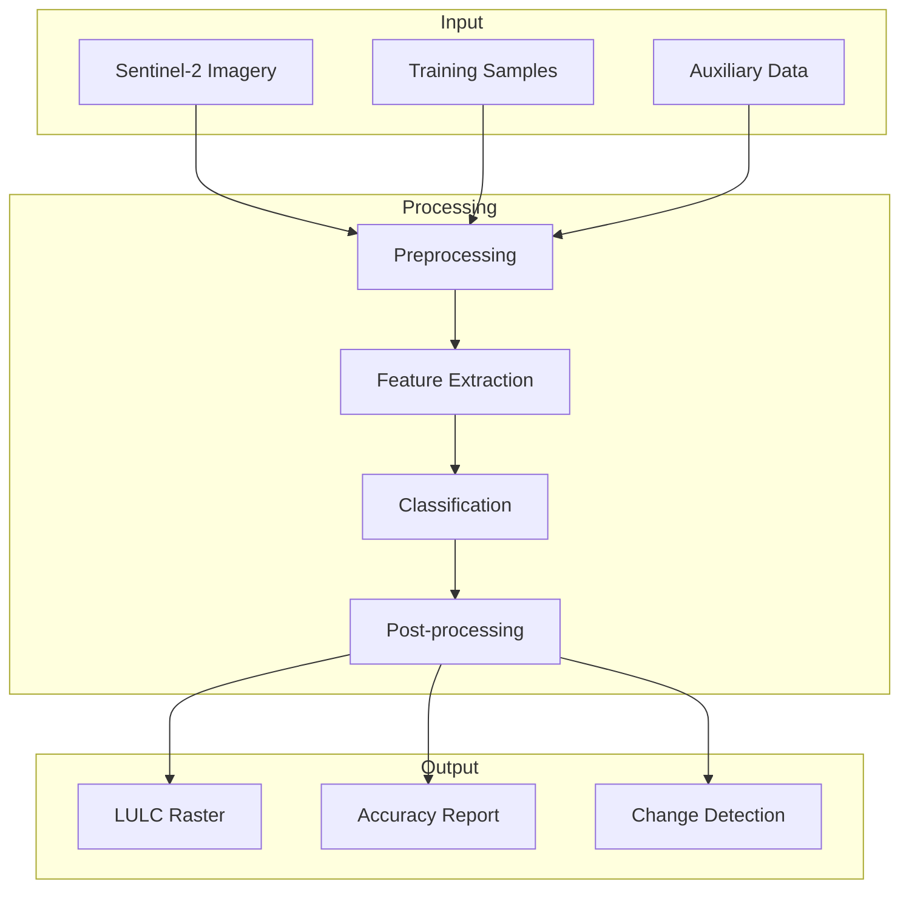
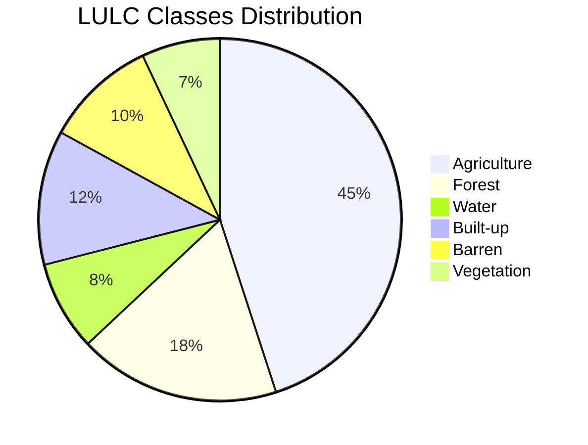
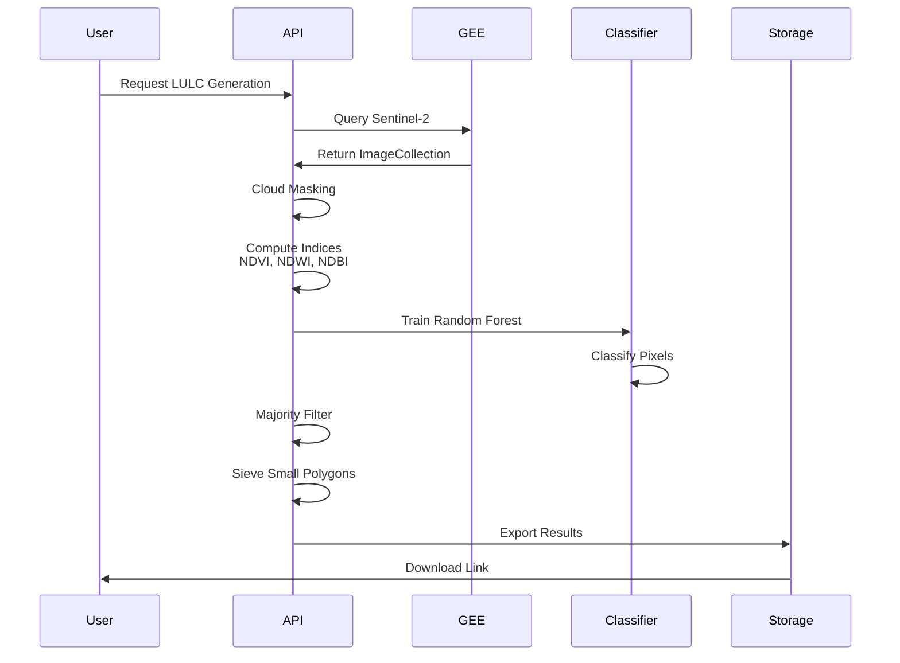
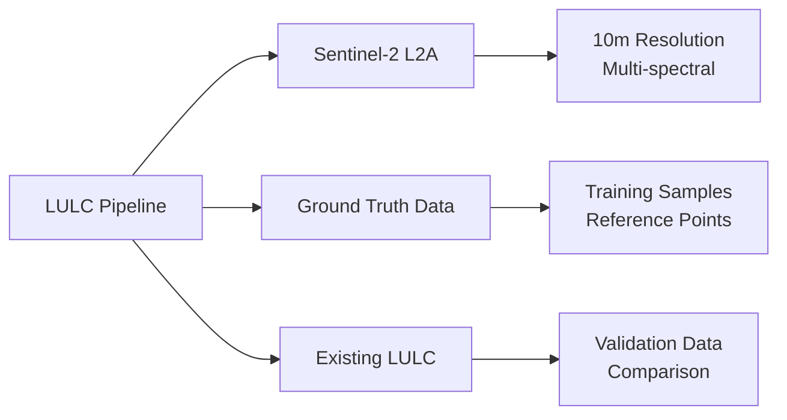
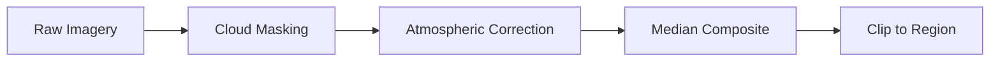
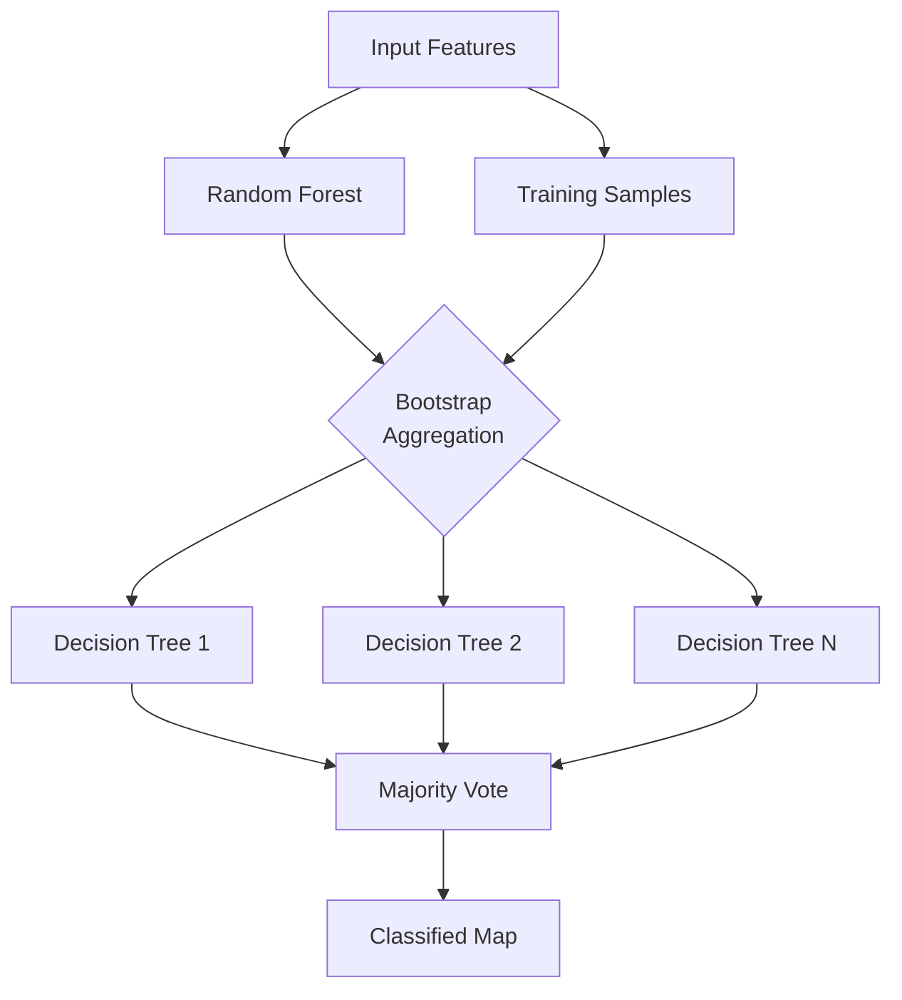
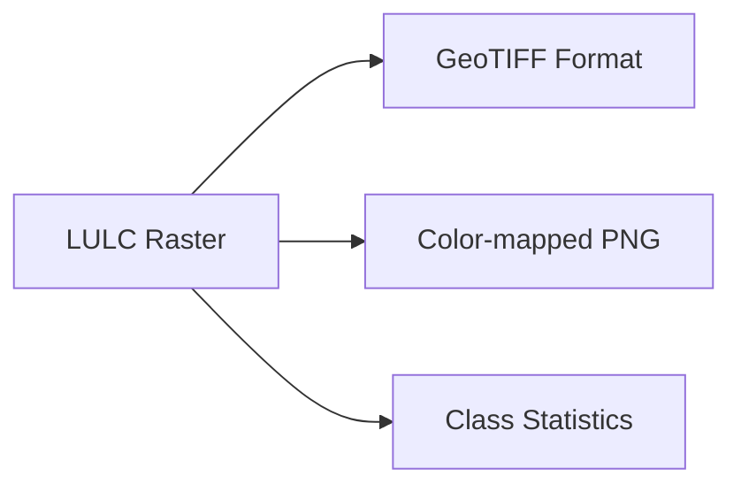
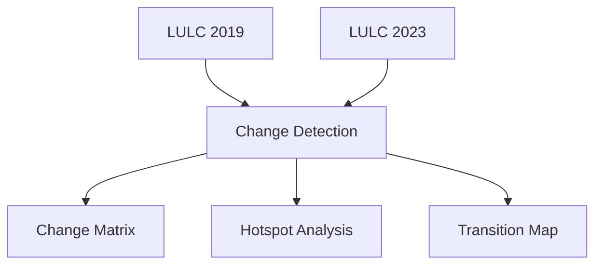

# LULC Generation Pipeline

Generate high-resolution Land Use Land Cover (LULC) maps using satellite imagery and machine learning.

---

## Overview



The LULC pipeline classifies land into categories such as:

- Agriculture
- Forest
- Water Bodies
- Built-up Areas
- Barren Land
- Vegetation

---

## Classification System



### Class Definitions

| Class | Code | Description | Color |
|-------|------|-------------|-------|
| Agriculture | 1 | Croplands, plantations | #ffff00 |
| Forest | 2 | Dense tree cover | #006400 |
| Water | 3 | Rivers, lakes, reservoirs | #0000ff |
| Built-up | 4 | Urban areas, roads | #ff0000 |
| Barren | 5 | Bare soil, rock | #a52a2a |
| Vegetation | 6 | Grasslands, shrubs | #7cfc00 |

---

## Algorithm Flow



---

## Input Requirements

### Required Parameters

```json
{
  "state": "karnataka",
  "district": "raichur", 
  "block": "devadurga",
  "year": 2023,
  "resolution": "10m"
}
```

### Input Data Sources



| Data Source | Purpose | Resolution |
|-------------|---------|------------|
| Sentinel-2 L2A | Primary imagery | 10m |
| Training samples | Supervised classification | Point data |
| Existing LULC | Validation | 30-100m |

---

## Processing Steps

### 1. Data Acquisition

```python
# Query Sentinel-2 for date range
start_date = f"{year}-01-01"
end_date = f"{year}-12-31"

# Filter by region and cloud cover
image_collection = (ee.ImageCollection('COPERNICUS/S2_SR_HARMONIZED')
    .filterDate(start_date, end_date)
    .filterBounds(geometry)
    .filter(ee.Filter.lt('CLOUDY_PIXEL_PERCENTAGE', 20)))
```

### 2. Preprocessing



### 3. Feature Extraction

Calculated spectral indices:

| Index | Formula | Purpose |
|-------|---------|---------|
| NDVI | (NIR-Red)/(NIR+Red) | Vegetation health |
| NDWI | (NIR-SWIR)/(NIR+SWIR) | Water detection |
| NDBI | (SWIR-NIR)/(SWIR+NIR) | Built-up areas |
| EVI | 2.5*(NIR-Red)/(NIR+6*Red-7.5*Blue+1) | Enhanced vegetation |

### 4. Classification



### 5. Post-processing

- **Majority filter**: Remove salt-and-pepper noise
- **Sieve filter**: Remove small polygons (< 0.5 ha)
- **Smoothing**: Gaussian kernel smoothing

---

## Output Products

### Raster Output



| Property | Value |
|----------|-------|
| Format | GeoTIFF |
| Resolution | 10m |
| CRS | EPSG:4326 |
| Bands | 1 (class values) |
| Compression | LZW |

### Statistics Report

```json
{
  "classification_stats": {
    "total_pixels": 1250000,
    "resolution_m": 10,
    "area_sqkm": 125.0,
    "class_distribution": {
      "agriculture": {"pixels": 562500, "area_sqkm": 56.25, "percentage": 45.0},
      "forest": {"pixels": 225000, "area_sqkm": 22.5, "percentage": 18.0},
      "water": {"pixels": 100000, "area_sqkm": 10.0, "percentage": 8.0},
      "built_up": {"pixels": 150000, "area_sqkm": 15.0, "percentage": 12.0},
      "barren": {"pixels": 125000, "area_sqkm": 12.5, "percentage": 10.0},
      "vegetation": {"pixels": 87500, "area_sqkm": 8.75, "percentage": 7.0}
    }
  },
  "accuracy": {
    "overall": 88.5,
    "kappa": 0.85,
    "producer_accuracy": {...},
    "user_accuracy": {...}
  }
}
```

---

## API Usage

### Request

```bash
curl -X POST "https://geoserver.core-stack.org/api/v1/lulc_for_tehsil/" \
  -H "Content-Type: application/json" \
  -d '{
    "state": "karnataka",
    "district": "raichur",
    "block": "devadurga",
    "start_year": 2022,
    "end_year": 2023,
    "version": "v3",
    "gee_account_id": 1
  }'
```

### Response

```json
{
  "Success": "generate_lulc_v3_tehsil task initiated"
}
```

---

## Local Mode

Local-first LULC documentation is still being aligned with the backend. For the current route surface, use the task-submission handlers in [`computing/api.py`](https://github.com/core-stack-org/core-stack-backend/blob/main/computing/api.py#L280-L438) and treat the Local-First section in this docs repo as roadmap material until that alignment is complete.


---

## Change Detection

Compare LULC between two time periods:



### Change Matrix Example

| From/To | Ag | Forest | Water | Built-up |
|---------|-----|--------|-------|----------|
| Ag | 85% | 5% | 2% | 8% |
| Forest | 10% | 88% | 1% | 1% |
| Water | 5% | 2% | 92% | 1% |
| Barren | 45% | 10% | 3% | 42% |

---

## Accuracy Assessment

### Confusion Matrix

```mermaid
matrix
    title Confusion Matrix
    x-axis Agriculture, Forest, Water, Built-up
    y-axis Agriculture, Forest, Water, Built-up
    
    Agriculture [85, 5, 2, 8]
    Forest [8, 90, 0, 2]
    Water [3, 1, 95, 1]
    Built-up [10, 2, 1, 87]
```

### Accuracy Metrics

| Metric | Value | Description |
|--------|-------|-------------|
| Overall Accuracy | 89.3% | Correctly classified / Total |
| Kappa Coefficient | 0.87 | Agreement beyond chance |
| Producer's Accuracy | 85-92% | Correct / Actual class |
| User's Accuracy | 84-93% | Correct / Predicted class |

---

## Troubleshooting

### Low Accuracy

| Issue | Cause | Solution |
|-------|-------|----------|
| Cloud contamination | Poor cloud masking | Increase cloud threshold |
| Class confusion | Similar signatures | Add more training data |
| Mixed pixels | 10m resolution | Use sub-pixel analysis |

### Processing Errors

| Error | Solution |
|-------|----------|
| "No clear images" | Expand date range |
| "Memory exceeded" | Reduce region size |
| "Export failed" | Check storage quota |

---

## Best Practices

1. **Use dry season imagery** - Better visibility of land features
2. **Multi-year composites** - Reduce year-to-year variation
3. **Ground truth validation** - Essential for accuracy
4. **Consistent classification** - Use same scheme for change detection

---

## See Also

- [SWB Pipeline](swb-detection.md) - Detect water bodies from LULC
- [Hydrology Pipeline](hydrology.md) - Calculate runoff from LULC
- [API Reference](../api/computing-endpoints.md) - Programmatic access
