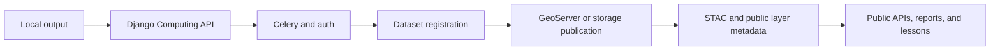

# Pipeline Integrations

This page covers the handoff between a successful computation and a usable platform output.

---

## The Integration Ladder



Each rung matters because users normally meet the result much later than developers meet the code.

---

## Main Integration Surfaces

| Surface | What it is for | Typical page to read next |
|---------|----------------|---------------------------|
| dataset registration | make outputs known to the platform | [Add and Integrate Public / New Data Resources](../developers/add-new-data-resources.md) |
| GeoServer publication | serve layers to maps and geometry clients | [GeoServer](../developers/integrations/geoserver.md) |
| GEE assets | upstream or intermediate asset storage and processing | [Google Earth Engine](../developers/integrations/google-earth-engine.md) |
| metadata and layer inventory | keep outputs discoverable by APIs | [Public API References](../api/public-endpoints.md) |
| STAC and schema surfaces | make structure and metadata inspectable | [STAC Specs](../api/stac-specs.md) |

---

## Dataset Registration Matters

When a new output should become a durable platform surface, registration is part of the job.

The developer-facing admin path to keep in mind is:

```text
http://127.0.0.1:8000/admin/computing/dataset/add/
```

That is one of the key bridges between:

- a finished computation
- a documented dataset
- a discoverable public or semi-public data surface

---

## Publication Is Not Only Map Serving

Publishing a pipeline often means several things at once:

- storing or syncing the geometry or raster output
- making the output render fast in GeoServer-backed clients
- saving metadata that later powers endpoint discovery
- exposing enough schema for developers and data users to understand the output

That is why integration work should be documented alongside science and code, not treated as afterthought.

---

## Typical Downstream Readers

=== "Public data user"

    They will usually meet your work through:

    - [Public API References](../api/public-endpoints.md)
    - [STAC Specs](../api/stac-specs.md)
    - [How Current Data Was Computed](../use-precomputed-data/how-current-data-was-computed.md)

=== "UI developer"

    They usually care about:

    - layer URLs
    - geometry routes
    - stable identifiers
    - report or dashboard handoffs

=== "Pipeline developer"

    They usually care about:

    - where registration happens
    - which helper saves metadata
    - how to make the new result appear across the stack

---

## Next Paths

- [Add and Integrate Public / New Data Resources](../developers/add-new-data-resources.md)
- [Integrations](../developers/integrations/index.md)
- [Computing API Endpoints](../api/computing-endpoints.md)
- [How Current Data Was Computed](../use-precomputed-data/how-current-data-was-computed.md)
- [STAC Specs](../api/stac-specs.md)
