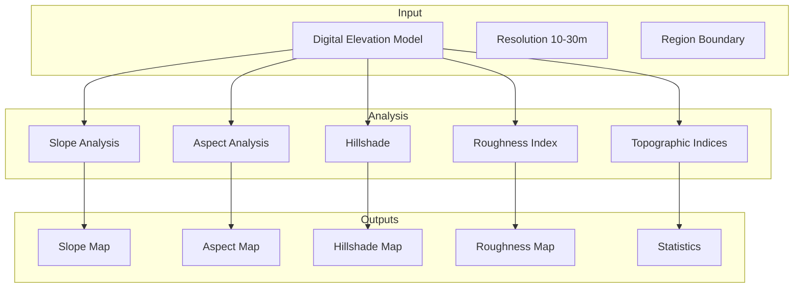
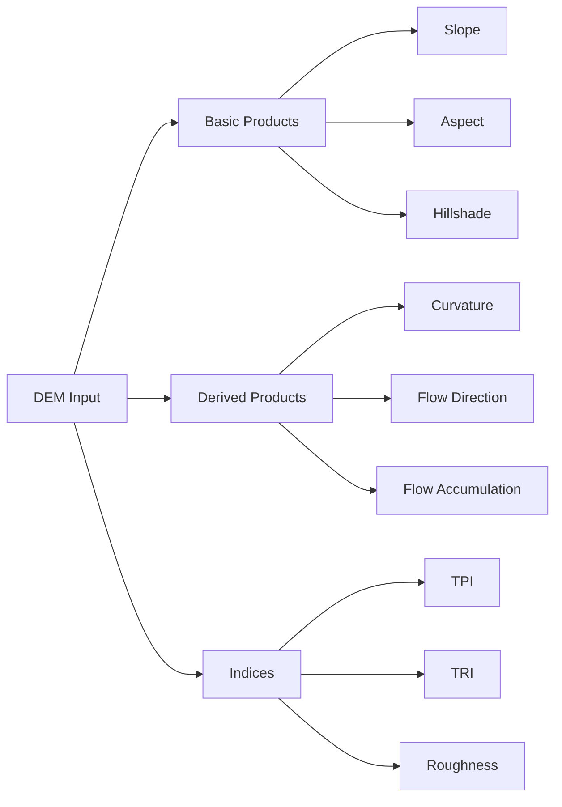
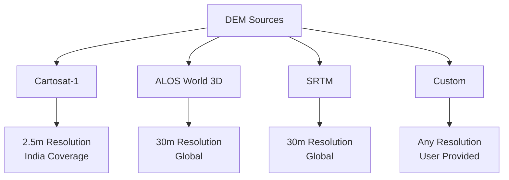
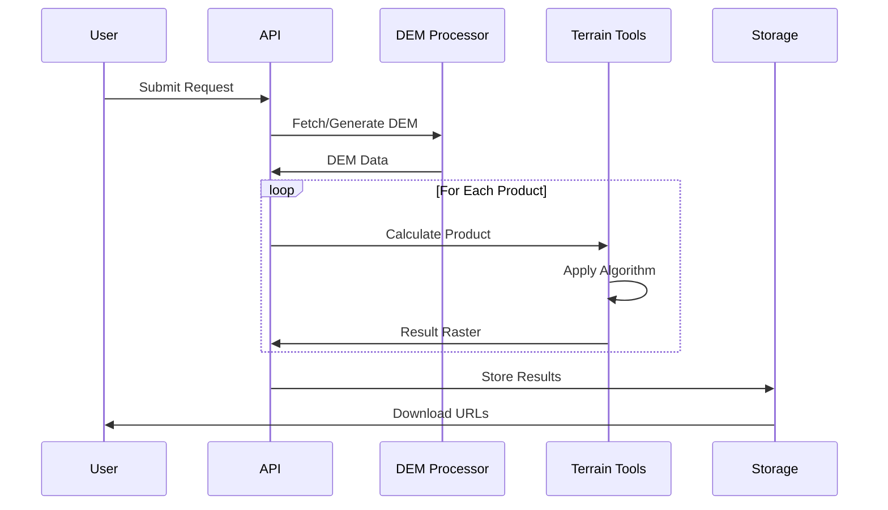
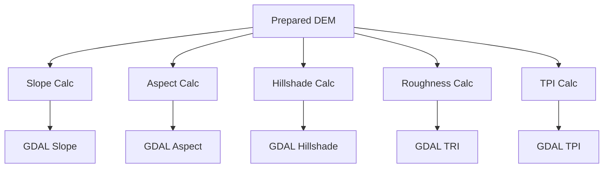
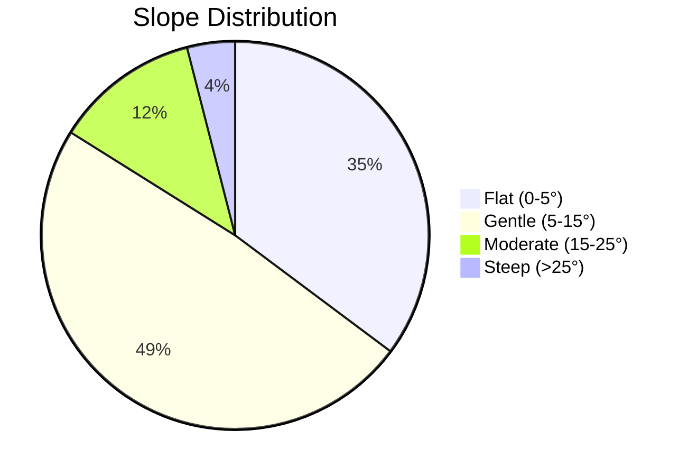
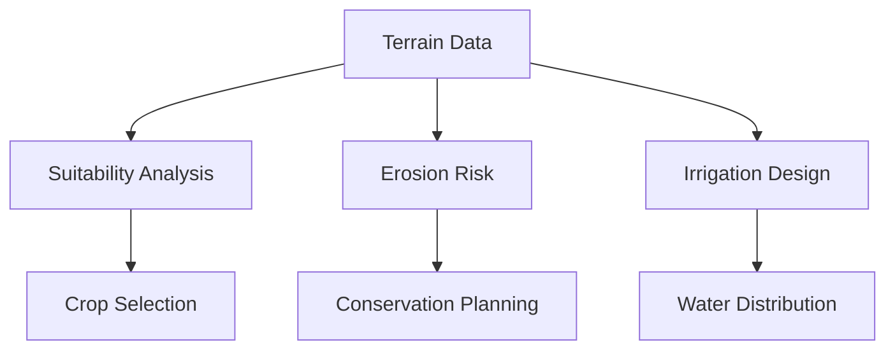
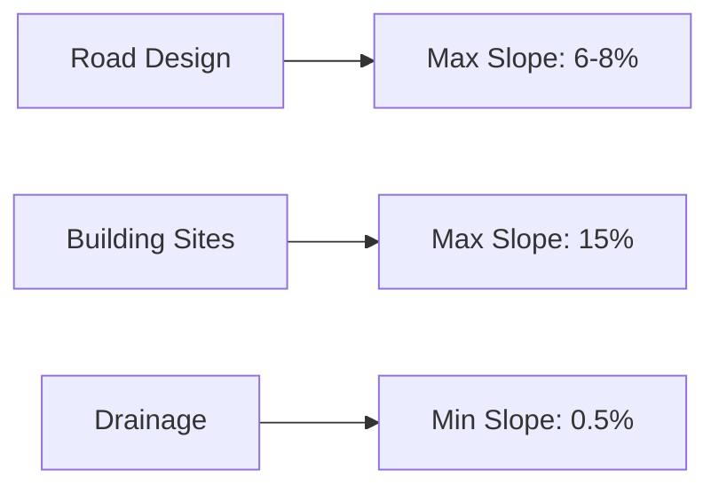

# Terrain Analysis Pipeline

Generate slope, aspect, hillshade, and other terrain derivatives from Digital Elevation Models (DEM).

---

## Overview



Terrain analysis provides foundational data for hydrology, agriculture, infrastructure planning, and environmental assessments.

---

## Available Products



| Product | Description | Units | Use Case |
|---------|-------------|-------|----------|
| **Slope** | Maximum rate of elevation change | Degrees (0-90) | Erosion, construction |
| **Aspect** | Direction of maximum slope | Degrees (0-360) | Solar exposure |
| **Hillshade** | Simulated illumination | 0-255 | Visualization |
| **Roughness** | Elevation variability | Dimensionless | Terrain difficulty |
| **TPI** | Topographic Position Index | -100 to +100 | Landform classification |
| **TRI** | Terrain Ruggedness Index | 0+ | Surface complexity |
| **Curvature** | Rate of slope change | 1/m | Water flow |

---

## Algorithm Details

### Slope Calculation

```mermaid
graph LR
    A[3x3 Window] --> B[dz/dx]
    A --> C[dz/dy]
    
    B --> D[Slope = atan√(dz/dx² + dz/dy²)]
    C --> D
    
    D --> E[Degrees]
```

Using Horn's method for improved accuracy:

```python
def calculate_slope(dem):
    """Calculate slope in degrees from DEM."""
    # Calculate gradients
    dz_dx = ((dem[0,0] + 2*dem[0,1] + dem[0,2]) -
             (dem[2,0] + 2*dem[2,1] + dem[2,2])) / (8 * cell_size)
    
    dz_dy = ((dem[2,0] + 2*dem[1,0] + dem[0,0]) -
             (dem[2,2] + 2*dem[1,2] + dem[0,2])) / (8 * cell_size)
    
    # Calculate slope
    slope_rad = np.arctan(np.sqrt(dz_dx**2 + dz_dy**2))
    slope_deg = np.degrees(slope_rad)
    
    return slope_deg
```

### Aspect Calculation

```mermaid
graph LR
    A[dz/dx] --> B[Aspect = atan2(dz/dy, -dz/dx)]
    A --> C[dz/dy]
    C --> B
    B --> D[Convert to 0-360]
    D --> E[North = 0°]
```

Aspect represents the compass direction that a slope faces:

| Aspect Range | Direction |
|--------------|-----------|
| 0-22.5, 337.5-360 | North |
| 22.5-67.5 | Northeast |
| 67.5-112.5 | East |
| 112.5-157.5 | Southeast |
| 157.5-202.5 | South |
| 202.5-247.5 | Southwest |
| 247.5-292.5 | West |
| 292.5-337.5 | Northwest |

### Hillshade

```mermaid
graph LR
    A[Slope] --> D[Hillshade = 255 × (cos(Z) × cos(S) + sin(Z) × sin(S) × cos(Az-As))]
    B[Aspect] --> D
    C[Sun Azimuth] --> D
    C2[Sun Zenith] --> D
```

Default sun position: Azimuth = 315°, Zenith = 45°

---

## Input Requirements

### Required Parameters

```json
{
  "state": "karnataka",
  "district": "raichur",
  "block": "devadurga",
  "products": ["slope", "aspect", "hillshade"],
  "resolution": "10m",
  "azimuth": 315,
  "altitude": 45
}
```

### DEM Sources



| Source | Resolution | Coverage | Best For |
|--------|------------|----------|----------|
| Cartosat-1 | 2.5m | India | Detailed analysis |
| ALOS World 3D | 30m | Global | Large areas |
| SRTM | 30m | Global | General use |

---

## Processing Workflow



### Step 1: DEM Preparation

- Reproject to EPSG:4326
- Resample to target resolution
- Fill sinks (hydro-enforcement)
- Clip to region boundary

### Step 2: Derivative Calculation



### Step 3: Quality Control

- Check for artifacts
- Validate statistics
- Generate previews

---

## Output Products

### Raster Outputs

| Product | Format | Data Type | Range |
|---------|--------|-----------|-------|
| Slope | GeoTIFF | Float32 | 0-90 degrees |
| Aspect | GeoTIFF | Float32 | 0-360 degrees |
| Hillshade | GeoTIFF | UInt8 | 0-255 |
| Roughness | GeoTIFF | Float32 | 0+ |
| TPI | GeoTIFF | Float32 | -100 to +100 |

### Statistics Report

```json
{
  "terrain_stats": {
    "elevation": {
      "min_m": 420.5,
      "max_m": 685.2,
      "mean_m": 542.8,
      "std_m": 45.3
    },
    "slope": {
      "min_degrees": 0.0,
      "max_degrees": 45.8,
      "mean_degrees": 8.5,
      "std_degrees": 6.2,
      "percent_under_5": 35.2,
      "percent_5_to_15": 48.7,
      "percent_over_15": 16.1
    },
    "aspect": {
      "dominant_direction": "southeast",
      "percent_north_facing": 22.5,
      "percent_south_facing": 28.3
    }
  }
}
```

### Slope Distribution



---

## API Usage

### Basic Request

```bash
curl -X POST "https://geoserver.core-stack.org/api/v1/generate_terrain_descriptor/" \
  -H "Content-Type: application/json" \
  -d '{
    "state": "karnataka",
    "district": "raichur",
    "block": "devadurga",
    "gee_account_id": 1
  }'
```

### Response

```json
{
  "Success": "generate_terrain_descriptor task initiated"
}
```

### Python Example

```python
import requests

response = requests.post(
    "https://geoserver.core-stack.org/api/v1/generate_terrain_raster/",
    json={
        "state": "karnataka",
        "district": "raichur",
        "block": "devadurga",
        "gee_account_id": 1
    }
)

print(response.status_code)
print(response.json())
```

---

## Applications

### Agriculture



**Slope Classes for Agriculture:**

| Slope | Class | Suitability |
|-------|-------|-------------|
| 0-3% | Level | Excellent |
| 3-8% | Gentle | Good |
| 8-15% | Moderate | Fair |
| 15-25% | Steep | Poor |
| >25% | Very Steep | Unsuitable |

### Hydrology

- **Flow routing**: D8/D-infinity algorithms
- **Watershed delineation**: Pour point analysis
- **Stream extraction**: Contributing area threshold

### Infrastructure



---

## Visualization

### Color Ramps

**Slope:**
- Green: 0-5° (Flat)
- Yellow: 5-15° (Gentle)
- Orange: 15-25° (Moderate)
- Red: >25° (Steep)

**Aspect:**
- Continuous color wheel
- North = Blue
- South = Red
- East = Yellow
- West = Green

### 3D Visualization

Combine hillshade with:
- Slope (opacity overlay)
- LULC (color overlay)
- Custom color ramps

---

## Troubleshooting

### Artifacts in Output

| Issue | Cause | Solution |
|-------|-------|----------|
| Striping | DEM source artifacts | Use higher quality DEM |
| Terracing | SRTM voids | Fill voids before processing |
| Noise | Low-quality DEM | Apply smoothing filter |

### Invalid Values

| Problem | Check |
|---------|-------|
| Negative slopes | DEM datum issues |
| Aspect = -1 | Flat areas (slope = 0) |
| NoData holes | Source data gaps |

---

## Best Practices

1. **Choose appropriate resolution** - Match to analysis scale
2. **Use hydro-enforced DEMs** - For watershed analysis
3. **Validate outputs** - Compare with known slopes
4. **Consider vertical datum** - MSL vs ellipsoid

---

## See Also

- [Hydrology Pipeline](hydrology.md) - Uses slope for runoff
- [LULC Pipeline](lulc-generation.md) - Combined analysis
- [API Reference](../api/computing-endpoints.md) - Programmatic access
