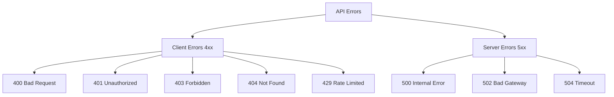

# API Errors Reference

Complete reference for common error shapes and categories documented for the CoRE Stack API.

---

## Error Response Format

All errors should be understandable enough for both API users and maintainers to debug quickly.

```json
{
  "status": "error",
  "error": {
    "code": "ERROR_CODE",
    "message": "Human-readable description",
    "details": {},
    "request_id": "req-uuid-for-support"
  }
}
```

---

## Error Categories



---

## 400 Bad Request

### `INVALID_PARAMETER`

The request contains invalid or missing parameters.

```json
{
  "status": "error",
  "error": {
    "code": "INVALID_PARAMETER",
    "message": "Invalid or missing required parameters",
    "details": {
      "state": "State 'unknown' not found",
      "year": "Year must be between 2015 and 2024"
    }
  }
}
```

### `INVALID_JSON`

The request body contains malformed JSON.

### `VALIDATION_ERROR`

Request parameters failed validation rules.

### `MISSING_FIELD`

Required field is missing from the request.

| Field | Description |
|-------|-------------|
| `state` | State name is required |
| `district` | District name is required |
| `block` | Block name is required |
| `year` | Year is required for temporal analyses |

---

## 401 Unauthorized

### `UNAUTHORIZED`

Request lacks valid authentication credentials.

Typical fixes:

- add `X-API-Key` for public data APIs
- add `Authorization: Bearer ...` for JWT-protected APIs
- confirm which auth mode the target API actually uses

### `INVALID_API_KEY`

The provided API key is invalid or malformed.

### `EXPIRED_TOKEN`

The provided bearer token has expired and needs refresh or re-login.

---

## 403 Forbidden

### `INSUFFICIENT_PERMISSIONS`

The caller is authenticated but not allowed to perform the requested action.

Common causes:

- a user is outside the required organization scope
- an API requires superadmin or organization admin privileges
- a project assignment does not match the user's organization

---

## 404 Not Found

### `RESOURCE_NOT_FOUND`

The requested API path, object, or dataset does not exist.

Typical examples:

- wrong district or block name
- wrong organization or project identifier
- stale layer or dataset URL

---

## 429 Rate Limited

### `RATE_LIMITED`

The caller has sent too many requests in a short period.

Typical response guidance:

- retry after waiting
- reduce polling frequency
- batch requests where possible

---

## 5xx Server Errors

### `INTERNAL_ERROR`

The backend failed in an unexpected way.

### `UPSTREAM_FAILURE`

A dependency such as GeoServer, Earth Engine, or another external system failed or returned an invalid response.

### `TIMEOUT`

The backend or an upstream job exceeded a time limit.

---

## Practical Debug Order

1. Confirm and test the API path, as documented in [Public APIs](../use-precomputed-data/public-apis.md).
3. Check spelling and case for geographic names and IDs.
4. For developer-side task flows, compare against the manual run path in [Build Pipelines](../pipelines/index.md#first-manual-run).
