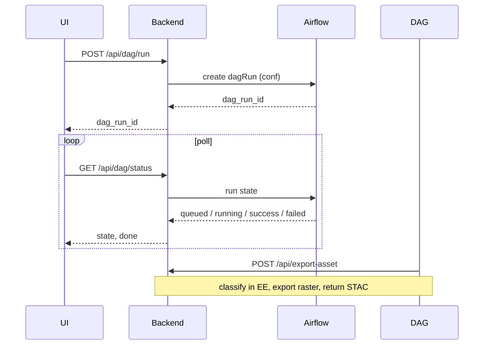

# Cluster Docker Services

## General guidelines for new Docker services

Every service added to the cluster must follow these rules before it is deployed or documented here.

### 1. No hardcoded configuration

Nothing environment-specific may be baked into the image or committed in plain text.

| Category | Must be env-driven (examples) |
| --- | --- |
| Database | `DB_HOST`, `DB_PORT`, `DB_NAME`, `DB_USER`, `DB_PASSWORD` |
| Search / object storage | API keys, bucket names, index names, endpoint URLs |
| Airflow | `AIRFLOW_API_BASE`, `AIRFLOW_DAG_ID`, `AIRFLOW_USERNAME` / `AIRFLOW_PASSWORD` (or `AIRFLOW_TOKEN`), `CORESTACK_API_BASE` |
| External APIs | Base URLs, tokens, service account paths |
| Paths | Input/output dirs, model dirs, log dirs, `CORESTACK_ROOT` / data roots |

**Required in every repo:**

- `.env.example` listing every variable with a short comment (no real secrets).
- Application reads config from environment at runtime — not from hardcoded defaults that differ per cluster.
- Empty `AIRFLOW_API_BASE` turns Airflow **off** (local compute). Do not use `AIRFLOW_BASE_API_URL` or a `COMPUTE_MODE` flag.

**Do not:**

- Put passwords, tokens, or hostnames in the `Dockerfile`.
- Commit a real `.env` file to Git.

Credential **files** (Earth Engine JSON, and similar) must be both referenced by an env var **and** present at that path inside the container (usually because the checkout is bind-mounted). Ship a one-command auth self-check in the repo.

### 2. Code, models, and data live on the host (mount, do not copy) { #2-code-models-and-data-live-on-the-host-mount-do-not-copy }

The image is **deps-only** (OS packages, Python/Node libs, entrypoint). Bind-mount three host folders. Same table as [checklist §1](cluster-service-checklist.md#1-store-all-relevant-data-and-compute-output-in-data) and [Tower Services](../infra/local-cluster.md#shared-terminology).

| Host folder | Container path | Contents |
| --- | --- | --- |
| **`code/`** | `/app` | Git checkout. Update with `git pull` + restart. |
| **`models/`** | `/app/models` | Weights, checkpoints, `.pt` / `.onnx` / `.joblib`. |
| **`data/`** | `/app/data` | Inputs, caches, **all compute output**. Logs: `data/logs/<application_name>/`. |

The three layers:

| Layer | Where it lives | How it gets there |
| --- | --- | --- |
| **Dependencies** | the **deps-only image** | `docker pull` from **GHCR or Docker Hub** |
| **Code** | host **`code/`** | `git clone` / `git pull`, mounted at `/app` |
| **Models** | host **`models/`** | mounted at `/app/models` |
| **Data** | host **`data/`** | mounted at `/app/data`; written at runtime |

**Why this split:**

- **Update the app = `git pull` + restart.** No image rebuild.
- **Rebuild the image only when dependencies change** (requirements file, system libs, CUDA, GDAL).
- With nothing mounted at `/app`, the container may start but has **no code to serve** — that is intentional.

A laptop shortcut that bind-mounts `.` onto `/app` (Custom LULC example) is fine for local try-out. **Cluster deploy** must use the three separate mounts.

Document every volume in the repo `README`.

### 3. Repository README — step-by-step installation

Each service GitHub repo must include a `README.md` with:

1. **Purpose** — what the service does in one paragraph.
2. **Prerequisites** — Docker version, disk, GPU (if any), network/proxy notes for IITD cluster.
3. **Clone and layout** — where code, models, and data should live on the host.
4. **Environment** — copy `.env.example` → `.env`, fill every variable.
5. **Pull image** — exact `docker pull` with image name and recommended tag (not only `latest`).
6. **Run** — full `docker run` or `docker compose up` with all `-v`, `-e`, ports, and network. Listen on `0.0.0.0` so other containers/hosts can reach the service (not only `localhost`).
7. **Verify** — health check URL, sample command, or log line that confirms success.
8. **Upgrade** — how to pull a new tag and restart without losing data (`git pull` + restart for code; rebuild only for deps).
9. **Troubleshooting** — common failures (proxy, permissions, missing mount, empty `/app`).

Cluster operators should be able to install from the service repo `README`; this page defines cluster-wide standards only.

### 4. `VERSION` changelog file

Maintain a **`VERSION`** file (or `CHANGELOG.md` dedicated to releases) in the repo root:

```text
1.2.0 — 2026-08-31
- Added support for batch inference
- Fixed DB connection pooling

1.1.0 — 2026-06-15
- Initial cluster deployment
```

Rules:

- Bump version when the **image** or **breaking env/mount contract** changes.
- Tag Docker images with the same version (`:1.2.0`), not only `:latest`.
- Note migration steps if env vars or mount paths change between versions.

### 5. GHCR or Docker Hub — build, push, and keep updated { #5-ghcr-or-docker-hub--build-push-and-keep-updated }

| Rule | Detail |
| --- | --- |
| Registry | Push to **GHCR** (`ghcr.io/...`) **or Docker Hub** (`docker.io/...`) |
| Tags | `latest` for dev convenience; **always** tag releases (`1.0.0`, `1.0.1`) |
| Rebuild | Rebuild and push when base image, system deps, or runtime libs change |
| Document | Record image name, current tag, and last push date in the service repo README |
| Pull on cluster | Use pinned tag in production; document upgrade path |

Example workflow:

```bash
docker build -t <registry>/<name>:1.0.0 .
docker tag <registry>/<name>:1.0.0 <registry>/<name>:latest
docker push <registry>/<name>:1.0.0
docker push <registry>/<name>:latest
```

`<registry>/<name>` is `ghcr.io/<org>/<name>` or `<dockerhub-user>/<name>`.

The Dockerfile should copy **only** the requirements file (not application source):

```dockerfile
FROM python:3.11-slim
WORKDIR /app
COPY deploy/requirements-docker.txt /tmp/requirements.txt
RUN pip install --no-cache-dir -r /tmp/requirements.txt
EXPOSE 8000
CMD ["uvicorn", "backend:app", "--app-dir", "src", "--host", "0.0.0.0", "--port", "8000"]
```

### 6. Additional requirements

| Area | Requirement |
| --- | --- |
| **Secrets** | Use env files or cluster secret store; never bake secrets into layers |
| **Networks** | Use a named Docker network shared with dependent services; document service DNS names |
| **Ports** | Document host ports; avoid conflicts with CoRE Stack (9000, 9001, 8080, etc.) |
| **Health checks** | Expose HTTP `/health` or equivalent; add `HEALTHCHECK` in Dockerfile where possible |
| **Logs** | `LOG_LEVEL` = `debug` \| `info` \| `error`. Files under **`data/logs/<application_name>/`** (and stdout) |
| **Restart policy** | Use `--restart unless-stopped` or equivalent in compose for cluster services |
| **Resources** | Document CPU/RAM/GPU needs; set limits if the host is shared |
| **Proxy (IITD)** | Configure Docker **daemon** proxy for pulls; do not put `registry-1.docker.io` in `NO_PROXY` |
| **Compose** | Prefer `docker-compose.yml` + `.env` for multi-container services (e.g. Airflow) |
| **Ownership** | Record repo owner and who to contact for upgrades |

### 7. Writing DAGs — STACD YAML workflow { #7-writing-dags--stacd-yaml-workflow }

Do **not** hand-write one-off Python DAG files for cluster services unless there is a strong reason. Define workflows as **STACD YAML** and let the framework generate and deploy the Airflow DAG.

**Authoritative guide:** [STACD Framework — §11 Writing Your Own YAML Workflow](https://github.com/SaharshLaud/STACD_framework/blob/dev/README.md#11-writing-your-own-yaml-workflow)

Each workflow requires **three YAML files**:

| File | Purpose |
| --- | --- |
| **DAG YAML** | Workflow graph — algorithm nodes, dataset nodes, dependencies, trigger params (`state`, `district`, `block`, region, year, …) |
| **Algorithm Repo YAML** | How each algorithm runs — **API** and/or **Docker** execution mode |
| **Dataset Repo YAML** | Root datasets (pre-existing inputs not produced by an algorithm) |

Pick an execution mode:

| Mode | When to use | What Airflow does |
| --- | --- | --- |
| **API** | The algorithm already has an HTTP “do the work” endpoint (Custom LULC, similar FastAPI/Django services) | POSTs to `url:` on the running backend; the container stays up as the executor |
| **Docker** | Batch/CLI image with a Python entry function (Bioacoustic, Drone, some LULC clip jobs) | Starts the pinned image and calls `module.function` |

**API execution mode** (Algorithm Repo YAML) — Custom LULC pattern:

```yaml
execution_modes:
  api:
    enabled: true
    url: "http://<backend-host>:8000/api/export-asset"  # CORESTACK_API_BASE + path
```

`url:` must be reachable from the **Airflow worker**, not from the operator’s laptop. Use a LAN/host/Docker-network address — not `localhost` unless Airflow and the backend share a network namespace.

**Docker execution mode** (Algorithm Repo YAML):

```yaml
--- !Algorithm_Instance
type: My_Algorithm
version: "1"
assets:
  code: "https://github.com/your-org/your-repo"
date: 2026-01-01 00:00:00
execution_modes:
  docker:
    enabled: true
    priority: 1
    image: "your-org/your-algo-image:1.0.0"   # pinned tag, not only latest
    module: "computing.lulc.lulc_v3_clip_river_basin"
    function: "lulc_river_basin"
```

Rules:

- **`image`**, **`module`**, and **`function`** come from the service repo — image name must match what is pushed to **GHCR or Docker Hub** (§5).
- **`code`** links to the GitHub repo; actual code is **mounted** on the host when the container runs (§2), not baked into the DAG file.
- For Docker mode, the container function must print its result between `===RESULT_JSON_START===` / `===RESULT_JSON_END===` markers (see STACD §11 — Docker stdout convention). The JSON payload must include a valid **STAC Item** — see [§9 STAC output](#9-always-return-output-in-stac-format).
- For API mode, the endpoint must tolerate a DAG `conf` envelope and extra keys, and return STAC (see [§8](#8-compute-and-processing--always-via-airflow) and the [LULC example](#worked-example-custom-lulc)).
- Set **`group`** on the DAG YAML for RBAC: `corestack`, `drone`, `bioacoustic`, etc.

**Deploy the workflow:**

1. Upload the three YAMLs via **STACD → Initialize Workflow** in the Airflow UI (see [STACD §7](https://github.com/SaharshLaud/STACD_framework/blob/dev/README.md#7-initialize-your-workflow-via-plugin-dashboard)).
2. STACD writes configs, initializes its DB, and deploys the generated DAG to `$AIRFLOW_HOME/dags/`.
3. Record the resulting **`dag_id`** in the service repo README and in the caller’s `.env.example` as `AIRFLOW_DAG_ID`.

**Updates:** Use STACD plugin pages (Register Algorithm, Register Dataset, Update DAG) — do not edit generated DAG Python files by hand. See [STACD §10](https://github.com/SaharshLaud/STACD_framework/blob/dev/README.md#10-updating-an-existing-workflow).

### 8. Compute and processing — Airflow when `AIRFLOW_API_BASE` is set { #8-compute-and-processing--always-via-airflow }

**`AIRFLOW_API_BASE` is the compute switch** (same rule as [checklist §2](cluster-service-checklist.md#2-compute-via-airflow-if-airflow_api_base-is-set-otherwise-local)). Do not add a `COMPUTE_MODE` flag.

| `AIRFLOW_API_BASE` in `.env` | Behaviour |
| --- | --- |
| **Set** (non-empty) | Trigger and poll Airflow. Follow the steps below. |
| **Empty / unset** | **Local compute** in this container. No Airflow client calls. Still write under `data/` and return a STAC Item (§9). |

When the variable is set:

1. **Define a DAG** — follow [§7 STACD YAML workflow](#7-writing-dags--stacd-yaml-workflow); do not ad-hoc Python DAGs for cluster services.
2. **Trigger from the REST API** — the calling service (API, UI backend, or another container) starts a run with `POST /api/v1/dags/{dag_id}/dagRuns` and a `conf` payload. Let Airflow mint `dag_run_id`.
3. **Poll until terminal state** — loop on `GET /api/v1/dags/{dag_id}/dagRuns/{dag_run_id}` until `state` is `success` or `failed`.
4. **Surface failures** — on `failed`, fetch task logs via the REST API and return a useful error to the caller.

**Two rules that keep this reliable:**

1. **The browser never talks to Airflow.** The UI calls your backend (same origin). The backend talks to Airflow server-side. Airflow does not send `Access-Control-Allow-Origin`, so a browser `fetch` is blocked even when `curl` works — and credentials stay off the page.
2. **It stays synchronous by feel.** Trigger → return `dag_run_id` → poll until `success` / `failed`. For API-mode DAGs, the run is not done until the worker’s callback into your backend (the “do the work” endpoint) returns success.

**Why:** Retries, logging, lineage, monitoring, and long-running jobs are handled in one place. Docker images stay thin executors; Airflow owns orchestration.

**Required env for callers** (document in each repo’s `.env.example`):

| Variable | Purpose |
| --- | --- |
| `AIRFLOW_API_BASE` | Airflow 2.x REST root, e.g. `http://airflow:8080/api/v1`. Empty = local compute. |
| `AIRFLOW_DAG_ID` | DAG to trigger for this service’s pipeline |
| `AIRFLOW_USERNAME` / `AIRFLOW_PASSWORD` | Basic auth (or `AIRFLOW_TOKEN` for bearer) |
| `CORESTACK_API_BASE` | Where the **Airflow worker** reaches **this** backend (LAN/Docker DNS, not `localhost` from the worker’s point of view) |

**Minimal integration pattern:**

```bash
# 1. Trigger
curl -X POST "${AIRFLOW_API_BASE}/dags/${AIRFLOW_DAG_ID}/dagRuns" \
  -H "Content-Type: application/json" \
  -u "${AIRFLOW_USERNAME}:${AIRFLOW_PASSWORD}" \
  -d '{"conf": {"param1": "value1"}}'
# → save dag_run_id from response

# 2. Poll until success or failed
curl -X GET "${AIRFLOW_API_BASE}/dags/${AIRFLOW_DAG_ID}/dagRuns/${DAG_RUN_ID}" \
  -u "${AIRFLOW_USERNAME}:${AIRFLOW_PASSWORD}"
```

| `state` | Action |
| --- | --- |
| `queued` / `running` | Wait and poll again (e.g. every 3–5 s) |
| `success` | Proceed with post-processing; response must include STAC output (§9) |
| `failed` | Fetch task logs; return error to user |

**Same-origin proxy** (backend, not the browser):

```python
# POST /api/dag/run     body: {"conf": {...}}  →  {"dag_run_id", "state"}
# GET  /api/dag/status  ?run_id=...            →  {"state", "done", "success"}
```

Auth helper (basic or bearer):

```python
def _auth():
    if config.AIRFLOW_TOKEN:
        return None, {"Authorization": f"Bearer {config.AIRFLOW_TOKEN}"}
    if config.AIRFLOW_USERNAME:
        return (config.AIRFLOW_USERNAME, config.AIRFLOW_PASSWORD), {}
    return None, {}
```

**“Do the work” endpoint** (what the DAG calls back in API mode):

- Accept params at the **top level or under `conf`**.
- Ignore extra keys the pipeline sends (`job_id`, `state`, `district`, …).
- Coerce stringified params (`year="2024"`, `region="[...]"`).
- Return a small JSON result: status + output id + **STAC Item(s)** (§9).
- Optional async: `?wait=false` → `task_id`, then poll a status URL until `done`.

**Prerequisites on the Airflow side:**

- REST API enabled with Basic Auth in `airflow.cfg`: `[api] auth_backends = airflow.api.auth.backend.basic_auth,airflow.api.auth.backend.session`. Restart the webserver if a call returns 401.
- Target DAG **unpaused** before trigger (`PATCH /api/v1/dags/{dag_id}` with `{"is_paused": false}` if needed).
- `conf` keys match what the DAG reads via `dag_run.conf`.

**Full reference:**

- [STACD §11 — Writing Your Own YAML Workflow](https://github.com/SaharshLaud/STACD_framework/blob/dev/README.md#11-writing-your-own-yaml-workflow) (define DAGs)
- [STACD §9 — Triggering and Monitoring Airflow DAGs via the REST API](https://github.com/SaharshLaud/STACD_framework/blob/dev/README.md#9-triggering-and-monitoring-airflow-dags-via-the-rest-api) (trigger + poll)
- STACD repo: [SaharshLaud/STACD_framework](https://github.com/SaharshLaud/STACD_framework) (`dev` branch)

For YAML-driven workflows (drone, bioacoustic, LULC, etc.), register algorithms in STACD with **API or Docker** execution mode (§7); the **API still triggers and monitors the DAG** (§8), not the container directly from the UI.

### 9. Always return output in STAC format

Every compute service (API endpoint, Docker task result, or pipeline completion handler) must return its **deliverable output as a STAC Item** — not ad-hoc JSON, raw file paths, or internal layer IDs alone.

**Applies to:** Bioacoustic, Drone, LULC, CoRE Stack computing APIs, and any new cluster service that produces geospatial assets.

#### Response format

Return a valid **STAC 1.x Feature** (Item) directly. The reference example below is a production vector layer from CoRE Stack (NREGA, Rajasthan). API-mode services (Custom LULC) wrap the same Item inside `{ "status", "asset_id", "stac_items": [ ... ] }` if STACD expects that envelope.

#### Required keys

Every STAC Item must include:

| Key | Type | Notes |
| --- | --- | --- |
| `type` | string | Always `"Feature"` |
| `stac_version` | string | e.g. `"1.1.0"` |
| `stac_extensions` | array | For vector layers, include [table extension](https://stac-extensions.github.io/table/v1.2.0/schema.json) |
| `id` | string | Unique id — pattern `{state}_{district}_{block}_{dataset}` (e.g. `rajasthan_bhilwara_mandalgarh_nrega_vector`) |
| `geometry` | object | GeoJSON geometry for the layer extent (`Polygon`, `MultiPolygon`, …) |
| `bbox` | array | `[west, south, east, north]` — must match geometry bounds |
| `properties` | object | See [properties keys](#stac-properties-keys) |
| `links` | array | At minimum `root`, `collection`, and `parent` — see [links keys](#stac-links-keys) |
| `assets` | object | At minimum `data`; include `style` and `thumbnail` when available — see [assets keys](#stac-assets-keys) |
| `collection` | string | Parent collection id (typically block / tehsil name, e.g. `mandalgarh`) |

#### STAC properties keys

| Key | Required | Notes |
| --- | --- | --- |
| `title` | Yes | Human-readable layer title |
| `description` | Yes | Methodology, data source, and class definitions (markdown links allowed) |
| `start_datetime` | Yes | Temporal coverage start (ISO 8601) |
| `end_datetime` | Yes | Temporal coverage end (ISO 8601) |
| `datetime` | Yes | Item creation or publication time (ISO 8601) |
| `keywords` | Yes | Search tags (array of strings) |
| `table:columns` | For vectors | One object per attribute: `{ "name", "type", "description" }` — list **every** output field |

Raster layers omit `table:columns` and the table extension unless the output is tabular.

#### STAC assets keys

Provide all three when the pipeline produces them:

| Asset key | `type` (example) | `roles` | Purpose |
| --- | --- | --- | --- |
| `data` | `application/geo+json` or `image/tiff; application=geotiff` | `["data"]` | GeoServer WFS/WCS URL, S3 object, or GEE export |
| `style` | `application/xml` | `["metadata"]` | QGIS `.qml` style (e.g. from [QGIS-Styles](https://github.com/core-stack-org/QGIS-Styles)) |
| `thumbnail` | `image/png` | `["thumbnail"]` | Preview image URL |

Each asset must include `href`, `type`, `title`, and `roles`.

#### STAC links keys

| `rel` | Purpose |
| --- | --- |
| `root` | Link to the root STAC catalog (relative or absolute `catalog.json`) |
| `collection` | Link to the parent collection JSON |
| `parent` | Same collection link as `collection` for tehsil-scoped items |

Each link includes `href`, `type` (`application/json`), and `title`.

#### Reference example (vector layer)

Structure and field names must match this pattern. Replace ids, geometry, URLs, and `table:columns` with values for your dataset.

```json
{
  "type": "Feature",
  "stac_version": "1.1.0",
  "stac_extensions": [
    "https://stac-extensions.github.io/table/v1.2.0/schema.json"
  ],
  "id": "rajasthan_bhilwara_mandalgarh_nrega_vector",
  "geometry": {
    "type": "Polygon",
    "coordinates": [
      [
        [74.85856, 25.0906083],
        [74.85856, 25.5041383],
        [75.3558228, 25.5041383],
        [75.3558228, 25.0906083],
        [74.85856, 25.0906083]
      ]
    ]
  },
  "bbox": [74.85856, 25.0906083, 75.3558228, 25.5041383],
  "properties": {
    "title": "NREGA Works",
    "description": "Mahatma Gandhi National Rural Employment Guarantee Act (MGNREGA) assets categorization map for India. …",
    "start_datetime": "2017-07-01T00:00:00Z",
    "end_datetime": "2025-06-30T00:00:00Z",
    "keywords": ["nrega, assets"],
    "table:columns": [
      { "name": "geom", "type": "geometry", "description": "geom" },
      { "name": "State", "type": "object", "description": "state name" },
      { "name": "District", "type": "object", "description": "district name" },
      { "name": "Block", "type": "object", "description": "block name" }
    ],
    "datetime": "2026-08-14T08:23:07.277491Z"
  },
  "links": [
    {
      "rel": "root",
      "href": "../../../../../catalog.json",
      "type": "application/json",
      "title": "CoRE Stack Spatio Temporal Asset Catalog"
    },
    {
      "rel": "collection",
      "href": "../collection.json",
      "type": "application/json",
      "title": "mandalgarh"
    },
    {
      "rel": "parent",
      "href": "../collection.json",
      "type": "application/json",
      "title": "mandalgarh"
    }
  ],
  "assets": {
    "data": {
      "href": "https://geoserver.core-stack.org:8443/geoserver/nrega_assets/ows?service=WFS&version=1.0.0&request=GetFeature&typeName=nrega_assets:bhilwara_mandalgarh&outputFormat=application/json",
      "type": "application/geo+json",
      "title": "Vector Layer",
      "roles": ["data"]
    },
    "style": {
      "href": "https://raw.githubusercontent.com/core-stack-org/QGIS-Styles/main/NREGA/NREG-Assets-Classified-Style.qml",
      "type": "application/xml",
      "title": "QGIS Style file",
      "roles": ["metadata"]
    },
    "thumbnail": {
      "href": "https://spatio-temporal-asset-catalog.s3.ap-south-1.amazonaws.com/STAC_output_merged_collection/rajasthan_bhilwara_mandalgarh_nrega_vector.png",
      "type": "image/png",
      "title": "Thumbnail",
      "roles": ["thumbnail"]
    }
  },
  "collection": "mandalgarh"
}
```

`table:columns` in the example shows four fields; **your output must list every attribute column** with `name`, `type`, and `description` (see the full NREGA item in the STAC catalog for the complete schema).

#### Docker / STACD task output

When running in Docker mode (§7), the JSON between `===RESULT_JSON_START===` / `===RESULT_JSON_END===` must be the STAC Item itself (STACD may use the field name `stac_spec` for the same object). STACD registers successful outputs in its catalog; see [STACD §12 — Algorithm Response Handling](https://github.com/SaharshLaud/STACD_framework/blob/dev/README.md#12-algorithm-response-handling).

**Do not:**

- Return only `asset_id`, GeoServer layer name, or local file path without a full STAC Item.
- Omit `assets.data.href` — must be a fetchable GeoServer, S3, or export URL.
- Skip `geometry`, `bbox`, or `collection`.
- Omit `style` or `thumbnail` when the pipeline can produce them.
- Ship vector layers without `table:columns` and the table STAC extension.

**Further reading:**

- CoRE Stack STAC browser and QGIS workflow: [STAC Specs](../use-precomputed-data/stac-specs.md)
- Public STAC catalog: [stac.core-stack.org](https://stac.core-stack.org/)

### 10. Checklist before adding a cluster service

Do not treat this as a second contract. Tick the **[Cluster Service Checklist](cluster-service-checklist.md)** — same ten items, same names:

| # | Term | This runbook |
| --- | --- | --- |
| 1 | `code/` `models/` `data/` | §2 |
| 2 | `AIRFLOW_API_BASE` set → Airflow; empty → local | §8 |
| 3 | Image pushed to **GHCR or Docker Hub** | §5 |
| 4 | Google SSO | §1 (env) |
| 5 | `LOG_LEVEL`; `data/logs/<application_name>/` | §6 |
| 6 | Frontend + backend in one Docker | checklist |
| 7 | Frontend API base from `.env` | §1 |
| 8 | Per-service architecture diagram | [Tower Services](../infra/local-cluster.md#architecture) is the cluster picture; each repo still needs its own |
| 9 | **Central Postgres** / `DATABASE_URL` | §1 |
| 10 | **`outputs.yaml`** — `public` / `private_persistent` / `delete` | checklist |

Also: README install steps, `VERSION`, STACD YAML (§7), STAC Item (§9), IITD proxy if you pull on campus.

---

## Worked example: Custom LULC

Concrete copy-this-pattern for an algorithm service: **deps-only image**, **bind-mounted checkout**, **backend triggers and polls Airflow**, **DAG calls back** into `POST /api/export-asset`. Source: [custom_lulc_deployment_and_airflow_pipeline.md](https://github.com/SaharshLaud/STACD_framework/blob/dev/report/custom_lulc_deployment_and_airflow_pipeline.md).

| Piece | Value |
| --- | --- |
| Repo | `github.com/salil-123/Project` |
| Image | `salil2003/corestack-lulc:latest` (deps only) |
| Port | `8000` |
| Backend | FastAPI in `src/backend.py` (uvicorn); frontend in `src/static/` |
| DAG id | `corestack_lulc` |
| Glue | `src/airflow_client.py` |
| DAG callback | `POST /api/export-asset` |

### Dockerisation

```yaml
services:
  lulc:
    image: salil2003/corestack-lulc:latest
    pull_policy: always
    ports: ["8000:8000"]
    env_file: [.env]
    volumes:
      - .:/app          # laptop shortcut: whole checkout at /app
    restart: unless-stopped
```

On the **local cluster**, use three mounts (`code/` → `/app`, `models/` → `/app/models`, `data/` → `/app/data`) — [§2](#2-code-models-and-data-live-on-the-host-mount-do-not-copy).

```bash
git clone https://github.com/salil-123/Project.git corestack-lulc && cd corestack-lulc
cp deploy/.env.example .env          # fill in (§ configuration below)
docker compose -f docker-compose.hub.yml pull
docker compose -f docker-compose.hub.yml up -d
# health: curl http://localhost:8000/api/health
```

Update app code with `git pull` and `docker compose … restart`. Rebuild the image only when `deploy/requirements-docker.txt` changes.

### Configuration and credentials

Everything host-specific is env-driven (`config.py` + gitignored `.env`; `deploy/.env.example` is committed).

**Earth Engine** (classify + export):

```bash
EE_PROJECT=<gee-project>
EE_ASSET_ROOT=projects/<gee-project>/assets/<folder>
EE_SERVICE_ACCOUNT_KEY=/app/deploy/ee-key.json
```

The key is a **file**: the var must point at a path that exists inside the container (true if the file is at `deploy/ee-key.json` and `.` is mounted at `/app`). Self-check: `python config.py` prints `EE init OK` or the provider error.

**Airflow:**

```bash
AIRFLOW_API_BASE=http://<airflow-host>:8080/api/v1
AIRFLOW_USERNAME=<user>
AIRFLOW_PASSWORD=<pass>          # or AIRFLOW_TOKEN for bearer
AIRFLOW_DAG_ID=corestack_lulc
CORESTACK_API_BASE=http://<this-backend-host>:8000
```

Empty `AIRFLOW_API_BASE` disables the DAG path.

### End-to-end pipeline



The UI never calls Airflow. Polling continues until the DAG’s callback (`/api/export-asset`) has succeeded.

### Backend glue (`airflow_client.py`)

Trigger (Airflow mints `dag_run_id`):

```python
def trigger_conf(conf: dict) -> dict:
    auth, headers = _auth()
    url = f"{config.AIRFLOW_API_BASE}/dags/{config.AIRFLOW_DAG_ID}/dagRuns"
    r = requests.post(url, json={"conf": conf}, auth=auth, headers=headers, timeout=30)
    r.raise_for_status()
    return r.json()
```

Poll:

```python
def run_state(run_id: str) -> str | None:
    auth, headers = _auth()
    url = f"{config.AIRFLOW_API_BASE}/dags/{config.AIRFLOW_DAG_ID}/dagRuns/{run_id}"
    r = requests.get(url, auth=auth, headers=headers, timeout=30)
    r.raise_for_status()
    return r.json().get("state")
```

Frontend: `POST /api/dag/run` → poll `GET /api/dag/status?run_id=…` every ~3 s until `success` or `failed`.

Raw REST (same calls the wrapper sends):

```bash
curl -u <user>:<pass> -H "Content-Type: application/json" \
  -X POST "http://<airflow-host>:8080/api/v1/dags/corestack_lulc/dagRuns" \
  -d '{"conf":{"region":[77.16,28.53,77.20,28.57],"year":"2024","base_scheme":"indiasat","execution_type":"fullexec"}}'

curl -u <user>:<pass> \
  "http://<airflow-host>:8080/api/v1/dags/corestack_lulc/dagRuns/<dag_run_id>"
```

### DAG callback — `POST /api/export-asset`

STACD registers this DAG from three YAMLs in `deploy/stacd/`:

- `corestack_lulc_dag.yaml` — params `region`, `year`, `base_scheme`
- `corestack_lulc_algorithm_repo.yaml` — **api** mode, `url:` = `CORESTACK_API_BASE` + `/api/export-asset`
- `corestack_lulc_dataset_repo.yaml` — output dataset type

Request (DAG `conf` envelope is accepted):

```bash
curl -X POST http://<backend-host>:8000/api/export-asset \
  -H "Content-Type: application/json" \
  -d '{"region":[77.16,28.53,77.20,28.57],"year":"2024","base_scheme":"indiasat"}'
```

Response shape STACD reads:

```json
{
  "status": "success",
  "asset_id": "projects/<proj>/assets/<folder>/..._2024",
  "version": "1",
  "hosting_platform": "GEE",
  "stac_items": [
    { "type": "Feature", "stac_version": "1.1.0", "id": "lulc_...", "...": "..." }
  ]
}
```

Long exports: `?wait=false` returns `task_id`; poll `GET /api/export-status?task_id=...` until `done`. The Item inside `stac_items` must still satisfy [§9](#9-always-return-output-in-stac-format).

### What to add to an existing app

Starting from a plain HTTP app, the integration is small:

1. **`airflow_client.py`** — `trigger_conf` + `run_state`, config-driven auth.
2. **Same-origin proxy** — `POST /api/dag/run`, `GET /api/dag/status`.
3. **Work endpoint** — tolerate `conf` + extra keys; return `{status, asset_id, stac_items}`.
4. **Config** — `AIRFLOW_*`, `CORESTACK_API_BASE`, empty-base = off.
5. **UI** — trigger then poll the proxy, never Airflow.
6. **`deploy/stacd/*.yaml`** — DAG + algorithm-with-`url` + dataset.
7. **Dockerfile / Compose** — deps-only image + `code/` `models/` `data/` mounts (§2); Airflow glue is code + env only.

### Verify inside-out

1. `curl /api/health`
2. Auth self-check (`python config.py` or equivalent)
3. `curl /api/export-asset` (real work, no Airflow)
4. Trigger via Airflow REST
5. Run reaches `success`

---

## Cluster notes (IIT Delhi proxy)

If `docker pull` times out on a campus host, configure the **Docker daemon** proxy. Do **not** list `registry-1.docker.io` or `auth.docker.io` in `NO_PROXY`.

```bash
sudo mkdir -p /etc/systemd/system/docker.service.d
sudo tee /etc/systemd/system/docker.service.d/http-proxy.conf <<'EOF'
[Service]
Environment="HTTP_PROXY=http://proxy21.iitd.ac.in:3128"
Environment="HTTPS_PROXY=http://proxy21.iitd.ac.in:3128"
Environment="NO_PROXY=localhost,127.0.0.1,::1,10.0.0.0/8,172.16.0.0/12,192.168.0.0/16"
EOF
sudo systemctl daemon-reload
sudo systemctl restart docker
```

Replace the proxy host with the one for your IITD account category.
