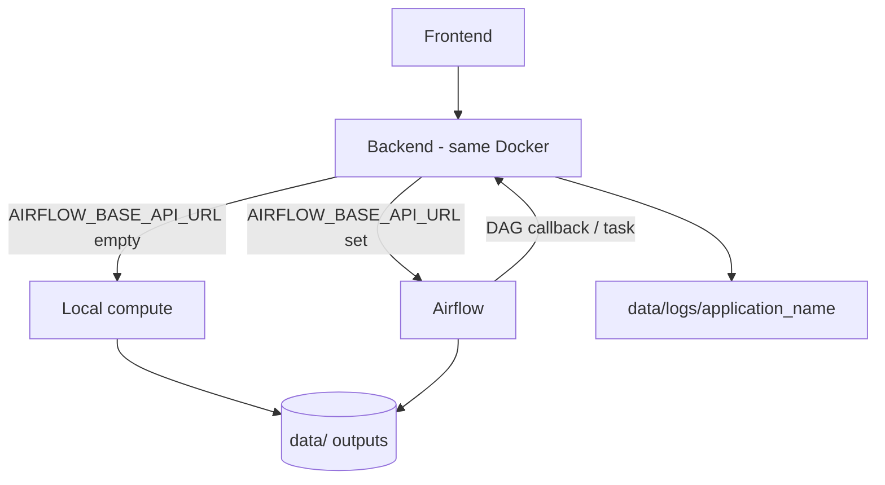

# Cluster Service Checklist

Acceptance checklist for every project that ships as a Docker service on the CoRE Stack cluster. Complete this page **before** asking for a cluster deploy.

This page is **not linked from the public site navigation**. Bookmark the URL directly.

**Direct URL:** `/server/cluster-service-checklist/`

Cluster-wide Docker, STACD, and Airflow standards: [Cluster Docker Services](cluster-docker-services.md).

---

## How to use this page

Copy the boxes into the service GitHub issue or README. Tick an item only when the **acceptance** line is true.

---

## 1. Store all relevant data and compute output in `data/`

Inputs, models, caches, **and compute outputs** go under a host **`data/`** directory (mounted into the container, typically `/app/data`). Do not write results into the image filesystem or into the git checkout outside `data/`.

- [ ] Repo uses `data/` (or `CORESTACK_DATA_DIR` pointing at one).
- [ ] Compose bind-mounts that directory; it is **not** baked into the image.
- [ ] Job outputs (rasters, vectors, STAC JSON, exports, temp working files) are written under `data/`.
- [ ] `.gitignore` excludes generated data; only small fixtures or empty placeholders are committed.
- [ ] README documents host path and container path.

**Acceptance:** Compute results survive a container restart because they live on the `data/` mount, not in the container layer.

---

## 2. Compute via Airflow if `AIRFLOW_BASE_API_URL` is set, otherwise local

Do **not** use a separate `COMPUTE_MODE` flag. The Airflow URL is the switch:

| `AIRFLOW_BASE_API_URL` in `.env` | Behaviour |
| --- | --- |
| **Set** (non-empty) | Trigger and poll Airflow (`/api/v1/dags/...`). Follow [Cluster Docker Services §8](cluster-docker-services.md#8-compute-and-processing--always-via-airflow). |
| **Unset / empty** | Run compute **locally** in the same container (in-process). |

- [ ] `.env.example` lists `AIRFLOW_BASE_API_URL` with a comment: leave empty for local compute.
- [ ] Backend reads that variable at runtime; empty means local, no Airflow client calls.
- [ ] When set: same-origin proxy so the browser never talks to Airflow; `AIRFLOW_DAG_ID` and worker callback URL (`CORESTACK_API_BASE` or equivalent) are also documented.
- [ ] Local path does not require an Airflow host.

**Acceptance:** The same image runs local jobs on a laptop (URL unset) and Airflow jobs on the cluster (URL set) by changing `.env` only.

---

## 3. Docker image pushed to GHCR **or** Docker Hub

The image must be in a registry others can pull. Use **GitHub Container Registry** (`ghcr.io/...`) or **Docker Hub** (`docker.io/...`).

- [ ] `Dockerfile` is deps-oriented; code and `data/` are mounted at runtime ([Cluster Docker Services §2](cluster-docker-services.md#2-code-and-models-live-on-the-host-mount-do-not-copy)).
- [ ] Image is tagged with a version (and optionally `latest`).
- [ ] Image is **pushed** to `ghcr.io/<org>/<name>:<tag>` **or** `<dockerhub-user>/<name>:<tag>`.
- [ ] README has the exact `docker pull` line.

**Acceptance:** A clean host can `docker pull` and start the service without building from source.

---

## 4. Google SSO is implemented

Users sign in with **Google Single Sign-On**. Protected APIs and compute triggers require a valid Google session/token.

- [ ] Google SSO (OAuth / Google Identity) is implemented on the frontend and validated on the backend.
- [ ] Client id/secret (and redirect URIs) come from **env**, not source.
- [ ] Unauthenticated users cannot start compute or mutate data.
- [ ] `.env.example` lists `GOOGLE_CLIENT_ID` / `GOOGLE_CLIENT_SECRET` (or the names you use), no real secrets.

GEE service-account keys are separate from SSO — see [Cluster Docker Services §1](cluster-docker-services.md#1-no-hardcoded-configuration).

**Acceptance:** Compute and write APIs reject requests without Google SSO; credentials are not in git.

---

## 5. Logging enabled; logs mounted from `data/logs/<application_name>`

Every container writes application logs. The log directory is a bind-mount from the host:

```text
data/logs/<application_name>/
```

Example: service `corestack-lulc` → `data/logs/corestack-lulc/`.

- [ ] Logging is enabled in the process that runs in the container (file and/or stdout).
- [ ] Compose (or `docker run`) mounts `./data/logs/<application_name>` into the container log path.
- [ ] Log files land under that directory (not only inside the ephemeral container FS).
- [ ] Log level is env-driven (`LOG_LEVEL`). No tokens or passwords in log lines.
- [ ] README shows the host path and how to tail (`tail -f data/logs/<application_name>/...` and `docker compose logs -f`).

**Acceptance:** After a container recreate, logs for that application are still on disk under `data/logs/<application_name>/`.

---

## 6. Backend and frontend in the **same** Docker — no separate frontend container

One image, one container, one port. Do **not** run a second Docker service for the UI (no separate Nginx/SPA container).

- [ ] A single Compose service (or `docker run`) serves backend **and** frontend.
- [ ] The backend serves the built UI (same origin), or both processes run in that one container.
- [ ] There is no `frontend:` service in Compose.

**Acceptance:** `docker compose up` starts one app container; the browser talks only to that host:port.

---

## 7. Frontend API base URL from `.env`, not hardcoded

The backend API URL the frontend calls must come from environment config. No `localhost:8000`, production hostname, or path prefix committed in JS/TS.

- [ ] `.env.example` has the API base (`API_BASE_URL`, `VITE_API_BASE_URL`, `REACT_APP_API_URL`, or equivalent).
- [ ] All frontend `fetch` / axios calls use that value.
- [ ] Changing `.env` retargets the UI without editing source (rebuild the UI only if the framework inlines env at build time — document that).
- [ ] Default is a relative base (`/` or `/api`) so the same-container deploy works.

**Acceptance:** Pointing the UI at another backend is an env change, not a code edit.

---

## 8. Architecture diagram — how compute is triggered and from where

Every project README (or `docs/architecture.md`) includes a diagram of **how compute is triggered and from where**.

Must show:

- Frontend and backend in the **same Docker**
- Decision: `AIRFLOW_BASE_API_URL` set → Airflow; unset → local
- Who calls whom (UI → backend → local job **or** Airflow DAG → callback/worker)
- `data/` for inputs and compute output
- `data/logs/<application_name>/` for logs
- External systems if used (GEE, GeoServer, object storage)

Mermaid in the README is enough:



**Acceptance:** A new operator can see, from the diagram alone, whether a UI action runs locally or via Airflow, and where files and logs land.

---

## Sign-off

| # | Item | Owner | Done |
| --- | --- | --- | --- |
| 1 | All data and compute output in `data/` | | |
| 2 | `AIRFLOW_BASE_API_URL` set → Airflow; unset → local | | |
| 3 | Image pushed to GHCR or Docker Hub | | |
| 4 | Google SSO | | |
| 5 | Logs under `data/logs/<application_name>/` | | |
| 6 | Frontend + backend in one Docker | | |
| 7 | Frontend API base URL from `.env` | | |
| 8 | Architecture diagram (compute trigger + from where) | | |

Service: _______________ Date: _______________ Reviewer: _______________
